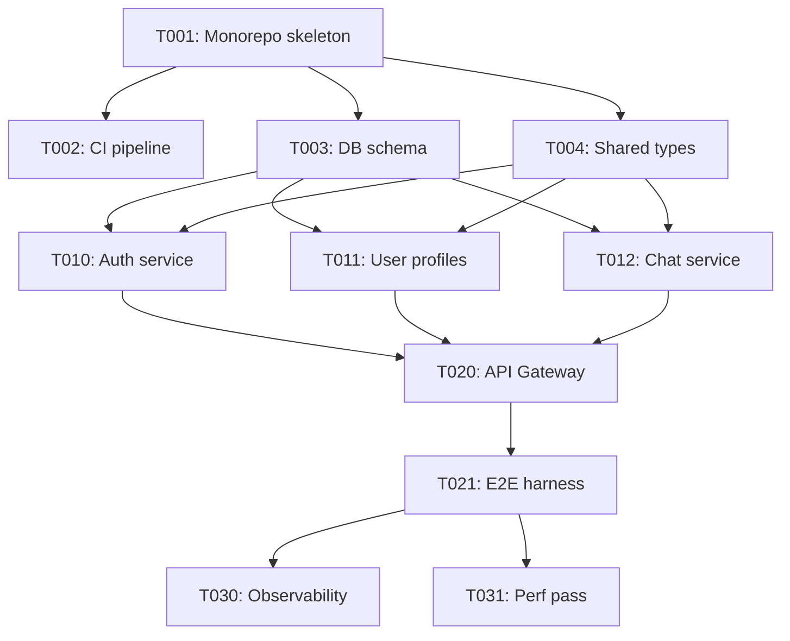

# Task Decomposition Heuristics

Reference material for the `task-decomposer` subagent and for humans editing task files.

## Core principles

1. **Tasks are atomic units of work.** One agent, 2h–1 day, one clear deliverable.
2. **Tasks are verifiable.** Each has a runnable check that says "done".
3. **Tasks minimize coupling.** Only shared infrastructure depends on multiple upstreams.
4. **Tasks name what they touch.** `file_domain` is non-negotiable.

## Sizing

| Estimated hours | Action |
|---|---|
| < 1h | Merge with a sibling — overhead > value |
| 1–4h | Ideal size |
| 4–8h | Acceptable; consider splitting |
| 8h–1d | Max; split if any uncertainty |
| > 1d | SPLIT. No exceptions. |

## Phase pattern

Most L/XL projects fit this shape:

### Phase 0 — Foundation (mostly sequential, 3–8 tasks)
- Monorepo / project skeleton
- CI pipeline
- Dev environment (docker-compose / etc.)
- Shared types / interface package
- DB schema + migrations framework
- Secrets / env management
- Logging / error-reporting wiring
- Auth framework (just the shell, not features)

These mostly depend on each other linearly. Parallelism here is low. **Don't fight it.**

### Phase 1 — Core modules (high parallelism, 6–15 tasks)
- Each major business module as its own task
- Workers own disjoint directories (`src/auth/`, `src/chat/`, `src/billing/`, ...)
- External integrations (one per task: Stripe, Twilio, etc.)
- Each has its own tests

This is where parallelism pays off. Aim for 3–5 concurrent workers.

### Phase 2 — Integration (sequential bottleneck, 3–6 tasks)
- API gateway wiring the modules together
- Cross-cutting middleware (auth, rate-limit, CORS)
- E2E test harness
- Staging deployment

Integration inherently serializes. Don't try to parallelize these.

### Phase 3 — Polish (moderate parallelism, 3–6 tasks)
- Observability (metrics, tracing, alerts)
- Performance pass
- Documentation
- Onboarding flow / empty states
- i18n (if needed)

Parallelizable again because each touches different concerns.

## Model routing heuristics

Each task's `recommended_model` drives `/parallel-kickoff` dispatch. Default to Sonnet.
Override when one of these applies:

### Use Opus 4.7 when:
- Task spans > 10 files with interdependencies
- Task involves a system-wide migration (e.g. DB schema change affecting many queries)
- Task is the "spine" of a feature (the one others will depend on heavily)
- The task file itself required the operator to think hard; impl will too

### Use Codex 5.4 when:
- Heavy shell / CLI / PowerShell / Windows-specific work
- Long autonomous runs (expected > 2h; Codex compaction handles this better)
- CI/CD / GitHub Actions / Terraform / K8s manifests
- Migration scripts that need to run against real data

### Use Codex 5.4 mini when:
- Small, narrow bug fix (< 100 LOC change)
- Specific lint / type error cleanup
- Rename refactor within a file

### Use Haiku 4.5 when:
- Pure boilerplate (e.g. "create 12 similar React components from a design spec")
- Format-only changes
- Translation of strings
- Generating test fixtures from a schema

### Use Codex-Spark when:
- < 20 LOC change with high iteration (tweaking a prompt, a copy change)
- You want near-instant response for a trivial edit

### Distribution health check
A healthy mix for a typical L/XL project:
- Opus: 10–15% (spine tasks)
- Sonnet: 55–70% (the bulk)
- GPT 5.4: 10–15% (ops, long runs)
- GPT mini: 5–10% (narrow fixes)
- Haiku: 5–10% (boilerplate)

If your mix is 80% Opus, you're overspending. If 80% Haiku, your spec is too trivial
or tasks too small.

## DAG construction rules

### Rule 1 — No cycles
Obvious but: if A depends on B and B depends on A, one of them is wrong.

### Rule 2 — No orphans
Every task is reachable from T001 via `blocks` edges. An orphan task won't be scheduled.

### Rule 3 — Max fan-out = max parallel width
If you see "T010 is depended on by 8 tasks", those 8 can run in parallel *once* T010
completes. Ensure T010 is well-specified and verified before Phase 1 begins.

### Rule 4 — Keep critical path short
Critical path = longest chain of sequential dependencies. It determines wall-clock
time. Aim for critical path ≤ 40% of total tasks.

### Rule 5 — Interfaces before implementations
For any module X that ≥2 other tasks import, create an explicit "interface" task
in Phase 0 that just writes the type / protocol / contract. Dependent tasks reference
the interface, not the implementation.

## Task file structure (authoritative)

```markdown
# T<NNN>: <short title>

**spec_ref**: specs/NNN-<n>/spec.md#<section-anchor>
**phase**: 0 | 1 | 2 | 3
**depends_on**: [T001, T005]
**blocks**: [T020, T021]
**parallelizable_with**: [T010, T011]
**file_domain**:
  - src/auth/**
  - tests/auth/**
**estimated_hours**: 4
**recommended_model**: sonnet-4-6
**risk_level**: low | medium | high

---

## Goal
One paragraph.

## Inputs
- Existing files / modules to read
- Required env vars (list names, not values)
- Upstream task outputs

## Outputs
- File A: `path` — what it exports / does
- File B: `path` — ...

## Implementation plan
1. ...
2. ...

## Verification (must be runnable)
- [ ] `pnpm test tests/<file>.test.ts` — N tests green
- [ ] `pnpm tsc --noEmit` — 0 errors
- [ ] Manual: `curl -X POST ...` returns expected shape
- [ ] Coverage for this task's files ≥ 85%

## Known gotchas
- ...

## Out of scope
- Do NOT modify `src/api/` (that's T012's job)
- Do NOT introduce a new dependency without updating tech-stack.md
```

## DAG visualization (Mermaid)

Use this template; order nodes by phase. Use comments for readability:



## Self-check after decomposition

Run these mentally (or explicitly):

1. **Total hours**: sum of all estimated_hours — sanity check total effort
2. **Critical path hours**: longest chain — wall-clock estimate with max parallelism
3. **Speedup**: total / critical-path — how much parallelism buys you
4. **Max parallel width**: most tasks runnable simultaneously — caps useful worker count
5. **Model mix**: should match distribution health check above

Example output:
```
Total: 87 hours
Critical path: 34 hours (tasks: T001 → T003 → T010 → T020 → T021 → T030)
Speedup if max parallelism: 2.56x
Max parallel width: 5 (Phase 1 peak)
Model mix: Opus 12% · Sonnet 63% · GPT 5.4 12% · GPT mini 8% · Haiku 5% ✅
```
