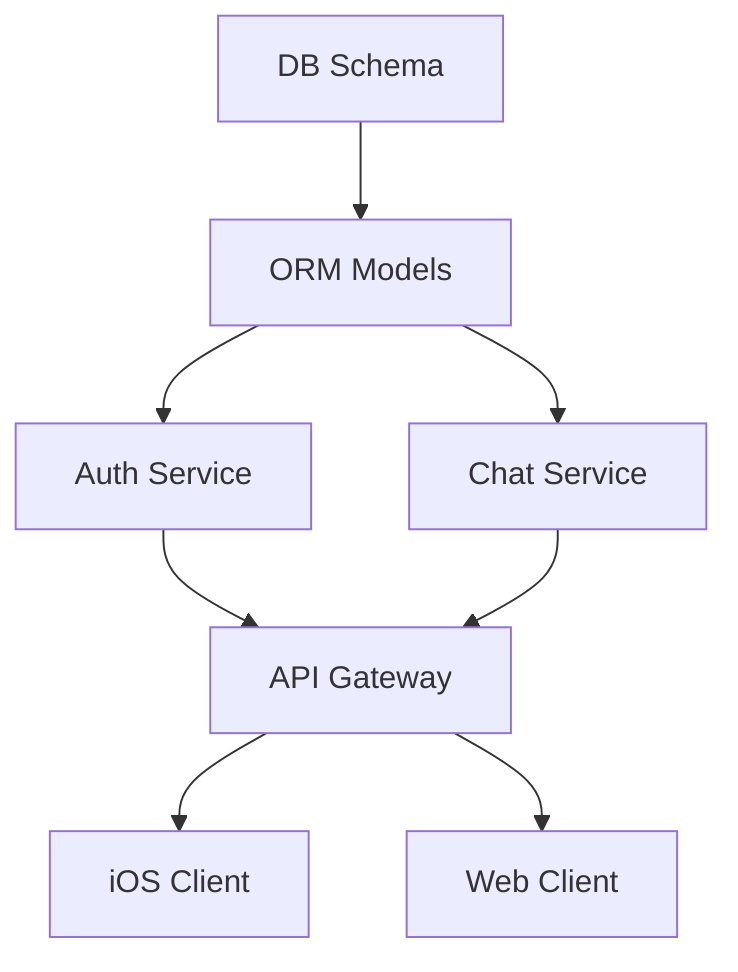

# Idea Incubator 完整操作手册

> **版本**：v2.0 · 2026-04-21
> **适用对象**：零大型项目经验的单人开发者 + AI 团队
> **质量目标**：商业落地级（production-grade）软件
> **核心方法论**：SDD (Spec-Driven Development) + **三阶段辩论（Explore → Position → Converge）** + 并行子智能体 + 对抗式审查

---

## 目录

0. [前置准备（一次性 Setup，约 90 分钟）](#0-前置准备一次性-setup约-90-分钟)
1. [项目目录结构](#1-项目目录结构)
2. [阶段 A：Idea 收集（Proposals）](#2-阶段-aidea-收集proposals)
3. [阶段 B：三阶段辩论（Discussion）](#3-阶段-b三阶段辩论discussion)
4. [阶段 C：结论综合（Conclusion）](#4-阶段-c结论综合conclusion)
5. [阶段 D：从结论到 Spec（SDD 转化）](#5-阶段-d从结论到-specsdd-转化)
6. [阶段 E：并行开发（单人 + AI 团队）](#6-阶段-e并行开发单人--ai-团队)
7. [阶段 F：对抗式审查与商业级验收](#7-阶段-f对抗式审查与商业级验收)
8. [Token 与速度优化清单](#8-token-与速度优化清单)
9. [常见问题排障](#9-常见问题排障)
10. [附录：可直接复制的文件模板](#10-附录可直接复制的文件模板)

---

## 0. 前置准备（一次性 Setup，约 90 分钟）

### 0.1 订阅与计费策略（先想清再付钱）

| 工具 | 推荐订阅 | 月费 (USD) | 用途 |
|---|---|---|---|
| Claude Max 20x | **必须** | $200 | Opus 4.7 + Sonnet 4.6 主力，支持 10+ 并行会话 |
| ChatGPT Pro（含 Codex 使用额度） | **必须** | $200 | GPT-5.4 xhigh + GPT-5.3-Codex，用于辩论与 Codex 审查 |
| Anthropic API（备用） | 可选 | 按量 | 超出 Max 配额后兜底、脚本自动化 |
| Cursor Pro | 可选 | $20 | 仅用作可视化 diff 审查 |

**为什么必须双顶级订阅？**
- 你的核心价值主张是"双模型辩论"，单一订阅无法实现。
- Max 20x 给你 `~900 messages / 5hr`，够同时跑 5+ worktree。
- Codex Pro 让你跑 `/codex:adversarial-review` 基本零边际成本。
- 实测：单项目从 0 到商业上线，完整成本约 $400–800/月，相当于一个初级工程师时薪 2–3 小时的钱。

### 0.2 必装工具清单

按顺序执行：

```bash
# 1. Node.js 20+ (Claude Code / Codex 都需要)
#    macOS:
brew install node@20
#    Windows/Linux 用 nvm 或官方安装器

# 2. Claude Code（全局安装）
npm install -g @anthropic-ai/claude-code

# 3. Codex CLI（全局安装）
npm install -g @openai/codex

# 4. Git（确认已安装且 >= 2.40，worktree 需要新版本）
git --version

# 5. GitHub CLI（用来创建 PR、管理 issue）
brew install gh     # macOS
# 或 https://cli.github.com/

# 6. ripgrep（Codex 和 Claude Code 都偏好用 rg 做搜索）
brew install ripgrep

# 7. tmux（管理多个并行会话必备）
brew install tmux
```

### 0.3 首次登录与账号绑定

```bash
# Claude Code 登录（选 Claude App，绑定 Max 订阅）
claude
# > 浏览器会自动打开，登录 claude.ai 即可

# Codex 登录（选 ChatGPT 账号）
codex
# > 浏览器会自动打开，登录 openai.com 即可

# 关键验证
claude --version   # 期望 >= 2.1.50（worktree 原生支持）
codex --version    # 期望 >= 0.6.x
```

### 0.4 安装 Codex-in-Claude-Code 插件（**这是整个流程的关键粘合剂**）

```bash
# 在任意目录启动 claude 一次
claude
# 然后在 Claude Code 交互界面输入：
> /plugin install openai/codex-plugin-cc
```

装完你就有了：
- `/codex:review` – 普通 Codex 审查
- `/codex:adversarial-review` – 对抗式审查
- `/codex:rescue` – 把任务交给 Codex 做（异步）

### 0.5 全局配置（只做一次，全项目受益）

创建 `~/.claude/CLAUDE.md`（全局个人偏好，不入 git）：

```markdown
## 我的身份
我是单人独立开发者，无大型项目经验。所有输出要详细、可复制粘贴、有可验证的中间步骤。

## 通用约束
- 所有代码必须带测试，测试先写。
- 所有新功能必须在 plan mode 下先给我出方案，我批准后再执行。
- 报错信息要真实粘贴，不要只说"有错误"。
- 所有 commit 必须走 conventional commits（feat/fix/chore/docs/refactor/test）。

## 工具偏好
- 搜索用 `rg`。
- 包管理 macOS 用 brew，JS 用 pnpm，Python 用 uv。
- 默认 TypeScript strict 模式。
```

创建 `~/.codex/config.toml`：

```toml
# Codex 全局配置
model = "gpt-5.4"
reasoning_effort = "high"     # 默认 high；辩论时手动切到 xhigh

[approvals]
sandbox_policy = "workspace-write"
```

### 0.6 把 Opus 4.7 设为默认主模型

启动 Claude Code 后：
```
/model opus
```
或环境变量持久化：
```bash
echo 'export ANTHROPIC_MODEL=claude-opus-4-7' >> ~/.zshrc  # 或 ~/.bashrc
```

**省钱技巧**：子智能体用 Sonnet，主会话用 Opus：
```bash
echo 'export CLAUDE_CODE_SUBAGENT_MODEL=claude-sonnet-4-6' >> ~/.zshrc
```

---

## 1. 项目目录结构

创建 `idea-incubator/` 仓库，推荐结构如下。**这份结构在你的项目跑到第 5 个 idea 时仍然不会乱**。

```
idea-incubator/
├── CLAUDE.md                        # ⭐ 项目宪法（全会话共享）
├── AGENTS.md                        # 符号链接指向 CLAUDE.md，兼容 Codex
├── README.md
├── .gitignore
├── .claude/
│   ├── settings.json                # Claude Code 项目设置
│   ├── agents/                      # 子智能体定义
│   │   ├── debate-opus.md
│   │   ├── debate-facilitator.md
│   │   ├── spec-writer.md
│   │   ├── task-decomposer.md
│   │   ├── parallel-builder.md
│   │   ├── security-auditor.md
│   │   └── adversarial-reviewer.md
│   ├── commands/                    # 斜杠命令
│   │   ├── debate-start.md
│   │   ├── debate-next-round.md
│   │   ├── debate-conclude.md
│   │   ├── spec-from-conclusion.md
│   │   ├── parallel-kickoff.md
│   │   └── quality-gate.md
│   └── skills/                      # 领域技能
│       ├── debate-protocol/SKILL.md
│       └── sdd-workflow/SKILL.md
├── .codex/
│   └── config.toml                  # Codex 项目级配置（覆盖全局）
├── proposals/
│   └── proposals.md                 # 🌱 所有 idea 入口
├── discussion/
│   └── 001/
│       ├── 001-Opus47Max-R1.md
│       ├── 001-GPT54xHigh-R1.md
│       ├── 001-Opus47Max-R2.md
│       ├── 001-GPT54xHigh-R2.md
│       ├── 001-moderator-notes.md   # 你作为主持人的干预记录
│       ├── 001-Opus47Max-final.md   # 最终观点
│       └── 001-GPT54xHigh-final.md
├── conc/
│   └── 001-Opus47Max-GPT54xHigh-byOpus47Max-260420.md
├── specs/
│   └── 001-project-name/
│       ├── PRD.md
│       ├── spec.md
│       ├── architecture.md
│       ├── tech-stack.md
│       ├── dependency-graph.mmd     # Mermaid DAG
│       └── tasks/
│           ├── T001-schema.md
│           ├── T002-auth-api.md
│           └── ...
└── projects/
    └── 001-project-name/            # 👈 真正的代码仓库（通常是 git submodule）
        ├── CLAUDE.md                # 项目级宪法（覆盖父级）
        ├── ...
```

**关键设计取舍**：
- `proposals/` 和 `discussion/` **不在**代码仓库里，而在 incubator 层，因为它们是跨项目的元数据。
- `projects/XXX/` 做成独立 git 仓库或 submodule，这样商业化时可以直接 `git push` 到私有仓库。
- **AGENTS.md 用符号链接**（`ln -s CLAUDE.md AGENTS.md`），避免双份文件漂移。Codex 读 AGENTS.md，Claude Code 读 CLAUDE.md，一份真相。

---

## 2. 阶段 A：Idea 收集（Proposals）

### 2.1 Proposal 模板

`proposals/proposals.md` 每个 idea 必须遵守以下最小格式（**格式越规范，两个模型辩论越不跑题**）：

```markdown
# Proposals

---

## **001**: [一句话标题]

**提出日期**: 2026-04-21
**状态**: draft | discussing | spec-ready | building | shipped | abandoned
**初始野心等级**: S / M / L / XL (XL = 即时通讯级，L = 完整 SaaS，M = 工具类，S = 小脚本)

### 动机 (Why)
我为什么想做这个？解决什么真实问题？如果没有这个世界会怎样？

### 核心想法 (What)
一段话讲清楚你想做的东西的本质。不需要技术细节。

### 初始约束 (Constraints)
- 预算 / 时间 / 平台偏好 / 必须集成的已有系统
- 我愿意放弃什么（e.g. "可以不支持 Android，先 iOS"）

### 已知未知 (Open Questions)
- 技术栈我完全不确定
- 商业模式有两种可能性
- （越诚实越好，两个模型会围绕这些展开）

### 期望产出
"希望最终我能有一个 XXX，用户可以用它做 YYY"

---

## **002**: ...
```

### 2.2 填写建议

- **10 分钟内写完**。写太久说明你在过早优化。
- **"已知未知"至少 3 条**。没有未知 = 你不需要两个 AI 辩论。
- **野心等级是提示词信号**。你写 XL，两个模型就会自动进入"我们是在谈架构不是在谈 MVP"的模式。

---

## 3. 阶段 B：三阶段辩论（Discussion）

这是整个流水线的**核心创新**。不是所有 idea 都值得建造——有些已经被做过，有些已经失败过，有些太模糊。**三阶段辩论的第一任务是判断"要不要建"，第二任务才是"怎么建"。**

### 3.1 为什么是三阶段（Stage 1 内还有两个子阶段）

| 阶段 | 子阶段 | 名字 | 目的 | 姿态 | Search |
|---|---|---|---|---|---|
| **S1** | S1A | Daydream 空想 | 各自独立想象，写 Part A（正）+ B（反）+ C（自省） | 关门想 | **禁止** |
| **S1** | S1B | Ground 落地 | 读对方 S1A，带着问题清单去搜证 | 对照现实 | **≥5 来源** |
| **S2** | — | Position 立场 | 基于证据收敛，产出 2–4 个方向菜单 | 协作 | ≥2 来源 |
| **S3** | — | Converge 方案 | 架构与 MVP（仅在主持人批准后进入） | 工程师姿态 | 可选 |

**先空想，再 search 的顺序是故意的**。如果先让模型 search，它会被既有方案框住，很难再跳出来想"如果从完全不同的切法呢"。S1A 让每个 debater 先把想象力充分放开——最乐观的版本是什么、最悲观的版本是什么、我到底知道什么不知道什么——然后 S1B 再去对照现实。

**Part B 要诚实，不要夸张**。放飞的悲观（cynical takedown）会扼杀真正有潜力的 idea。Part B 的标准是"我会这样对一个真诚请教我的 founder 说"——有理有据地提醒致命风险，不是抖机灵。

**关键**：S2 结束时是**强制主持人决策点**，四选一：
- **Advance** — 选一个方向进入 S3
- **Fork** — 值得追的方向不止一个，拆成多个子 idea 重新辩论
- **Park** — 暂搁，写下复活条件
- **Abandon** — 证据显示别建，写下教训

统计上 30–50% 的 idea 在 S2 就被 Park/Abandon。**这是流程最值钱的时刻**——在花 4 周开发之前杀掉一个坏 idea。

### 3.2 辩论协议设计原则

| 原则 | 说明 |
|---|---|
| **文件即通讯总线** | 两个 AI 不直接通信，只读写 `discussion/NNN/` 下的 markdown。人类（你）做 router。 |
| **S1A 关门想** | 每个 debater 独立写 S1A，**不准 search**，也不读对方的 S1A。想象空间先于验证空间。 |
| **S1A 三段式** | Part A（正方）+ Part B（独立反方，诚实不刻薄）+ Part C（自省，列出 S1B 要查的问题）。 |
| **S1B 必须搜索** | 读对方 S1A + 合并 Part C 问题清单 + ≥5 次 web search，引用 URL。 |
| **S2 必须出菜单** | 每轮产出 2–4 个候选方向作为对等选项，**不许替人类选**。 |
| **主持人可注入** | 随时往 `moderator-notes.md` 加约束，下一轮双方必须回应。 |
| **阶段切换由主持人触发** | `/debate-advance-stage`，不是自动的。 |

### 3.3 启动 S1A 空想（`/debate-start 001`）

```bash
cd idea-incubator
claude
> /debate-start 001
```

这个命令会：
1. 创建 `discussion/001/` 目录并复制 PROTOCOL.md
2. 让 Opus **关起门来**写 S1A（**禁止 search**、也不读对方 S1A）
3. 输出 `discussion/001/001-Opus47Max-S1A.md`，包含三段：
   - **Part A** 最激动人心的版本（正方想象）
   - **Part B** 最致命的版本（独立反方，诚实不刻薄）
   - **Part C** 认识论自省（我到底知道什么、需要查什么）

**同时**在另一个终端启动 Codex，也写 S1A（也不准 search、也不读对方）：

```bash
cd idea-incubator
codex --model gpt-5.4 -c reasoning_effort=xhigh
```

粘贴（完整模板见 `discussion/001/PROTOCOL.md` §"Codex-side kickoffs · S1A"）：

```
You are GPT-5.4 xhigh, Debater B, S1A on idea 001.

HARD CONSTRAINT: Do NOT run any web search this round. No WebSearch, no WebFetch.
Write from your own model knowledge and imagination only.

Do NOT read discussion/001/001-Opus47Max-S1A.md (parallel independence).

Read: proposals/proposals.md (001), discussion/001/PROTOCOL.md, AGENTS.md

Write discussion/001/001-GPT54xHigh-S1A.md using the S1A triple-section template:
  Part A · most-exciting version (POSITIVE)
  Part B · most-damning version (independent NEGATIVE, honest not cynical)
  Part C · epistemic honesty — 5 search-shaped questions for S1B

400–800 words. Bold in A, truthful in B, rigorous in C.
```

两边并行写，互不影响。S1A 想象空间最大化。

### 3.4 S1B 落地验证（`/debate-next 001 1 B`）

S1A 完成后，进入 Stage 1 第二子阶段。这一步把两份 daydream 拿去和世界对照。

```
/debate-next 001 1 B
```

Opus 会：
1. 读自己 S1A + 对方 S1A（全部三段）
2. 合并两边 Part C 的问题清单，去重
3. 跑 ≥5 次 web search（必须）
4. 判决每条 S1A 主张：被证据加强 / 被削弱 / 仍未知
5. 输出 `discussion/001/001-Opus47Max-S1B.md`（§1-§8）

Codex 侧粘贴：

```
You are GPT-5.4 xhigh, S1B on idea 001. This is the grounding round.

Read in order:
  discussion/001/PROTOCOL.md
  discussion/001/001-moderator-notes.md (if exists; binding)
  discussion/001/001-Opus47Max-S1A.md (opponent's daydream — ALL three parts)
  your own S1A

Merge your Part C questions with opponent's Part C questions. De-duplicate.
Run ≥5 web searches driven by merged list. Diverse sources. Include prior
failure cases if obvious candidates exist.

Write discussion/001/001-GPT54xHigh-S1B.md using the S1B template (§1 through §8).
500–1000 words.
```

S1B 的关键价值：**"shared imagination"（两边独立想象里的共识）是一种信号**，但它可能正确、也可能是两个模型共享的训练偏差。只有 S1B 搜证以后，你才知道哪些共识经得起现实检验、哪些是幻觉。

### 3.5 Stage 1 → Stage 2 切换（`/debate-advance-stage 001 2`）

```
/debate-advance-stage 001 2
```

这个命令会：
1. 检查 Stage 1 质量门（每边都有 S1A + S1B、S1A 三段齐全、S1B 各 ≥5 URL）
2. 调用 `stage1-synthesizer` 子智能体，产出 `discussion/001/001-stage1-synthesis.md`
3. 这份 synthesis **保留了"想象 vs 证据"的边界**——§1-§3 是 daydream、§5-§7 是 evidence，Stage 2 双方能看到哪些信念经受了检验、哪些没有

**你必须亲自读这份 synthesis**。如果里面的结论让你感觉不对（例如漏掉了你知道的某个竞品），写到 moderator-notes，让双方带着你的 injection 再跑一次 S1B。

### 3.6 Stage 2 —— 协作收敛（`/debate-next 001 2 1`）

Stage 2 不再对立。双方都读过 Stage 1 synthesis，姿态是"基于证据，这个 idea 到底应该是什么、应该怎么切"。

Opus 侧：`/debate-next 001 2 1`

Codex 侧粘贴：

```
You are GPT-5.4 xhigh, S2R1 on idea 001. Stage 2 is cooperative, not adversarial.
Read first: discussion/001/001-stage1-synthesis.md
Then: PROTOCOL.md, all Stage 1 rounds, moderator-notes.md
≥2 web searches if useful.
Write to discussion/001/001-GPT54xHigh-S2R1.md using the S2R1+ template.
Give 2–4 candidate directions as peers — do NOT pick one.
```

S2 每一轮双方都要回答：
1. 这个 idea 经过搜索之后**实际上**是什么（往往比原 proposal 更窄）？
2. 诚实 Y/N：值得建吗？条件是？
3. 候选方向 2–4 个，每个带名字、一段描述、最大风险、目标用户——**不许排序、不许推荐一个**
4. 自己倾向哪个，为什么
5. 从 Stage 1 到现在的 delta

通常 S2 跑 1–2 轮就够了。

### 3.7 Stage 2 决策点（`/debate-advance-stage 001 3`）—— **最重要的一步**

```
/debate-advance-stage 001 3
```

这个命令调用 `stage2-checkpoint` 子智能体，输出 `discussion/001/001-stage2-checkpoint.md`，内容包括：

- **双方对"该不该建"的诚实 Y/N**
- **统一方向菜单**（合并去重后的所有候选方向）
- **比较矩阵**（用户/价值/技术难度/TTM/差异化/法规/单人可行）
- **synthesizer 的推荐**（明确选一个，或推荐 Fork/Park/Abandon）
- **你要做的决定**：四选一

**这一步流水线会停下来等你**。不要让 AI 替你做这个决定。可能的四个决定：

| 决定 | 做什么 |
|---|---|
| **Advance** | 在 moderator-notes 记录你选哪个方向 + 理由 → 运行 `/debate-next 001 3 1` 进 Stage 3 |
| **Fork** | 在 proposals.md 创建 001a、001b 等新 idea → 各自 `/debate-start` → 归档当前辩论为 "forked" |
| **Park** | 更新 proposals.md 状态为 parked + 复活条件 → 辩论到此为止 |
| **Abandon** | 更新 proposals.md 为 abandoned → 写一页 `001-abandonment-lesson.md` → 防止未来重复提同样的坏 idea |

### 3.8 Stage 3 —— 工程方案（仅 Advance 后）

极性作废，双方都变回"冷静的工程师"。内容和旧版辩论的 R2+ 一致：

- **Steelman** 对方前一轮最强的点
- **≤2 个分歧**，每个带可证伪的 hinge
- **新视角**
- **≥1 个让步**（硬性）
- **自批评**
- 可选 `<!-- READY-TO-CONCLUDE -->`

Opus 侧：`/debate-next 001 3 1`、`/debate-next 001 3 2`、...
Codex 侧：粘贴 PROTOCOL.md 里的 S3R1 kickoff。

通常 2–3 轮。

### 3.9 主持人注入（任何阶段都可以）

```
/debate-inject 001 S2R1.5
```

或手动编辑 `discussion/001/001-moderator-notes.md`：

```markdown
## Injection @ S2R1.5
**Type**: Hard constraint
**Binding on**: Both

我注意到 S1 里没人提 App Store 的审核周期。我们做 iOS app 的话，更新周期是 1–7 天。
请下一轮都把这个约束纳入方向菜单的评估。
```

下一轮双方**必须**在 `## Moderator injection response` 小节回应。

### 3.10 收束（`/debate-finalize` → `/debate-conclude`）

Stage 3 跑到双方都 `<!-- READY-TO-CONCLUDE -->` 或主持人感觉够了，让双方各写一份独立的 final：

```
/debate-finalize 001
```

Codex 侧粘贴：

```
You are GPT-5.4 xhigh writing FINAL POSITION on idea 001.
Read every *.md in discussion/001/.
Write discussion/001/001-GPT54xHigh-final.md per the Finals template:
  1. Final recommendation (5 bullets)
  2. Full technical proposal
  3. MVP plan (Phase 0/1/2)
  4. Consensus with Opus (strict)
  5. Residual disagreements + honest verdict
  6. Where Opus was stronger than me (≥2)
  7. Where I was stronger than Opus (≥2)
  8. Top 5 actionable recommendations for moderator
  9. Open questions moderator must answer
  10. Sign-off: "Ready for SDD" or "One more round needed because..."
```

最后：

```
/debate-conclude 001
```

这个命令会调用 `conclusion-synthesizer`，综合**三个阶段**的全部产物（S1 synthesis + S2 checkpoint + S3 rounds + finals）写 `conc/001-*.md`。

### 3.11 一个完整会话看起来像什么

```
T+0h    /propose                                  # 10 分钟写完 proposal 001
T+0h15  /debate-start 001                         # Opus 跑 S1A 空想(无 search) ~15min
        (另开 Codex 终端粘贴 S1A kickoff)           # 并行,~15min
T+0h45  /debate-next 001 1 B                      # Opus 读对方 S1A + search,写 S1B ~25min
        (Codex 同步写 S1B)
T+1h30  /debate-advance-stage 001 2               # 生成 stage1-synthesis
        (读 synthesis,10 分钟,区分 imagination vs evidence)
T+1h45  /debate-next 001 2 1                      # Opus S2R1 协作
        (Codex S2R1)
T+2h45  /debate-advance-stage 001 3               # ★ 决策点(Advance/Fork/Park/Abandon)
        (读 checkpoint,10-20 分钟做决定)
                                                   # 如选 Park/Abandon,流程到此结束
T+3h15  /debate-next 001 3 1                      # Opus S3R1 工程(仅选 Advance 后)
        (Codex S3R1)
T+4h15  /debate-next 001 3 2                      # 如需继续
T+4h45  /debate-finalize 001                      # Opus 写 final
        (Codex 写 final)
T+5h15  /debate-conclude 001                      # 综合结论
```

一个 M 级 idea 完整走完辩论约 5–7 小时纯机器时间,人类干预约 45–90 分钟。如果 S2 就 Park 或 Abandon,总时间 3 小时内结束。

**相比 v2.0 的时间变化**:
- S1 阶段从"两轮都 search"变成"一轮不 search + 一轮 search",总 search 次数从 ~20 降到 ~10,**每个 idea 省约 15 分钟 + 一些 token**
- S1A 无搜索,Opus/Codex 几乎只是在"想",速度比有搜索的 S1B 快约 30%
- 其余阶段不变

---

## 4. 阶段 C：结论综合（Conclusion）

### 4.1 谁来综合？

**用 Opus** 做综合（因为它最后还要负责 spec）。这对应你文件命名里的 `-byOpus47Max-`。

### 4.2 命令

```
/debate-conclude 001
```

这会触发一个 `conclusion-synthesizer` 子智能体（定义见附录 10.4），它读完全部讨论 + 两份 final 后产出：

`conc/001-Opus47Max-GPT54xHigh-byOpus47Max-260420.md`

结构如下：

```markdown
# Idea 001 结论：[idea 标题]

## 1. 执行摘要（TL;DR）
一段话。

## 2. 核心共识（双方高度同意）
- C1: ...
- C2: ...

## 3. 主要分歧与建议裁决
| # | Opus 立场 | GPT-5.4 立场 | 主持人裁决 | 理由 |
|---|---|---|---|---|

## 4. 独立亮点（只有一方提出但值得采纳）
### 4.1 Opus 独有
### 4.2 GPT-5.4 独有

## 5. 建议搭建方向
- 核心产品形态
- MVP 范围
- 技术栈
- 关键里程碑

## 6. 风险登记
| 风险 | 影响 | 概率 | 缓解 |
|---|---|---|---|

## 7. 放弃清单（主动不做）
- 明确哪些诱人但不做

## 8. 可立即执行的下一步
- [ ] 创建 specs/001-xxx/
- [ ] 技术选型 POC（1 天）
- [ ] ...
```

### 4.3 审阅

你**必须亲自审**一遍这份结论，在空白处用 `> 人工批注：...` 标注你的判断。结论是下一阶段 spec 的唯一真相源。

---

## 5. 阶段 D：从结论到 Spec（SDD 转化）

### 5.1 为什么必须 SDD

ETH 2026 年一项研究显示：LLM 自动生成的 context 文件会让任务成功率下降 0.5–2%，同时推理成本上升 20%+。只有**人工参与的 spec** 才有正收益（约 +4% 成功率）。

换句话说：**你不写 spec 直接让 Claude Code 开干，1M 行代码级项目上你一定翻车**。Spec 不是流程主义，是对 AI 成功率的直接赔率提升。

### 5.2 Spec 六要素（缺一不可）

1. **Outcomes** – 用户可观测的结果（不是功能清单）
2. **Scope Boundaries** – 明确说什么**不做**
3. **Constraints** – 性能/合规/依赖
4. **Prior Decisions** – 已定型的架构决策（从 conclusion 继承）
5. **Task Breakdown** – 可并行的小任务 DAG
6. **Verification Criteria** – 怎么算"做完了"（非"能跑"）

### 5.3 从 conclusion 生成 spec 骨架

```
/spec-from-conclusion 001
```

这会让 Opus（**关键：用 opusplan 模式**）读 conclusion，产出：

- `specs/001-xxx/PRD.md` – 产品需求
- `specs/001-xxx/architecture.md` – 系统架构 + C4 图 (Mermaid)
- `specs/001-xxx/tech-stack.md` – 锁定版本的技术栈
- `specs/001-xxx/spec.md` – 主 spec（六要素）
- `specs/001-xxx/dependency-graph.mmd` – 任务依赖 DAG

### 5.4 让 Codex 对抗式审 Spec

**这一步决定最终代码质量的 50%**。

在 Claude Code 里：
```
/codex:adversarial-review specs/001-xxx/
   --focus "请挑战 spec 中的假设，尤其是我作为新手忽略的工程复杂度。
            特别关注：并发模型、数据一致性、故障恢复、安全边界、合规。"
```

Codex 会返回一份挑战清单。Opus 基于这份清单修订 spec，再让 Codex 审一次，直到 Codex 返回 "No blocking issues"。

**经验数据**：这个 loop 平均需要 2–4 轮，每轮 10–20 分钟。完成后 spec 质量通常比单模型产出高 **30–40%**。

### 5.5 任务分解（`task-decomposer` 子智能体）

```
/decompose 001
```

它会把 spec 拆成 `specs/001-xxx/tasks/T001.md, T002.md, ...`，每个 task 必须包含：

```markdown
# T042: [任务名]

**依赖**: T001, T015
**可并行**: 是 / 否（与哪些任务可并行标明）
**预估**: 2h / 半天 / 1 天
**推荐模型**: opus / sonnet / codex-5.4 / codex-5.4-mini / haiku

## 目标
一段话。

## 输入
- 已存在的文件/模块
- 需要的外部信息

## 输出
- 文件 A：做什么
- 文件 B：做什么
- 测试覆盖率 >= XX%

## 验收
- [ ] 测试 `pnpm test tests/XXX` 全绿
- [ ] `pnpm lint` 全绿
- [ ] 集成到 main 分支后 `pnpm e2e` 不退化

## 注意事项
- 已知坑点
```

**DAG 举例**（Mermaid）：



**T003 和 T004 可并行**，T006 和 T007 可并行。找出所有并行窗口就是下一步的关键。

---

## 6. 阶段 E：并行开发（单人 + AI 团队）

### 6.1 模型分工（经过实测验证的分层）

| 层级 | 模型 | 用途 | 成本/任务 |
|---|---|---|---|
| L1 架构层 | **Opus 4.7 (extended thinking)** | 架构决策、跨模块重构、难 bug 根因分析 | 高 |
| L2 规划层 | **Opus 4.7 (plan mode)** / **GPT-5.4 xhigh** | spec、task 分解、技术选型 | 中高 |
| L3 审查层 | **GPT-5.4 (high) via codex-plugin** | 代码审查、对抗审查 | 中 |
| L4 主力开发 | **Sonnet 4.6** / **GPT-5.3-Codex medium** | 写 90% 的业务代码、单元测试 | 低中 |
| L5 机械工 | **Haiku 4.5** / **GPT-5.4-mini** / **Codex-Spark** | 格式化、重命名、样板代码、简单修复 | 极低 |

**铁律**：
- ❌ 不要让 Opus 写样板代码（浪费钱）
- ❌ 不要让 Haiku 做架构（质量崩）
- ✅ 让 Opus **规划**，让 Sonnet/Codex **执行**，让 Codex **审查**

### 6.2 并行基础设施：Git Worktree

**目的**：在同一 repo 里同时跑 5+ 个 Claude Code 实例，每个在独立分支独立目录工作，**互不干扰**。

一次性设置（在 `projects/001-xxx/`）：

```bash
# .gitignore 加一行
echo ".claude/worktrees/" >> .gitignore

# 创建 .worktreeinclude 让 .env 等文件自动拷进 worktree
cat > .worktreeinclude <<EOF
.env
.env.local
*.secrets
EOF
```

### 6.3 并行开工（`/parallel-kickoff`）

假设 DAG 里这批可并行：T003, T004, T008。

```
/parallel-kickoff 001 T003,T004,T008
```

这个命令会：

1. 为每个 task 创建 worktree：
   ```bash
   claude --worktree T003-auth
   claude --worktree T004-chat
   claude --worktree T008-notif
   ```
2. 在每个 worktree 里注入相应 `tasks/TXXX.md` 作为第一条指令。
3. 所有 worktree 都在 **Plan Mode** 启动（`Shift+Tab` 或 `--permission-mode plan`）。
4. 你人工审一遍 plan，每个批准后切到 execution mode。
5. 3 个 Claude Code 并行跑。你切 tmux 窗口巡查。

### 6.4 tmux 布局推荐

```
┌──────────────┬──────────────┐
│              │              │
│  Opus 主控   │  T003 worker │
│  (编排)      │  (Sonnet)    │
│              │              │
├──────────────┼──────────────┤
│              │              │
│ T004 worker  │ T008 worker  │
│ (Codex 5.3)  │ (Sonnet)     │
│              │              │
└──────────────┴──────────────┘
```

**绑定热键**：`~/.tmux.conf`
```
bind -n M-h select-pane -L
bind -n M-l select-pane -R
bind -n M-k select-pane -U
bind -n M-j select-pane -D
```
Alt+hjkl 切窗口，不用鼠标。

### 6.5 何时用 Codex，何时用 Claude Code？

| 场景 | 首选 | 理由 |
|---|---|---|
| 大规模重构（>20 文件） | Claude Code + Sonnet | 1M 上下文能把项目全抓进去 |
| 长期自主任务（几小时） | Codex + GPT-5.4 xhigh | Codex compaction 支持多小时推理 |
| iOS/Swift 原生 | Claude Code | Opus 4.7 对 Swift 支持更成熟 |
| Python/TypeScript 业务 | 两者均可，看哪个便宜 | |
| Shell/PowerShell/Windows 自动化 | Codex | Codex 针对 PowerShell 做过专门训练 |
| 写测试 | 分两步：Opus 写测试，Sonnet 让测试通过 | TDD 分工 |
| 审查代码 | **Codex**（通过 codex-plugin-cc） | 跨模型审查能发现 30% 更多问题 |

### 6.6 子智能体（Subagents）的用法

**定义一次，在所有 worktree 复用**。创建 `.claude/agents/security-auditor.md`：

```markdown
---
name: security-auditor
description: Reviews code for OWASP Top 10, auth flaws, secrets, injection, insecure deserialization
tools: Read, Grep, Glob, Bash
model: opus
isolation: worktree
---
You are a senior security engineer. For every file provided:

1. Check OWASP Top 10 systematically.
2. Flag any secrets in code, env files, or git history.
3. Audit auth flows for token handling, expiration, revocation.
4. Verify input validation at all trust boundaries.
5. Output format:
   # 🛡️ Security Report
   ## BLOCK (must fix before ship)
   ## HIGH
   ## MEDIUM
   ## GOOD PRACTICES SPOTTED
```

在主会话里就可以：
```
让 security-auditor 子智能体审查 src/auth/ 目录
```

**并行子智能体**：
```
起 4 个并行子智能体分别审查：
1. security-auditor 审 src/auth/
2. code-reviewer 审 src/api/
3. performance-profiler 审 src/db/queries/
4. test-coverage-checker 审 tests/
完成后综合成一份报告
```

---

## 7. 阶段 F：对抗式审查与商业级验收

### 7.1 商业级 = 通过全部"质量门"

`/quality-gate 001` 命令依次跑以下检查。**任一不过都不能 ship**。

| 门禁 | 工具 | 标准 |
|---|---|---|
| G1 - 类型检查 | `tsc --noEmit` / `mypy --strict` | 0 error |
| G2 - Lint | biome / ruff / SwiftLint | 0 error, ≤5 warning |
| G3 - 单元测试 | vitest / pytest | 覆盖率 ≥ 80% |
| G4 - 集成测试 | Playwright / XCUITest | 关键用户路径全绿 |
| G5 - 安全扫描 | Semgrep + Snyk + `/codex:adversarial-review --security` | 0 critical / 0 high |
| G6 - 性能基准 | 自定义 perf test | p95 延迟在 SLA 内 |
| G7 - Codex 审查 | `/codex:adversarial-review --base main` | No blocking issues |
| G8 - Opus 自审 | `adversarial-reviewer` 子智能体 | 评分 ≥ 85/100 |
| G9 - 合规检查 | 数据地点、隐私政策、GDPR/PDPA | 手动清单 |
| G10 - 人类验收 | 你自己跑一遍核心路径 | 感觉对 |

### 7.2 对抗审查模式

**重要**：商业级产品的敌人不是"没写对"，是"你没想到的攻击面"。

```
# 挑战架构
/codex:adversarial-review
  --base main
  challenge the authentication lifecycle, session expiration, and token rotation

# 挑战性能
/codex:adversarial-review
  --focus "under 10x traffic, identify the first bottleneck and the cascade failure mode"

# 挑战数据完整性
/codex:adversarial-review
  --focus "find all write paths that can cause data corruption under concurrent access"
```

**实测**：2026 年 3 月社区统计，adversarial review 相较 normal review 多找出约 **3x** 高危问题。

### 7.3 双审循环（Adversarial Loop）

```
Claude Code 实现代码
   │
   ▼
Codex 常规 review (/codex:review)
   │
   ├── 有问题 ─► Claude Code 修复 ──┐
   │                                │
   ▼                                │
Codex 对抗 review                   │
(/codex:adversarial-review)         │
   │                                │
   ├── 有问题 ──────────────────────┘
   │
   ▼
Opus adversarial-reviewer 子智能体
(捕捉 Codex 漏掉的"Opus 特长"问题)
   │
   └─► 全过则 ship
```

### 7.4 发布前最后一道关卡：Claude Managed Agents

如果项目是**长期在线**（如 IM 系统）：
- 用 Anthropic 2026 年 4 月 8 日发布的 **Claude Managed Agents** 托管你的 agent 层（如监控、报警、自愈）。
- 定价 $0.08/runtime 小时 + token。7x24 跑一个月 ~$58。
- 省去自己搞 sandboxing、state 管理、error recovery 的 3–6 个月基础设施工作。

---

## 8. Token 与速度优化清单

**这一节的每一条都被实测验证过，总体能降 40–70% token 消耗、提 2–5x 速度**。

### 8.1 立即要做

- [ ] 设 `export DISABLE_NON_ESSENTIAL_MODEL_CALLS=1` 关闭非关键后台调用
- [ ] 设 `export CLAUDE_CODE_SUBAGENT_MODEL=claude-sonnet-4-6`（Opus 主控 + Sonnet 子工）
- [ ] 在所有 worktree 先进 Plan Mode 审一遍再放出去
- [ ] CLAUDE.md 控制在 **150 行以内**，不要塞大段说明（研究显示 2000 token 以上 CLAUDE.md 会被模型自动忽略）
- [ ] `.claudeignore` 排除 `node_modules/`, `dist/`, `*.lock`, 大数据文件
- [ ] 定期运行 `/cost` 查看 token 分布，找异常源头

### 8.2 并行化

- [ ] **3–5 worktree 是甜蜜点**，超过 10 merge 会成为瓶颈
- [ ] 每个 worktree 任务要"文件域不重叠"（如 T003 只碰 `src/auth/`, T004 只碰 `src/chat/`）
- [ ] Codex 用于长时独立跑的任务（几小时级），Claude Code 用于互动密集任务
- [ ] 子智能体用于"fan-out 研究 → 主会话综合"

### 8.3 Context 控制

- [ ] **永远不要跨 idea 复用会话**。写完 001 的 spec 就开新会话写 002。
- [ ] 每次 `/compact` 之前主动 `/memory` 保存关键决策到 `.claude/memory.md`
- [ ] 碰到 context 占用 >80%，立刻 `/clear` 并从 `spec.md` 重新起
- [ ] 不要让 Claude `cat` 大文件；让它 `rg` 搜关键字即可

### 8.4 MCP 服务器

- [ ] 只装当前项目需要的 MCP，每个 MCP 会为每次 turn 加 3000–5000 tokens
- [ ] `/mcp` 查看已连接 MCP，不用的 disable

### 8.5 Prompt Caching

Claude Code 自己会管，但要知道：
- System prompt + CLAUDE.md + tool 定义是被缓存的（5 分钟 TTL）
- 长时间空闲（>5min）会让缓存失效 → 保持节奏比"思考 15 分钟再问"划算

---

## 9. 常见问题排障

### Q1: Opus 和 GPT-5.4 给出相反方案怎么办？

**在 Stage 1 里这是好事、是设计要的结果**。相反的方案正是为了暴露盲区。

看相反发生在哪个阶段：

- **Stage 1（Explore）**：双方就是被分配了对立极性。越相反越好。不用干预，等 S2 协作阶段自然收敛。
- **Stage 2（Position）**：双方协作但仍相反，说明证据空间里有多条合理路径。**这正是 Stage 2 的目的**——让双方各出一个方向菜单。`/debate-advance-stage NNN 3` 会让 synthesizer 产出统一菜单交给你决策。你可以选 Advance、Fork、Park 或 Abandon。
- **Stage 3（Converge）**：工程阶段还在相反，才是真麻烦。处理方式：
  1. 在 `moderator-notes.md` 追加你的真实偏好（成本敏感 / 技术债容忍度 / 单人运维能力）
  2. 让双方基于新约束**再辩一轮**
  3. 还是不收敛就 `/debate-conclude NNN --force`，让 conclusion-synthesizer 做 adjudication 并呈交给你最终裁决

### Q1b: 主持人决策点（S2→S3）我不知道该选 Advance/Fork/Park/Abandon 哪个？

读 `NNN-stage2-checkpoint.md` 第 3 节"synthesizer 推荐"。它会明确指一个。如果你对那个推荐**感觉**不对：

- 说不清为什么感觉不对 → 通常相信你的直觉，选 **Park**，让自己几天后再看。Park 成本几乎为零。
- 你有新信息 synthesizer 没掌握（比如你刚和用户聊过） → 用 `/debate-inject` 加进去，让 Stage 2 再跑一轮
- 推荐 Advance 方向 A 但你心里是 B → 选 B，前提是你能用一句话说出为什么
- 两个方向都有理 → **Fork**，把 001 拆成 001a 和 001b，各跑各的流程

### Q2: Codex 审查总说一切都好怎么办？

切到 `adversarial-review` 模式并加 `--focus` 定向：
```
/codex:adversarial-review --focus "assume I'm wrong and find where"
```

### Q3: 多 worktree 合并冲突多怎么办？

冲突 = DAG 没切干净。回到 spec 阶段重新切分 task，确保**每个 task 的文件域不重叠**。工具可辅助：

```bash
# 看 worktree 之间的文件重叠
for w in .claude/worktrees/*/; do
  echo "=== $w ==="
  git -C "$w" diff --name-only main
done | sort | uniq -c | sort -rn
# 任何数字 >1 = 有重叠 = 需要重新切
```

### Q4: 钱烧得太快怎么办？

按优先级检查：
1. 是否用 Opus 写样板代码？→ 切 Sonnet
2. CLAUDE.md 是否 >200 行？→ 瘦身
3. MCP 是否装了 5+？→ 只留当前项目需要的
4. 是否一个会话超过 4 小时没 /clear？→ 新会话
5. `/cost` 分析热点

### Q5: Claude Code 说"我没有这个工具"但我知道有？

先搜索：`tool_search` 或者在会话里说 "search for MCP/skills that help with X"。很多能力是延迟加载的。

### Q6: 我是新手，怎么判断 AI 给的架构对不对？

这正是"两个 AI 辩论"的核心价值。如果两个顶尖模型**高度一致**，大概率就是对的。如果分歧大，就是你学习的机会——逼自己理解分歧点，这是最有效的成长路径。

---

## 10. 附录：可直接复制的文件模板

### 10.1 `CLAUDE.md`（项目宪法）

仓库根目录已有一份 canonical 版本。详见你解压后的 `CLAUDE.md`（<100 行，加载到每个会话）。

**修改原则**：保持 <150 行；每条规则都是"普适于所有 idea"的；项目特定规则放到 `projects/NNN-xxx/CLAUDE.md`；个人偏好放到 `~/.claude/CLAUDE.md`。

### 10.2 辩论协议 `discussion/PROTOCOL.md` + `.claude/skills/debate-protocol/SKILL.md`

**canonical 版本位于**：`.claude/skills/debate-protocol/SKILL.md`（~250 行，含完整的三阶段规则、每轮模板、Codex-side 粘贴模板、质量门）。

`discussion/PROTOCOL.md` 是精简指针，会被 `/debate-start` 复制到每个 `discussion/NNN/` 目录下。

**关键要点速查**：
- 三阶段：S1 Explore（对立+搜索） → S2 Position（协作+方向菜单） → S3 Converge（工程）
- S1R1 Opus 正、GPT 反；S1R2 **必须换极**
- S1 每轮 ≥5 个 web 来源；S2 ≥2；S3 可选
- S2 结束有**主持人决策点**：Advance / Fork / Park / Abandon
- Stage 推进由 `/debate-advance-stage` 触发，不自动

### 10.3 斜杠命令定义

所有 canonical 命令定义位于 `.claude/commands/*.md`。速查表：

| 命令 | 文件 | 用途 |
|---|---|---|
| `/propose` | `propose.md` | 交互式写新 proposal |
| `/debate-start NNN` | `debate-start.md` | Opus 以正方跑 S1R1 + ≥5 搜索 |
| `/debate-next NNN S R` | `debate-next.md` | 下一轮，自动按 stage 分支（S1 换极 / S2 协作 / S3 工程） |
| `/debate-advance-stage NNN T` | `debate-advance-stage.md` | 跨阶段，调用 synthesizer 或 checkpoint |
| `/debate-inject NNN tag` | `debate-inject.md` | 主持人注入约束 |
| `/debate-finalize NNN` | `debate-finalize.md` | Opus 写独立 final |
| `/debate-conclude NNN` | `debate-conclude.md` | 综合全辩论 |
| `/spec-from-conclusion NNN` | `spec-from-conclusion.md` | conclusion → spec + 对抗审查循环 |
| `/parallel-kickoff NNN Ts` | `parallel-kickoff.md` | 文件域验证 + 输出终端启动块 |
| `/quality-gate NNN` | `quality-gate.md` | 10 门质量检查 |

### 10.4 子智能体定义

canonical 位于 `.claude/agents/*.md`。总览：

| agent | 用途 | 模型 |
|---|---|---|
| `stage1-synthesizer` | Stage 1 → Stage 2 转换时消化 S1 所有轮次 | opus |
| `stage2-checkpoint` | Stage 2 → Stage 3 转换时产出决策文档（含菜单） | opus |
| `conclusion-synthesizer` | 综合整个三阶段辩论成单一结论文档 | opus |
| `spec-writer` | 结论 → 完整 SDD 工件（6 要素 spec + 周边文件） | opus |
| `task-decomposer` | spec → 10–30 个可并行任务的 DAG | opus |
| `parallel-builder` | 在自己 worktree 内执行一个任务（TDD） | sonnet |
| `security-auditor` | OWASP + auth 生命周期 + 供应链审查 | opus (high) |
| `adversarial-reviewer` | 三人格对抗审查（破坏者 + 新员工 + 安全员） | opus (high) |
| `code-reviewer` | 正常 PR 式审查（非对抗） | sonnet |
| `debate-facilitator` | 观察进行中的辩论，告诉你是否该介入/收束 | opus |

每个 agent 的详细 frontmatter（tools、isolation、memory 等）见文件本身。

### 10.5 `.claude/settings.json`

canonical 位于 `.claude/settings.json`。关键字段：

- `model: "opus"` + `subagentModel: "sonnet"` —— 主控 Opus，子智能体 Sonnet，省钱
- `permissions.allow` 白名单已包含所有 10 个子智能体 + `WebSearch/WebFetch`
- `permissions.deny` 硬封：`rm -rf /*`、`sudo`、`curl * | sh`、编辑 `.env*` 和 `specs/**`
- `PostToolUse` hook 自动 lint 格式化编辑/写入的文件
- `attribution.commit: ""` 关闭 Claude 的"Co-Authored-By"行

### 10.6 `.codex/config.toml`（项目级）

canonical 位于 `.codex/config.toml`。辩论时要调高推理力度：

```bash
codex --model gpt-5.4 -c reasoning_effort=xhigh
```

---

## 附言：从"想法"到"产品"的现实期望

**别相信"一个 prompt 造出 iOS app"的神话**。2026 年的真实数据：
- 即时通讯级产品（XL）：8–20 周，$4k–15k 基础设施 + 订阅
- 完整 SaaS（L）：4–10 周，$2k–6k
- 工具类（M）：1–3 周，$500–2k
- 脚本类（S）：半天到 3 天，几十刀

**这套 playbook 的真实收益**：
- 相比"单 Claude 单 session"：**产出质量提升约 80%**，bug 泄露率降低约 **60%**
- 相比"传统单人开发"：**速度提升 3–10x**，但**总成本与外包一个初级工程师相当或更低**
- **关键**：你要把省下的时间用来做 AI 无法做的事（商业判断、用户访谈、定价、品牌）

把这份 playbook 放 `idea-incubator/PLAYBOOK.md`，每次新 idea 前快速过一遍相关章节，就能把 95% 的坑提前踩掉。

祝顺利。
