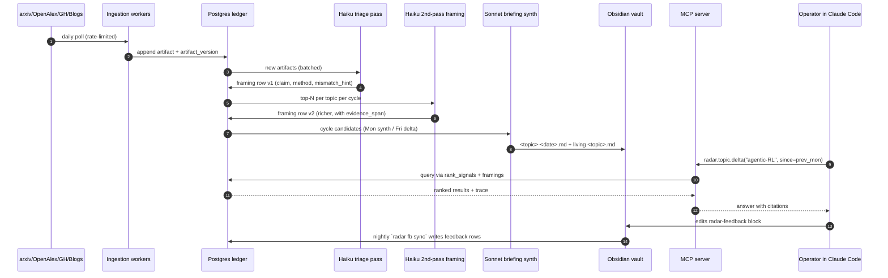

# Idea 002 · Opus · Final Position

**Author**: Opus 4.7 Max
**Timestamp**: 2026-04-23
**Debate stages digested**: S1A + S1B + S2R1 + S3R1 + S3R2 + S3R3, plus the
synthesis, checkpoint, and all 4 operator answers in `002-moderator-notes.md`.
**Status**: This document is consolidation, not extension. No new speculation.

---

## 1. My final recommendation (TL;DR, 5 bullets max)

1. **Build a lab-internal Research Radar** (NOT a SaaS), organized around
   the operator's 8 seed topics, emitting a **twice-weekly briefing** into
   his Obsidian vault plus an **MCP query surface** that Claude Code can
   call on demand — no web UI, no dashboard.
2. **One normalized PostgreSQL ledger**, append-only on artifacts /
   framings / evidence / link transitions; `rank_signals` and
   `ranker_version` first-class; `idea_candidate` tables **reserved** for
   the Direction-B upgrade path but **non-authoritative** in v1 (no
   artifact can require an idea-candidate assignment to appear anywhere).
3. **Framings, not scores.** The system extracts `claim`, `method`,
   `why-it-matters`, `mismatch_hint`, `adjacent-prior-work` per artifact.
   It never surfaces an "impact: 0.87" number as a primary sort key.
   Novelty-hint stays advisory, labeled as such.
4. **Recall-first architecture with two surfaces**: the briefing is what
   the operator *reads* (≤15 items × 2 briefings/week); the inbox is what
   the system *promises it saw* (queryable via MCP, not scanned linearly).
   That division is the recall-bias contract.
5. **8-week solo build, 3 explicit gates** (Gate A end-of-week-1 =
   seed corpus + cold-start briefing + labeling loop live; Gate B
   end-of-week-3 = GEPA-shaped eval set with negatives + controls; Gate C
   end-of-week-5 = Mon+Fri cadence + feedback-loop proving the ranker can
   be steered). Plus Gate A.5 at week 2 decides hybrid retrieval in/out
   on evidence, not argument.

---

## 2. Full technical proposal

### 2.1 System shape

```text
┌─────────────────────────────────────────────────────────┐
│                    INGESTION LAYER                      │
│  arxiv · OpenAlex · Semantic Scholar · OpenReview ·     │
│  GitHub trending · operator-whitelisted blogs           │
│  [X adapter: schema + stub only, no v1 client]          │
└──────────────────┬──────────────────────────────────────┘
                   ↓
┌─────────────────────────────────────────────────────────┐
│              NORMALIZATION + LEDGER STORE               │
│  artifact · artifact_version · topic · topic_artifact_  │
│  link · framing · evidence_span · briefing_cycle ·      │
│  briefing_item · feedback · rank_signals ·              │
│  idea_candidate (reserved) · idea_candidate_member      │
│  Append-only on artifacts / framings / link state       │
└──────────────────┬──────────────────────────────────────┘
                   ↓
┌─────────────────────────────────────────────────────────┐
│           TRIAGE + RANKING LAYER                        │
│  Recall-first: every artifact scored, none dropped      │
│  v0 rank = w·(BM25 + pgvector/sem + recency +           │
│            centroid_shift); no ML learning in v1        │
│  Haiku 4.5 second-pass framing on top-N per topic       │
│  mismatch_hint on every framing (trace-level v1)        │
└──────────────────┬──────────────────────────────────────┘
                   ↓
         ┌─────────┴─────────┬──────────────────┐
         ↓                   ↓                  ↓
  ┌──────────────┐    ┌──────────────┐   ┌──────────────┐
  │ BRIEFING     │    │ INBOX        │   │ MCP SURFACE  │
  │ Mon+Fri AM   │    │ (read-thru   │   │ 8 tools,     │
  │ Obsidian md  │    │ via MCP)     │   │ stdio        │
  │ cycle_kind=  │    │ per topic +  │   │ read-same-   │
  │ {synth,delta}│    │ global       │   │ store        │
  └──────────────┘    └──────────────┘   └──────────────┘
```

### 2.2 Pinned stack (v1)

- **Runtime**: Python 3.12, `uv` for env.
- **Storage**: PostgreSQL 16 with `pg_trgm`, full-text search, JSONB,
  `pgvector` (installed day 1, used by ranker only if Gate A.5 passes).
  Single primary, backups to local disk + weekly encrypted snapshot. No
  separate vector DB.
- **ORM**: SQLAlchemy 2.x + Alembic.
- **Embeddings**: local BGE-M3 on the 4090 (~1.5 GB VRAM), batched;
  embeddings cached per `artifact_version`, never recomputed.
- **LLM routing** (v0 defaults):
  - *Triage pass* (every artifact): Haiku 4.5. Extracts `claim_span`,
    `method_span`, `novelty_hint`, `mismatch_hint`. Budget: ≤2k input +
    ≤400 output.
  - *Second pass* (top-N per topic per cycle): Haiku 4.5 with a richer
    framing schema. Budget: ≤8k input + ≤800 output.
  - *Briefing synthesis*: Sonnet 4.6, one pass per topic per cycle.
    Budget: ≤10k input + ≤2k output.
  - *No Opus in v1.* Cost discipline per CLAUDE.md "Prohibited."
  - GLM-4.6 / MiniMax-M2 held as cost-optimization fallback if observed
    Haiku run-rate exceeds ~$20/week (Gate A.5 cost audit decides).
- **Scheduler**: plain `cron` + `systemd timers`. No Airflow/Prefect.
- **HTTP / ingestion**: `httpx`, `trafilatura` for blog HTML, strict
  `robots.txt` via `urllib.robotparser`, per-host 1 req / 5s cap, RSS
  fallback where offered.
- **MCP server**: Python MCP SDK, stdio transport for Claude Code.
- **Briefing sink**: Obsidian vault at
  `~/obsidian-vault/research-radar/YYYY/MM/YYYY-MM-DD-<topic>.md`; a
  parallel `<topic>.md` living-page view regenerated each cycle.
- **Tests**: `pytest`; real Postgres in Docker (per CLAUDE.md — no mocked
  DB on critical path).
- **Lint/format**: `ruff`.
- **Observability**: structured JSONL logs; per-artifact cost telemetry
  in Postgres; `radar.health()` MCP tool for live status.

### 2.3 Data model — canonical tables

```text
artifact                -- append-only; unique on (source, source_url)
artifact_version        -- immutable snapshot; (artifact_id, fetch_ts)
topic                   -- {candidate | active | archived}; max 15 active
topic_artifact_link     -- append-only on state transitions; carries
                        --   (relevance_score, relevance_reason, link_state,
                        --    first_seen_at)
framing                 -- immutable; keyed by (artifact_id, prompt_version,
                        --   model, created_at); has superseded_by FK
evidence_span           -- (framing_id, field_name, text_range, source_uri)
rank_signals            -- (artifact_id, topic_id, lex_score, sem_score,
                        --   recency_score, centroid_sim, confidence,
                        --   ranker_version) — separate table so a new
                        --   ranker_version regenerates signals without
                        --   updating in place
briefing_cycle          -- (cycle_date, cycle_kind ∈ {synthesis, delta},
                        --   topic_id, ranker_version, created_at)
briefing_item           -- (cycle_id, topic_id, artifact_id, rank_pos,
                        --   section, rationale, ranker_version)
feedback                -- (briefing_item_id OR artifact_id, kind, note,
                        --   operator_ts); kind ∈
                        --   {useful, noise, missed, wrong_frame,
                        --    should_track_topic}
idea_candidate          -- RESERVED: operator-authored only in v1
idea_candidate_member   -- RESERVED: operator-confirmed only in v1
```

**Hard invariant** (GPT's R2 boundary, adopted): no artifact needs an
`idea_candidate` assignment to appear in briefing, inbox, or MCP search.
B-compatibility is schema discipline, never product dependency.

### 2.4 Ranking — the v0 spec

Transparent, 4-signal weighted rank — no black-box LLM score, no
click-trained weights (filter-bubble mitigation):

```
rank = w1·lex_score       # BM25 over (title, abstract, method section)
     + w2·sem_score       # cos(artifact_embedding, topic_centroid)
     + w3·recency_score   # exp(-Δdays / half_life_topic)
     + w4·centroid_shift  # distance from prior-cycle topic centroid
     + bias_terms         # optional per-source / per-author priors
```

Defaults: `w = (0.30, 0.30, 0.20, 0.20)`, per-topic tunable.
`half_life_topic` defaults to 21 days, tunable per topic.
`topic_centroid` = EMA over (curated seed artifacts + operator-marked-
useful artifacts in last 30 days), recomputed weekly.

`sem_score` ships only if Gate A.5 passes (see §2.6).

### 2.5 Output — briefing + inbox + MCP

**Briefing** (Mon synthesis + Fri delta; same Obsidian template,
`cycle_kind` separates semantics):
- ≤15 items per topic per briefing
- sections: `NEW & MOVING`, `CARRYOVER (materially reframed)`,
  `POSSIBLY OVERHYPED`, `POSSIBLY UNDERRATED`, `MISMATCH WATCH` (gated
  — empty if below precision bar; see §2.7)
- every item: claim / method / why-it-matters / links / mismatch flag /
  rank signals / `<!-- radar-feedback: -->` block

**Inbox** (not a reading surface — a recall guarantee):
- full ranked list of every artifact ingested since cycle X, queryable
  by MCP only. ~1,700–2,100 items/week at measured volume. The operator
  does not scan this linearly; he *queries* it when he needs to know
  "did we see X?"

**MCP surface — 8 tools, day-1, stdio**:

| # | Tool | Purpose |
|---|---|---|
| 1 | `radar.topic.briefing(topic, cycle?)` | Latest Obsidian briefing body for a topic |
| 2 | `radar.topic.inbox(topic, since?, limit?)` | Full ranked inbox, recall-first |
| 3 | `radar.topic.delta(topic, since_cycle?)` | What changed on topic T since cycle C: new artifacts, re-framings, promotions/demotions |
| 4 | `radar.topic.contrarian_view(topic)` | Items the default ranker hid or deprioritized, with promotion rationale (serendipity valve) |
| 5 | `radar.search(query, topic_filter?, since?, limit?)` | Natural-language search over claims + methods + framings; recall-first ranked output |
| 6 | `radar.artifact.trace(artifact_id)` | Framing + evidence spans + rank signals + feedback history — the GEPA-case surface |
| 7 | `radar.health()` | Ingest backlog, last-cycle cost, per-source status; fails loudly when a source goes down |
| 8 | `radar.feedback.record(artifact_id, kind, note?)` | Capture feedback in-flow without leaving Claude Code |

### 2.6 Hybrid retrieval — decided by Gate A.5, not by argument

Gate A.5 (end of week 2, blocking for week-3 second-pass framing):
- Three-way eval: lex-only · sem-only · hybrid (BM25 + pgvector + RRF
  via `pg_textsearch` or `ParadeDB`) against week-1 seed labels plus
  operator-confirmed cross-phrased queries.
- **Pass conditions**: hybrid recall@20 ≥ lex-only + 10 pp, **OR**
  hybrid recovers ≥ 2 cross-phrased cases lex-only misses.
- **If pass** → hybrid is the default ranker signal; `sem_score`
  active. **If fail** → v1 ships lex-only + centroid + recency; pgvector
  stays installed but unused by ranker; revisit in v1.5.
- Either outcome is a successful gate. The gate decides; it does not
  force hybrid to win.

### 2.7 GEPA-shaped mismatch detection — gated promotion

`mismatch_hint: {flag, kind, confidence, evidence_span_id}` is computed
on every second-pass framing from week 3. The briefing shows it in two
stages, gated on evidence:

- **Weeks 3–5** (trace-level): the briefing body can inline a mismatch
  mention only when `confidence >= 0.85` AND the framer flagged it
  spontaneously (was not prompted to find one).
- **Week 6 decision** (Gate C-adjacent): run eval on the labeled set
  from Gate B — ≥ 10 genuine + ≥ 10 not-genuine + ≥ 5 flashy-
  method-aligned controls.
- **Promotion bar**: `precision@10 ≥ 0.7` AND operator judges ≥ 5 of
  top-10 flags "genuinely useful." If met → named `MISMATCH WATCH`
  briefing section live in week 7. If not met → remains trace-level
  indefinitely; revisit in v1.5 with more data.

Named sections are trust surfaces; we earn the name.

### 2.8 Feedback capture — Obsidian frontmatter + MCP fallback

Each briefing item writes a `<!-- radar-feedback: kind: ... | note: ...
-->` block. Operator edits in-place in Obsidian. A nightly cron
(`radar fb sync`) parses the vault, writes `feedback` rows, archives
the comment. No web form, no separate app.

`radar.feedback.record(...)` MCP tool for in-flow feedback during
Claude Code sessions — same table, different surface.

**Gate-C bar** (GPT's refined metric, adopted): ≥ 8 labeled items per
cycle AND ≥ 3 corrective labels per 2 weeks across `noise` /
`wrong_frame` / `missed`. Per-item percentage targets are too sensitive
to briefing size.

### 2.9 Topic lifecycle

- States: `candidate → active → archived`. No deletion.
- Annual review via `radar.topic.review()` (operator-triggered, not
  calendar-cron).
- Archiving preserves all artifacts + past briefings; topic page
  becomes read-only; briefing cron skips it; queries still return it
  with a topic-archived flag.
- Hard limit: 15 active topics. A candidate that would exceed 15 is
  refused until an active topic is archived.
- New topic: `radar.topic.create(name, seed_keywords, seed_papers)`;
  `candidate` until first successful ingest cycle.

### 2.10 Deployment

- Single Linux box with the 24 GB 4090 (operator's existing hardware).
- `systemd` services: ingestion workers (one per source, rate-limited),
  embedding worker, briefing cron, MCP server (started by Claude Code
  via stdio).
- Postgres on the same box; backups nightly to a local external disk
  + weekly encrypted snapshot to a second location.
- **Day-1 hardware check**: confirm 4090 availability window
  (batched embedding jobs compete with other lab workloads for VRAM).
  Flagged in the build-phase checklist.

### 2.11 Diagrams



---

## 3. MVP plan

### 3.1 Phase 0 — Proof of concept (3 days)

**Goal**: prove the triage + framing loop is cost-viable and
quality-viable on a single topic.

- Day 1: ingest 90-day backfill for 1 topic (`agentic-RL`) from arxiv +
  OpenAlex; stand up minimal artifact + framing tables; run Haiku
  triage + framing on ~500 artifacts.
- Day 2: hand-grade a 30-paper sample for (claim-span accuracy,
  method-span accuracy, mismatch-hint precision). Measure cost per
  framing.
- Day 3: decide — Haiku (current plan) or cost-escalate to Sonnet-small
  / downshift to GLM. Write a one-pager committing to the pick.

**Acceptance**: claim + method spans correct on ≥ 80% of sample; cost
≤ $0.01 per framed artifact; mismatch-hint precision ≥ 0.5 (noisy but
directionally useful; we'll gate the named feature later).

**If fails**: stop and re-estimate before committing to the 8-week plan.
Better to discover at day 3 than at week 4.

### 3.2 Phase 1 — v0.1 shippable (8 weeks from PoC completion)

Three gates. Each is binary — moderator can read the state and tell if
the build is on track.

**Gate A · end of week 1**
- 8 seed topics loaded (operator's Q-M1 list: `agentic-RL`,
  `agent-self-evolution`, `diffusion-LLMs`, `compressing-LLM-reasoning`,
  `novel-LLM-architectures`, `on-policy-distillation`,
  `LLM-explainability`, `LLM-adapters`).
- 90-day topic-scoped backfill completed.
- All canonical tables live.
- First cold-start briefing generated from the backfill (intentionally
  wrong; its job is to surface items for labeling).
- Operator labels ≥ 20 seed items in Obsidian OR via MCP.
- `radar.artifact.trace(...)` works on every item that appeared in the
  seed briefing.
- `ranker_version = "v0.1-coldstart"` committed to every briefing_item
  row; cost telemetry surfaces tokens + dollars for the seed briefing.

**Gate A.5 · end of week 2** (hybrid-retrieval decision)
- Three-way retrieval eval run against week-1 seed labels plus
  ≥ 5 operator-confirmed cross-phrased queries.
- Decision committed in writing: hybrid is `blocking-v1` or `deferred-v1.5`.
- Week-2 cost audit: if observed weekly run-rate on Haiku exceeds $20,
  switch triage to GLM-4.6 and re-run the eval with downgraded first-pass.

**Gate B · end of week 3**
- Second-pass framing pipeline (Haiku 4.5) live; `mismatch_hint`
  populated on every framing.
- GEPA-shaped eval set complete: ≥ 10 genuine mismatches + ≥ 10
  not-genuine + ≥ 5 flashy-method-aligned controls.
- First ranker comparison (lex vs. sem vs. hybrid, if pass) run on
  labeled seed set; rank_signals stored with `ranker_version`.
- Mismatch stays trace-level (not a named briefing section yet).

**Gate C · end of week 5**
- Mon synthesis + Fri delta cadence live across all 8 topics (same
  Obsidian template; `cycle_kind` separates semantics).
- Feedback loop proving the ranker can be steered: ≥ 8 labeled
  items/cycle AND ≥ 3 corrective labels (`noise` / `wrong_frame` /
  `missed`) per 2 weeks.
- Briefing useful enough that operator still opens it.

**Week 6** — MCP server + 8 tools; `contrarian_view` implementation;
mismatch `precision@10` eval on the Gate-B labeled set. Promotion
decision for the named `MISMATCH WATCH` section.

**Week 7** — If mismatch passed Gate C promotion: ship the named
section. Topic lifecycle commands. X adapter stub + schema fields.
Begin the 4-week A/B experiment on Friday delta-eligibility (carryovers
vs. delta-only).

**Week 8** — Hardening. Backup/restore drill. Rate-limit edge cases.
Cost audit. Operator runbook committed to `projects/002-*/README.md`.
`ranker_version` audit log shipped.

### 3.3 Phase 2 — v1.0 commercial / durable (weeks 9–24)

"Commercial" here means **commercial-grade as an internal tool**, not
"SaaS." The honest framing (synthesis §8) is personal-tool-with-
publishable-internals.

Priorities in order:
1. **Hybrid retrieval calibration** (if Gate A.5 passed): re-eval at
   weeks 10 and 14 as more labeled cross-phrased queries accumulate.
2. **Friday delta-eligibility decision**: the 4-week A/B from week 7
   completes; commit to one variant.
3. **Mismatch section maturation** (if promoted): expand the eval set
   to 50+ labeled cases; tune the detector on real-world performance.
4. **Idea-candidate clustering — cautious v1.5 entry**: operator can
   now author ~15–30 idea candidates from accumulated artifacts. Start
   showing *suggested* idea-candidate memberships in `radar.trace` but
   require operator confirmation. No auto-population.
5. **X adapter v1**: implement the actual client behind the feature
   flag; operator defines the accounts-to-watch list; ingested X posts
   become a new artifact type subject to all the same framing/ranking.
6. **Second-researcher access**: if the operator brings in another
   researcher, expose read-only MCP surface with per-user feedback
   namespacing. This is where the "multi-user" question first appears
   honestly.
7. **Cost & ops hardening**: rotate API keys via a vault; alerting on
   health-tool regressions; cost dashboard.

Explicitly out of scope for v1.0, even at month 6:
- No web UI.
- No auto-clustering of idea candidates (operator-authored only).
- No cross-lab sharing.
- No fine-tuned local models.
- No paywalled content.
- No "chief of staff" auto-decision-making surfaces.

---

## 4. Consensus with GPT

I'm strict about this — "both mentioned X" doesn't count. These are
things we both *committed to* as the way forward by the end of S3R3.

1. **A-primary is the right v1 surface.** Both endorsed the topic-
   ledger-briefing direction over B (idea-migration), C (project-
   linked), and D (MCP-only). Neither of us wavered after Q-M2
   confirmed project-state discipline doesn't exist.
2. **B-compatibility is a schema discipline, never a product
   dependency.** GPT's R2 §2.4 invariant ("no artifact should need an
   `idea_candidate` assignment to appear in briefing / inbox / MCP")
   became my Concession #5 in R3. Both accept this as a hard rule.
3. **D from v1, same underlying store.** Not optional garnish — both
   treat the MCP surface as part of how the operator will interrogate
   the ledger during the week. Consistent across our S2R1s, S3R1s,
   and S3R2s.
4. **Framings, not scores, as the primary output.** Driven by S1B
   evidence (NovBench, GraphMind, Literature-Grounded Novelty,
   DeepReview). Both rounds of S3 centered the product on auditable
   framings — claim / method / mismatch_hint / adjacent-work — with
   novelty-hint demoted to advisory.
5. **Recall-first via briefing + inbox split.** Briefing = reading
   surface (≤ 15 items × 2 briefings/week). Inbox = recall guarantee
   (queryable, not scanned). GPT adopted this as concession #1 in S3R2;
   I adopted it as the product contract in R2.
6. **Append-only artifact / framing / evidence / link-state
   transitions.** Reproducibility as a database property, not a
   test-suite concern. `artifact_version`, `rank_signals`, and
   `ranker_version` are first-class.
7. **Named mismatch section gated behind precision@10 ≥ 0.7 + operator
   utility.** Trace-level field from week 3; named section only after
   the Gate-C-adjacent eval. This is Pattern B (authoritative nonsense)
   mitigation — named surfaces are trust surfaces.
8. **Twice-weekly cadence with same template, `cycle_kind` separating
   Mon (synthesis) from Fri (delta).** Resolves the R2/R3 Disagreement
   2 into one data-plane column + one A/B experiment on delta-
   eligibility. Both of us signed off.
9. **Hybrid retrieval in v1, decided by Gate A.5.** Not argued; tested.
   My R2 pushed "hybrid from day 1"; GPT's R2 pushed "hybrid proven
   first"; R3 collapsed both into an explicit gate with a metric and a
   pre-committed response to either outcome.
10. **Obsidian-first feedback capture** with nightly `radar fb sync`
    cron + MCP `feedback.record` fallback. No web form, no separate app.
    Gate-C bar = absolute quotas (≥ 8 labeled/cycle, ≥ 3 corrective/2
    weeks), not percentages.
11. **8-week solo build, 3 named gates + Gate A.5.** Cost envelope
    $6–$25/week at observed volume.
12. **Cold-start discipline as week-1 principle.** Week 1 is only
    "done" when a seed corpus + first cold-start briefing + labeling
    loop all exist — not when ingestion adapters are online. GPT's R2
    §1 adoption of my R2 §2.5.

---

## 5. Residual disagreements

**None remain at the architectural level.** Both my R3 and GPT's R2
marked READY-TO-CONCLUDE. What stays open are *scheduled in-build
experiments*, not unresolved debates:

### 5.1 Friday delta-eligibility (should carryovers be re-surfaced?)

- **GPT's view**: Friday should be semantically delta-only — include
  only newly arrived or materially re-framed items since Monday.
  Carryovers reduce Friday's distinct signal.
- **My view**: Friday is full-structured over a 4-day window, including
  high-signal carryovers that remain top-ranked. Structural symmetry
  with Monday reduces cognitive re-orientation cost.
- **Who's more likely right**: honestly, I'm not sure — both priors
  are plausible and both survive the data-plane resolution (`cycle_kind`
  + same template). GPT's instinct fits generic knowledge-work patterns;
  mine is a closer read of the operator's symmetric Q-M3 phrasing
  ("周一早上，周五早上"). **My honest view is 55/45 toward GPT's delta-
  only, not the other way around** — the operator said "I read on those
  two days," not "I want equal-weight briefings on those two days," and
  the delta framing is the more honest product claim if the signal
  volume really is lighter Mon→Fri.
- **Experiment that settles it**: the 4-week A/B scheduled in week 7
  (Variant A: full over 4-day window with tagged carryovers; Variant
  B: delta-only, no carryovers unless materially re-framed). Metric:
  per-briefing open rate × items-clicked-through × operator's explicit
  `useful` count.

### 5.2 Feedback-loop completion rate target

- **GPT's view**: absolute quotas (≥ 8 labeled items/cycle + ≥ 3
  corrective labels / 2 weeks) are the right bar for a solo operator.
- **My view** (R2): ≥ 40% of items in last 3 briefings have non-empty
  feedback. I self-critiqued this number as a guess in R2 §6 and
  adopted GPT's absolute quotas in R3.
- **Who's right**: GPT, probably. My R2 number had no grounding; GPT's
  quotas are more realistic for a single-operator tool. But GPT's own
  R2 self-critique noted the quotas may *starve* the ranker of
  corrective signal. **My honest view: GPT's quotas ship; we revise
  upward at Gate C + 2 weeks if the actual labeling rate is higher
  than the quota requires.**
- **Experiment that settles it**: Gate C measures the real rate. If
  we observe ≥ 20% of items labeled across 3 cycles without prompting,
  the quota is too forgiving and we tighten it. If we observe < 8
  labeled/cycle, the mechanism is failing and we redesign (likely a
  weekly 3-prompt questionnaire).

### 5.3 "Did we need to build this at all?"

Not a disagreement between Opus and GPT — but the one residual
disagreement between *the debate* and *the operator's deferred
counterfactual*. Stage 2 §6 flagged that neither debater priced the
cost of *not* building this, i.e. using Semantic Scholar Research
Feeds + Zotero + papersgpt for 4–6 weeks first and generating a
concrete gap list.

The operator chose Advance, which closes that decision path. But the
honest engineering admission is that v1 has a failure mode where,
after 6 weeks in production, the operator discovers 80% of v1's
usefulness was already available in commodity tools at 5% of the
build cost. I can't reduce this probability at the architectural level,
but I want finals to acknowledge it as a known residual risk, not a
month-4 surprise.

---

## 6. Where GPT was stronger than me

Intellectual honesty — these are framings, catches, or discipline
where GPT's version was better than mine.

1. **"The system is a triage + memory + audit substrate, NOT an AI
   that issues verdicts."** (GPT S2R1 §1.) My S2R1 kept the phrase
   "auditable verdicts," which retains system-issues-verdicts ambition
   that Stage 1 evidence (novelty-scoring fragility) doesn't support.
   GPT's framing is weaker on system claim and stronger on product
   honesty — it's the right north star. I adopted it as S3R1 Concession
   #1. This reframing changed the UX: briefings now show framings (claim
   / method / adjacent work / mismatch) rather than scores (novelty:
   0.87). A principled product claim I didn't reach on my own.

2. **"Named surfaces are trust surfaces — earn the name."** (GPT S3R1
   §5 Disagreement 2.) My S3R1 shipped "headline/method mismatches"
   as a day-1 named briefing section with the precision gate measured
   at week 6. That ships a *claim-surface* ("we flag overhyped papers")
   for 5 weeks before it's validated. GPT correctly identified this as
   Pattern B (authoritative nonsense) — if the section fires noisily
   for 5 weeks, the operator's trust in *all* briefing sections
   degrades. GPT's precision-gated promotion (trace-level v1 with a
   week-6 Gate-C bar for the named section) is more conservative and
   more correct.

3. **"Preference prison" as the sharper framing of filter-bubble risk.**
   (GPT S1A Part B.) My S1A gestured at taste-training-on-own-priors
   and taste-development atrophy. GPT named it "preference prison"
   — *narrowing curiosity instead of expanding it* — which is the
   actionable formulation. I credited this in S1B §1. The label survived
   into the synthesis as one of the cross-cutting concerns (Pattern F).

4. **"Which failure hurts more: missed important work or too many
   false positives?"** (GPT S1A Part C.) I simply did not ask this.
   It's the core product-tradeoff question and GPT surfaced it as a
   question to be answered, not a position to defend. The operator's
   answer (`更怕漏报`) became the single most load-bearing design
   constraint — and my S1A hadn't set up the question that made the
   answer useful.

5. **Semantic Scholar Research Feeds as ready-made prior art.** (GPT
   S1B §2.) I did not surface this in my S1B, despite naming 10+ other
   tools. GPT's catch collapsed the "AI-personalized daily paper feed"
   direction into "what does OUR version do that Research Feeds
   doesn't?" — which forced the Stage 2 novelty claim to anchor on
   project-awareness / idea-migration rather than on personalization
   per se.

6. **Gates A/B/C as moderator-readable launch gates.** (GPT S3R2 §2.1.)
   My S3R1 shipped a week-by-week sequence; GPT transformed it into
   explicit binary gates that the moderator can read to judge progress.
   Weeks are descriptive; gates are testable. I adopted this in R3 §2.

---

## 7. Where I was stronger than GPT

Named with the same discipline as §6. Two things I caught that GPT
didn't, and why each mattered.

1. **Cold-start week-1 deliverable**. (S3R2 §2.5.) Both R1 rounds
   described mature architecture but neither described the first 7
   days of reality. I wrote a concrete cold-start protocol (Day 1–2
   backfill → Day 2–3 seed centroid from operator-supplied canonical
   papers → Day 3 cold-start briefing → Day 4–5 live ingestion begins
   → Day 7 first live briefing) that turned "week 1 ingestion is
   online" into "week 1 ends with a labeling loop." GPT adopted this
   as their R2 Concession #1 and made it a first-class principle for
   Stage 3. Without this, weeks 2–4 would produce a ranker we couldn't
   evaluate — the most common internal-tool failure mode in this space
   (Pattern D: manual-pipeline decay).

2. **Ranking algorithm spec with transparent 4-signal weighted
   formula**. (S3R2 §2.3.) GPT's S3R1 wrote "rank transparently" but
   didn't specify what that meant operationally. I wrote the explicit
   `rank = w1·lex + w2·sem + w3·recency + w4·centroid_shift` formula
   with concrete defaults (0.30/0.30/0.20/0.20), half-life tuning,
   centroid EMA update rules, and the explicit decision to *never*
   train weights from click data (filter-bubble mitigation, Pattern F).
   This turned "the ranker is transparent" from a product promise
   into a schema + code decision. GPT's R2 adopted `rank_signals` as
   first-class data — their Concession #2 — which only makes sense
   given the explicit formula.

Honorable mention — three more where I pressed harder than GPT but
the calls are more tied:

- **Hybrid retrieval in v1** as a non-optional recall-promise
  requirement (S3R2 §3 D1). GPT pushed back correctly on "week-1
  blocking" vs. "v1 blocking"; the Gate-A.5 resolution is a
  collaboration. Still, I think the argument that the GEPA pain case
  is *structurally* a cross-phrasing recall failure was load-bearing
  and GPT didn't surface it.
- **Feedback-capture spec with Obsidian frontmatter + nightly sync**
  (S3R2 §2.8). GPT's S3R1 Decision Question 2 raised the need but
  didn't answer it. My spec (Obsidian sidecar CLI / file-watcher,
  mirrored by `radar.feedback.record` MCP tool) became the v1 design.
- **GEPA eval-set harvest protocol** (S3R2 §2.9). Both R1s said "need
  10–20 examples" without saying *how to get them*. My 3-step harvest
  (synthetic Haiku generation → operator labels → week-3 decision
  point with genuine_count ≥ 10 gate) closed the "what if the operator
  doesn't have 10 examples?" failure mode.

---

## 8. Top 5 actionable recommendations for the moderator

Prioritized; each with recommendation, why, effort, and risk-if-
skipped.

### R1 · Supply ≤ 5 canonical seed papers per topic before day 3

- **Recommendation**: For each of the 8 topics from Q-M1, name ≤ 5
  canonical "this is what we mean by this topic" papers. Format:
  `{topic}: arxiv_id_1, arxiv_id_2, ...`. Can be a few hand-picked
  2024–2026 papers per topic; doesn't need to be exhaustive.
- **Why**: Week-1 seed centroid is computed from these. Without them,
  `sem_score` has nothing to compare against and the ranker degrades
  to lex+recency only. My R3 §5 self-critique flagged that this
  assumes operator can supply them in 2 days — making the request
  explicit upfront avoids the degraded cold-start.
- **Effort**: ~30 minutes operator time. 5 papers × 8 topics = 40
  arxiv IDs. Can be pulled from what the operator has already marked
  interesting.
- **Risk if skipped**: Fallback is auto-seed from top-5 arxiv
  keyword-search results per topic, which are measurably worse
  centroids. Cold-start briefing on day 7 will be noisier; the first
  feedback-weighted centroid update (week 2) has to correct more.

### R2 · Confirm 4090 availability window on day 1 of build

- **Recommendation**: Before the build worker starts, operator writes
  one sentence: "The 4090 is available for Radar ingestion jobs
  during these hours: X-Y" (e.g., "overnight 22:00–07:00 + weekends").
  If the 4090 is heavily used for other lab workloads, the embedding
  job schedule has to work around that.
- **Why**: Batched BGE-M3 embedding on the 2,500-artifact backfill is
  ~2 hours of 4090 time. If the 4090 is running training jobs 20/7,
  the embedding job can't complete on day 1 and Gate A slips.
- **Effort**: 5 minutes of operator time. One sentence.
- **Risk if skipped**: Silent week-1 VRAM contention. Worst case: the
  embedding worker OOMs on a batched job and Gate A slips by 3–5 days.
  This is exactly the kind of environmental gap S3R3 §5 flagged.

### R3 · Commit to a 6-week behavioral test, not a 6-month one

- **Recommendation**: Write the success criterion for v1 in one
  sentence, in advance. My proposal: *"By end of week 6 after Gate C,
  I have opened ≥ 8 briefings (out of 12 total Mon+Fri briefings), and
  I can name ≥ 2 specific instances where Radar helped me catch
  something I would otherwise have missed."* Set the criterion now;
  judge at that milestone; abandon if missed.
- **Why**: Pattern A (useful-but-niche plateau) is the dominant failure
  mode. A 6-month drift where the briefing becomes a Monday ritual that
  slowly stops changing behavior is far more likely than a catastrophic
  week-2 failure. The way to avoid it is a pre-committed behavioral
  test — not a post-hoc "well, I still open it sometimes."
- **Effort**: 15 minutes to draft the criterion; re-read at week 6 +
  Gate C.
- **Risk if skipped**: The tool becomes a zombie — used enough not to
  delete, not enough to justify 6 months of build. Synthesis §8
  "personal-tool-with-publishable-internals" framing directly says
  this is the likely outcome unless actively guarded against.

### R4 · Budget 10–20 historical GEPA-style cases into week 2–3

- **Recommendation**: Operator blocks 2 hours during weeks 2–3 to
  review ~30 Haiku-generated candidate mismatches and label them
  `genuine / not_genuine / borderline`, plus volunteer 5–10 incidents
  from memory. This feeds the Gate-B labeled set (≥ 10 genuine + ≥ 10
  not-genuine + ≥ 5 controls).
- **Why**: The mismatch detector is the one v1 feature where "GPT's
  gating discipline" (§2.7) depends on operator-supplied ground truth.
  If the operator doesn't deliver labels in weeks 2–3, the feature
  silently pushes to v1.5 and one of the headline v1 capabilities
  evaporates.
- **Effort**: 2–3 hours of operator time split across weeks 2 and 3.
- **Risk if skipped**: Named `MISMATCH WATCH` section never ships;
  v1 ships without the "we help you catch GEPA-style overclaims"
  feature that was Q-M4's direct response. The product still works;
  it loses its most distinctive piece.

### R5 · Pre-commit to abandon conditions before starting

- **Recommendation**: Write, now, the three scenarios under which v1
  gets abandoned and not patched. Proposed list: (a) Gate A slips by
  > 1 week (signals the seed/backfill/label loop is fundamentally
  harder than estimated); (b) Gate C feedback rate < 8 labels/cycle
  across 3 cycles with no recoverable explanation; (c) 6-week
  behavioral test (R3) missed.
- **Why**: Sunk-cost fallacy is the dominant failure mode for
  internal tools that almost work. Pre-committing to abandon
  conditions now, when the decision is cheap, makes it possible
  later, when the decision is expensive.
- **Effort**: 20 minutes to draft the 3 scenarios + commit criteria.
- **Risk if skipped**: Build continues past the point where evidence
  says to stop. Month-4 abandonment is 4x the cost of week-6
  abandonment.

---

## 9. What I would want to know before shipping

Open questions the moderator must still answer (interviews, metrics,
legal). These are not architecture-blocking — v1 can be built without
them — but they sharpen v1.0 and later.

1. **Does the operator use the Radar during the day, or only Mon+Fri
   AM?** Q-M3 told us Mon+Fri AM are reading windows. What we don't
   know: does he *query* Radar from Claude Code during the day (i.e.,
   does the MCP surface get pull-traffic), or is the briefing the only
   surface actually exercised? This changes the priority of weeks 6–8
   MCP-surface polish vs. briefing-quality polish. *How to learn*: the
   cost telemetry + `radar.health` logs will show MCP query counts
   from week 6. Check at Gate C.

2. **What is the operator's recall ceiling preference?** He said
   "更怕漏报, 可以接受小部分误报" — recall > precision. But the v1 inbox
   has ~1,700–2,100 items/week. At what rank-position does he stop
   trusting the ranker entirely? If it's rank-50, the briefing's top-
   15 captures the trusted zone. If it's rank-200, we need a different
   inbox surface (MCP search with confidence threshold knobs). *How
   to learn*: week-6 operator interview (15 minutes) to map his
   personal recall-confidence curve.

3. **Is the current list of 8 topics stable, or already drifting?**
   Q-M1 gave us a snapshot on 2026-04-23. The operator said topics
   drift ±2–3 per year. How much has drifted already — are any of
   the 8 topics already less "live" than they were 2 months ago? *How
   to learn*: simple operator check before Gate A: "for each of the
   8 topics, rate active / declining / exploratory." Affects seed-
   paper selection and ranker half-life tuning.

4. **Does the operator want Radar outputs to be shareable?** v1 is
   strictly single-user (the lab-internal framing per S2R1). But if
   the briefings become high-value, will other researchers ask for
   access? If yes, feedback-capture needs per-user namespacing at
   v1.0 (Phase 2), not v2. *How to learn*: operator pre-decides in
   week 8 whether he plans to show briefings to students; if yes,
   Phase 2 priority #6 (second-researcher access) moves earlier.

5. **What's the operator's maintenance-tax tolerance?** v1 requires
   weekly feedback labels (≥ 8/cycle) to keep the ranker useful. If
   after 6 weeks the operator says "this works but I can't sustain
   the labeling," that's a v1.5-shaped problem: can we move to
   implicit-signal feedback (clicks, dwell time in Obsidian)? Pattern
   F (filter-bubble) says no to pure-behavioral training; but a
   mixed-signal approach is viable. *How to learn*: Gate-C + 2 weeks
   check-in on whether labeling feels like a tax or a habit.

---

## 10. Signing off

**I believe this proposal is ready for SDD conversion.**

Both sides marked READY-TO-CONCLUDE (GPT in S3R2, me in S3R3). All
architectural disagreements collapsed cleanly — two into explicit
gates (A.5 hybrid-retrieval, Friday-delta-eligibility A/B), one into
a data-plane column (`cycle_kind`). Five concessions on each side.
The protocol's S3 → Finals bar is met: ≥ 3 substantive disagreements
resolved (mismatch-gating, hybrid-sequencing, Friday-semantics,
cold-start, feedback-metric, labeled-set-composition); ≥ 5 consensus
points beyond the proposal (the 12 listed in §4); each side named ≥ 2
things the other caught (§6 and §7 here each contain 6+).

Remaining opens are:
- **In-build experiments** (Gate A.5 hybrid decision; Friday delta
  A/B): scheduled, falsifiable, with pre-committed responses to
  either outcome. These are spec-level contracts, not Stage-3 residue.
- **Residual uncertainties** (triage cost at observed volume; feedback
  completion rate): both have scheduled checkpoints (Gate A.5 cost
  audit; Gate C completion measurement) and reversible fallbacks.
- **Honest residual risk** (§5.3): v1 may turn out to duplicate 80% of
  Research Feeds + Zotero + papersgpt at 5% of the cost. Not reducible
  at the architectural level; reducible by R3 (behavioral test) and
  R5 (abandon conditions) from §8.

This is a personal-tool-with-publishable-internals in the honest
framing, not a category-creating product. That framing is consistent
across synthesis §8, checkpoint §3, S3R3 §7, and this finals doc. A
spec written for this scope — 8-week solo build, internal tool, one
Obsidian vault + Claude Code as the operator surface — is achievable
with 1 architect + 6–7 juniors in substantially less than the
operator's budget, which leaves room for the inevitable unknown
unknowns.

Ready for SDD.

---

### One-line summary

**Opus final: 5-bullet TL;DR + full technical proposal (Postgres ledger,
Haiku/Sonnet routing, hybrid retrieval decided by Gate A.5, framings-
not-scores, recall-first briefing + inbox, 8-tool MCP surface); 3-phase
MVP (3-day PoC → 8-week v0.1 with 3 gates + A.5 → weeks 9–24 v1.0); 12
consensus points with GPT, 3 residual disagreements (all scheduled as
in-build experiments), 6 places GPT was stronger than me (named
discipline / triage-not-verdicts / preference-prison / miss-vs-FP
tradeoff / Research-Feeds catch / gate framing), 2 places I was
stronger (cold-start week-1 deliverable / ranking spec); 5 actionable
moderator recommendations; signed off READY FOR SDD.**
