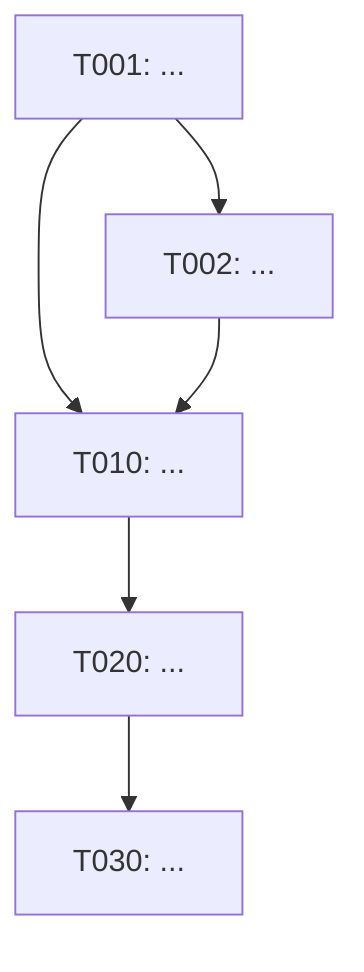

# task-decomposer · XenoDev L4 自派生

> **结论先**:读 frozen spec.md,按 phase 拆 10-30 task,每 task 9 字段 frontmatter + verification + suggested executor model;同步产 dependency-graph.mmd。

## 0 · 输入硬约束(失败立停)

读取 `specs/<feature>/spec.md` frontmatter,**任一不满足直接拒**:

| 字段 | 期望 | 失败行为 |
|---|---|---|
| `status` | `frozen` | echo "ERR: spec.md status=$val,需 frozen 才接;先跑 spec-writer Phase 2 review" >&2; exit 1 |
| `reviewed-by` | ≠ `pending` 且 ≠ `blocked-*` | echo "ERR: reviewed-by=$val,需 codex/gpt/opus@<date>" >&2; exit 1 |
| `ppv_count` | ≥ 1 | echo "ERR: ppv_count=$val,§7 PPV 缺 P_i" >&2; exit 1 |
| `feature` | 非空 | echo "ERR: feature 字段缺" >&2; exit 1 |

读 spec.md 全文,重点抽:
- **§1 Outcomes**(O1, O2, ...)— 每个 task 应 ref 至少 1 个 Outcome
- **§5 Task Breakdown**(phase 列表)— task 按 phase 分组
- **§6 Verification Criteria** — task 的 verification 必须能滚到 spec verification
- **§7 PPV** — 至少 1 个 task 必须 own PPV 真路径的实装

## 1 · Phase 0 — Sizing 校核

per IDS task-decomposer-skill 范式,直接派生:

| Estimated hours | 处理 |
|---|---|
| < 1h | 合并 sibling — overhead > value |
| 1–4h | **理想** |
| 4–8h | 可接受;有不确定性即拆 |
| 8h–1d | Max;有任何不确定即拆 |
| > 1d | **必拆** 无例外 |

总 task 数:**10-30**(L/XL spec)。< 10 → spec 太小或拆得太粗;> 30 → 拆得太细,合并。

## 2 · Phase 1 — 9 字段 frontmatter(每 task)

```yaml
---
id: T<NNN>                        # T001, T002, ...,严格三位数,顺序紧凑
title: <短标题,< 60 字符>
spec_ref: specs/<feature>/spec.md#<section-anchor>   # 必须可 grep 到
phase: 0 | 1 | 2 | 3              # 同 spec §5
depends_on: [T<NNN>, ...]         # 上游必完成才能起本 task
blocks: [T<NNN>, ...]             # 本 task 完成后能解锁
file_domain:                      # glob 列表;parallel-builder 用此判 worktree 冲突
  - <path/glob/**>
estimated_hours: <int>            # 1-8;> 8 必拆
suggested_executor_model: opus | sonnet | haiku | codex | codex-mini   # per §3
risk_level: low | medium | high   # PPV-owning task 至少 medium
---
```

**两条强约束**:
1. `depends_on` 与 `blocks` 必须双向一致(T002 depends_on=[T001] ⇔ T001 blocks=[T002])
2. `file_domain` 在并行 task 间**不可重叠**(parallel-builder 据此判 worktree 安全;重叠 → DAG 加 dep 串行化)

## 3 · suggested_executor_model 路由(强约束)

per IDS task-decomposer-skill §"Model routing heuristics" 派生 + XenoDev 调整:

### 3.1 Opus 4.7(spine,10-15%)
- task 跨 > 10 file 且互依
- 系统级迁移(schema / 跨仓协议)
- 是 spine task(其他 task 重度依赖)
- 含 PPV 真路径实装的 task

### 3.2 Sonnet 4.6(主力,55-70%)
- 单 module / 单 directory 内的实装
- 标准 CRUD / API / library wiring
- 默认值

### 3.3 Codex 5.5(ops,10-15%)
- 重 shell / CI/CD / GitHub Actions
- 长跑 > 2h 的迁移脚本
- 跑真实数据的 migration

### 3.4 Codex mini(narrow fix,5-10%)
- < 100 LOC 单点修
- lint / type 错误清理
- 单文件 rename refactor

### 3.5 Haiku 4.5(boilerplate,5-10%)
- 纯样板(从 schema 生 12 个相似 component)
- 格式化 / i18n string 翻译
- test fixture 生成

### 3.6 健康分布(decompose 完自审)
```
Opus 10-15% · Sonnet 55-70% · Codex 10-15% · Codex mini 5-10% · Haiku 5-10%
```
80% Opus → 超支;80% Haiku → spec 太碎或太 trivial。

## 4 · Phase 2 — Verification 段(每 task body 必含)

per spec §6 verification + IDS task 范式,task body 必含可跑 verification:

```markdown
## Verification(必须可执行)
- [ ] `<runnable command>` — <expected outcome>
- [ ] `<grep / curl / pnpm test>` — <metric / shape>
- [ ] Coverage for `<file_domain>` ≥ 85%(若 task 含 production code)
- [ ] Manual checkbox: <human sign-off,仅当无法自动化>
```

**反 verification(直接拒)**:
- ❌ "实装完即可"
- ❌ "通过 review 即可"(review 是另一回事)
- ❌ 无量化 / 无命令 / 无 checkbox

## 5 · Phase 3 — task body 标准结构

```markdown
# T<NNN>: <title>

**spec_ref**: specs/<feature>/spec.md#<anchor>
**phase**: <n>  **depends_on**: [..]  **blocks**: [..]
**file_domain**: <list>
**estimated_hours**: <n>  **suggested_executor_model**: <m>  **risk_level**: <l>

---

## Goal
<一段话,关联到 spec Outcome O_i>

## Inputs
- 需读的现有文件 / module
- 必需 env vars(列名,不列值)
- 上游 task 输出(T_NNN.outputs.X)

## Outputs
- 文件 A: `<path>` — 导出 / 行为
- 文件 B: ...

## Implementation plan
1. ...
2. ...

## Verification(per §4)
- [ ] ...

## Known gotchas
- ...

## Out of scope
- 不修 `<path>`(那是 T_NNN 的事)
- 不引新依赖未更新 tech-stack.md
```

## 6 · Phase 4 — dependency-graph.mmd

同时产 `specs/<feature>/dependency-graph.mmd`:



### 6.1 DAG 5 条铁律

1. **No cycles** — A→B→A → 一个错
2. **No orphans** — 每 task 从 T001 经 blocks 边可达
3. **Max fan-out** — T_X 被 N task 依赖 → 那 N 个能并行(T_X 必须先稳)
4. **Critical path ≤ 40% 总 task 数** — 长链 = wall-clock,长链长则并行收益小
5. **Interfaces before implementations** — ≥2 task import 的 module → Phase 0 一个 interface task,impl task 引 interface 不引实装

## 7 · Self-check(decompose 完跑)

```
Total hours: <sum>
Critical path: <longest chain>(tasks: T001 → ... → T_last)
Speedup if max parallelism: total / critical-path
Max parallel width: <peak concurrent task count>
Model mix: Opus X% · Sonnet Y% · Codex Z% · ... <对照 §3.6 健康分布>
```

输出格式:写入 `specs/<feature>/decompose-report.md`(单文件,operator 可读)。

## 8 · Anti-patterns(直接拒)

1. **task < 1h** — 合并 sibling
2. **task > 1d** — 必拆
3. **`file_domain` 重叠** — 并行 task 互踩 → DAG 加 dep 串行化或重新切边界
4. **`depends_on` / `blocks` 单向不一致** — 必双向写
5. **verification = "实装完即可"** — 拒
6. **PPV 真路径无 owning task** — spec §7 P1 没人实装 → 加 task,owner 至少 medium risk
7. **80% Opus** — 超支信号,重审 sizing(可能拆得不够细)
8. **DAG 有孤儿 / 环** — DAG validate 失败,重画
9. **跳过 Phase 0 Sizing 校核就硬塞输入** — 拒

## 9 · 完成 checklist

- [ ] spec.md frontmatter 4 字段全过(status / reviewed-by / ppv_count / feature)
- [ ] tasks/T*.md ≥ 1(self-test 阶段)/ 10-30(真跑)
- [ ] 每 task 9 字段 frontmatter 全 + verification 段可跑
- [ ] dependency-graph.mmd 存在,5 条铁律全过
- [ ] decompose-report.md 含 self-check 5 项
- [ ] PPV 真路径有 owning task(risk_level ≥ medium)
- [ ] git status 干净 / 文件已 stage(不主动 commit)

## 10 · Failure mode + escalation

| 症状 | 处理 |
|---|---|
| spec.md status ≠ frozen | hard-fail;让 operator 回 spec-writer Phase 2 |
| spec §7 PPV 缺 / ppv_count=0 | hard-fail;回 spec-writer 补 PPV |
| sizing 全部 > 1d | 回 spec 缩 scope 或加 phase |
| DAG 出现环 | 列出环 path,operator 改 spec 边界 |
| `file_domain` 严重重叠且无法切 | spec module 边界设计有问题,回 spec-writer 重画 §2 boundaries |
| Opus mix > 30% | 重审 sizing;可能 task 太大或拆得不够 |

## 11 · 与上下游的关系

- **上游**:`spec-writer` skill 产 frozen spec.md(本 skill 输入就绪信号 = `status: frozen` + `reviewed-by ≠ pending`)
- **下游**:`parallel-builder` skill 读 tasks/T*.md + dependency-graph.mmd,按 DAG 起 worktree 跑 TDD(Block E 实装)
- **跨仓**:本 skill **不**写回 IDS;hand-back 由 parallel-builder ship 后产

---

**Provenance**:
- 9 字段 frontmatter / sizing / DAG 5 铁律 / model routing 派生自 `ideababy_stroller/.claude/skills/task-decomposer-skill/SKILL.md`(IDS 历史范式)
- "spec frozen 才接"硬约束派生自 `ideababy_stroller/framework/xenodev-spec-writer-derivation-guide.md` §"Block D 完成标志"
- PPV-owning task 强约束派生自 XenoDev `spec-writer` skill §2.2 PPV 契约(本仓自洽)
