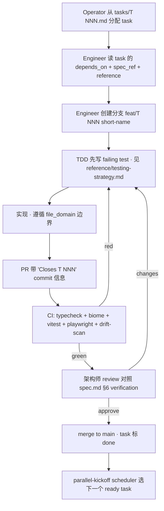

## §1 这是什么

本目录 `specs/001-pA/` 是 **fork `001-pA`（PI Briefing Console）v0.1 工程交付包**——供 **1 名架构师 + 6–8 名初级工程师** 在 5 周（~100h 总预算，solo operator × 20h/周 dogfood）内合作完成的**单一权威契约**。本 fork 由 `proposals/001` → `discussion/001/L1 inspire` → `L2 explore` → `L3 scope candidate A` 经 operator 在 2026-04-23 批准 `/fork 001 from-L3 candidate-A as 001-pA` 派生而来；所有 `spec.md` / `architecture.md` / `tech-stack.md` / `reference/*.md` / `tasks/T*.md` 在本文档 ≥ 0.2.2 版本下**逐字对齐**。

**Golden rule**：**任何代码层偏离这批文档 = bug**。偏离且有理由 → 不直接改代码 · 先开 `OPEN-QUESTIONS-FOR-OPERATOR.md` 新 Q · 由 operator + spec-writer 决定 patch 点。

---

## §2 如何阅读（按角色给出最短路径）

### 2.1 你是**架构师**（1 人 · 资深 · 负责把控全局）

目标：**2 小时**拿到完整 mental model；3 小时内能回答"任何一个 task 实现偏了怎么校准"。

| # | 文件 | 时长 | 目的 |
|---|---|---|---|
| 1 | `README.md`（本文件） | 5 min | 全盘导航 |
| 2 | `spec.md` | 20 min | 6 要素契约 · Outcomes / Scope / Constraints / Prior Decisions / Phase / Verification |
| 3 | `architecture.md` | 30 min | C4 L1/L2 + 7 个 ADR + data model（15 表）+ 部署拓扑 |
| 4 | `tech-stack.md` | 10 min | 版本 pin + LLM 两家候选 + 排除清单 + dependency policy |
| 5 | `DECISIONS-LOG.md` | 15 min | 所有第一性论证过的犹豫点（~15 条）· 遇"为什么这么做"时的权威依据 |
| 6 | `risks.md` | 15 min | 全类风险（TECH/OPS/SEC/COM/LEG/DOGFOOD/BUS）· 30+ 条含 BUS-1 / DOGFOOD-1 强制项 |
| 7 | `reference/*.md`（skim） | 20 min | 只看目录 + headings · 知道"如果需要细节去哪查" |
| 8 | `dependency-graph.mmd`（Mermaid 渲染） | 10 min | 25 task 拓扑 + critical path 58h |
| 9 | `tasks/T001.md` + `T003.md` + `T004.md` | 15 min | 3 条 spine task（LLM spike · DB schema · LLM adapter） |

**完成后的判断标准**：能回答 "Q: T013 为什么要事务内先写 llm_calls 再写 paper_summaries?" / "Q: skip why 为什么 DB + API + UI 三层都要?" / "Q: v0.1 为什么不实现 /api/today endpoint?"

### 2.2 你是**初级工程师**（6–8 人 · 每人负责 1–3 个 task）

目标：**1 小时**内能进入 kickoff 状态；2 小时内开始写第一行代码。

| # | 文件 | 时长 | 目的 |
|---|---|---|---|
| 1 | `README.md`（本文件）| 5 min | 整体位置感 |
| 2 | `spec.md` §1 Outcomes + §2 Scope | 10 min | 知道产品在做什么 · 不做什么 |
| 3 | `reference/directory-layout.md` §1 目录树 + §11 first-time setup | 15 min | 知道文件在哪 · 本地能跑起栈 |
| 4 | 你被分配的 `tasks/T<NNN>.md`（含 `spec_ref` / `depends_on` / `file_domain`） | 15 min | 知道要构建什么 · 对应 spec 哪一节 |
| 5 | （API 类 task）`reference/api-contracts.md` · 你负责的 endpoint 块 + §1 global conventions | 10 min | endpoint 契约 / error envelope / idempotency 规则 |
| 6 | （DB 类 task）`reference/schema.sql` 对应 §`N` 表 | 10 min | 权威 DDL · 字段 / 约束 / index |
| 7 | （LLM 类 task）`reference/llm-adapter-skeleton.md` | 20 min | 可抄可跑的 adapter 骨架 + prompt 约束 + cost 计算 |
| 8 | （测试 task）`reference/testing-strategy.md` 你的层（unit / integration / e2e） | 10 min | 该层的 pattern + fixture + 覆盖率红线 |
| 9 | **任何** throwing error 时 | on-demand | `reference/error-codes-and-glossary.md §1` 挑对应 code · **不要自造字面量** |

**完成后的判断标准**：能回答 "Q: 我的 task 失败时应该抛哪个 error code?" / "Q: 我可以修改 `specs/001-pA/` 里哪些文件?（答：零）" / "Q: 我不确定字段命名，看哪？（答：`reference/error-codes-and-glossary.md §3`）"

### 2.3 你是**operator**（= 本项目首要人 · 每日 review 进度）

目标：**10 分钟** review 自上次 checkpoint 以来的变化。

| # | 文件 | 目的 |
|---|---|---|
| 1 | `DECISIONS-LOG.md`（看新增条目） | 知道今天 spec-writer / 架构师做了哪些第一性判断 |
| 2 | `risks.md`（看新增 ID 或 mitigation 更新） | 新风险是否 accept / need mitigation |
| 3 | `OPEN-QUESTIONS-FOR-OPERATOR.md` | 列表最新的 Q 是否需要你签字 · 尤其 `🔜 deferred` 项 |
| 4 | `.codex-outbox/` 最新 `.md` | Codex adversarial review 最新一轮输出（BLOCK / FOLLOW-UP / OK） |
| 5 | `dependency-graph.mmd` 已完成 task | 进度对 total 100h budget |

**完成后的判断标准**：能决策 "今天要不要 abandon / pivot / continue / escalate"。

---

## §3 完整文件清单

| 文件 | 面向 | 目的 |
|---|---|---|
| `README.md` | 全员 | 本文件 · 导航入口 |
| `spec.md` | 全员 | **6 要素契约 · 当前 v0.2.2** · PRD 之外的所有工程决策源头 |
| `architecture.md` | 架构师 + 资深 | C4 L1/L2 + 7 个 ADR + data model + 部署 · 当前 v0.2 |
| `tech-stack.md` | 全员 | 版本 pin · LLM 两家候选 · 排除清单 · 当前 v0.1（drift 1/2/3 patched） |
| `SLA.md` | 架构师 + ops | v0.1 best-effort vs v1.0 99.5% 分阶段 |
| `risks.md` | 全员 | 7 类风险 · 30+ 条 · 含 BUS-1 + DOGFOOD-1 强制 · SEC-10 drift 5 accepted |
| `non-goals.md` | 全员 | 刻意 descope 项（A 继承 PRD / B 工程层 / C 未来路径）· "不要加回来" 的硬证据 |
| `compliance.md` | 全员 | PIPL 轻合规 + 数据本地化 + lab operator 声明模板 |
| `dependency-graph.mmd` | 全员（Mermaid 渲染） | 25 task DAG + critical path 58h |
| `DECISIONS-LOG.md` | 架构师 + operator | 所有第一性论证 · 含 5 个 interface drift 裁决 |
| `OPEN-QUESTIONS-FOR-OPERATOR.md` | operator | 等待 operator 决定的合同漂移 · 关 Q1/Q2/Q4/Q5（resolved）· Q3 deferred |
| `tasks/T001.md`..`T034.md` | 初级工程师 | 逐个 task 契约（spec_ref / depends_on / file_domain / Outputs / Implementation / Verification） |
| `reference/schema.sql` | 全员 | **全 15 表**可执行 DDL · CI 断言与 drizzle 同步 |
| `reference/directory-layout.md` | 全员 | 目录树 + env 变量 + 本地 setup |
| `reference/api-contracts.md` | API / 前端 | 18 endpoint（16 v0.1 实现 · 2 v0.2 deferred）+ 30 error code + 11 resource shape + schema_version bump 规则 |
| `reference/llm-adapter-skeleton.md` | LLM 工程师 | 完整 adapter 代码骨架 · prompt 模板 · cost 计算（$15/M output） |
| `reference/ops-runbook.md` | ops | 部署 · backup · on-call · Caddy 配置 |
| `reference/testing-strategy.md` | 全员 | unit / integration / e2e 分层 · fixture 与 coverage |
| `reference/error-codes-and-glossary.md` | 全员 | 错误码清单（API 30 + 内部 ~20）+ 日志规约 + 扩展术语表 60+ 词条 |

---

## §4 端到端 task 生命周期



**注**：本项目为 solo-operator dogfood · "Operator 分配 task" 实际等价于 "Operator 在 Claude Code 里 kick off parallel-builder subagent"；流程本身不变，只是人类在 scheduler 位置退化为单人（见 BUS-1）。

---

## §5 Spec 版本规则（摘自 `.claude/rules/specs-protection.md`）

- **Patch bump**（0.2.1 → 0.2.2）：澄清 only · 不动 Outcome / Scope / Constraint · 例：drift 消化 / 数字订正 / 字段命名统一（本次就是）
- **Minor bump**（0.2 → 0.3）：Scope 内变化 · 例：新增一个 task / 调整某个 constraint 数字（真实 scope impact）
- **Major bump**（0.x → 1.0）：商业化 launch 里程碑

**当前**：`spec.md v0.2.2`（Q5 + 5 interface drift + reference/ 完整交付 + README 导航）

**每次 bump**：
1. 更新 `spec.md` 头的 `**版本**:` + `上次修订:` 字段
2. 追加一行到 `## 变更日志` 表末
3. commit message 遵循 Conventional Commits · 例：`docs(spec): bump 0.2.1 → 0.2.2 for drift consolidation`
4. 创建 git tag · 格式 `spec/001-pA/v0.2.2`

---

## §6 谁写什么（修改权限表）

| 文件类型 | 可修改方 | 禁止 |
|---|---|---|
| `specs/001-pA/README.md` · `spec.md` · `architecture.md` · `tech-stack.md` · `SLA.md` · `risks.md` · `non-goals.md` · `compliance.md` · `DECISIONS-LOG.md` · `OPEN-QUESTIONS-FOR-OPERATOR.md` · `reference/*.md` | **只**operator · spec-writer subagent | parallel-builder workers 禁止 |
| `specs/001-pA/tasks/T*.md` · `specs/001-pA/dependency-graph.mmd` | **只**operator · spec-writer · task-decomposer subagent | parallel-builder workers 禁止 |
| `specs/001-pA/reference/schema.sql` | **只**operator · spec-writer · CI（drift-scan job 断言与 drizzle 同步后 operator commit） | parallel-builder workers 禁止 |
| 实际代码 `src/**` · `deploy/**` · `tests/**` · `scripts/**` | parallel-builder workers（按 task file_domain） | 禁碰 `specs/` 下任何文件 · 反之亦然 |

**铁律**：发现 spec 有问题的 worker **不自行修改 spec** · 写 blocker 到 PR description → operator 决定 `/plan-patch` 或人工修 spec → 重新 dispatch。

---

## §7 Quick-start runbook（新机器 · ≤ 10 min 启动本地开发）

```bash
# 1. clone（假设已有仓库）
git clone <repo-url> pi-briefing
cd pi-briefing

# 2. read entry point
cat specs/001-pA/README.md

# 3. 本地依赖（首次）
# 需要 Node 22 LTS · pnpm 9 · Postgres 16
nvm install 22 && nvm use 22
npm i -g pnpm@9
# macOS:    brew install postgresql@16
# Linux:    sudo apt install postgresql-16
# 启动 postgres 服务（平台特定）

# 4. 项目脚手架（由 T002 完成后）
pnpm install

# 5. 环境变量
cp .env.example .env
vim .env    # 填 DATABASE_URL / DATABASE_URL_WORKER / SESSION_SECRET / LLM_API_KEY / ADMIN_EMAIL
           # 详细变量清单见 `reference/directory-layout.md §3`

# 6. 数据库 schema
createdb pi_briefing
psql pi_briefing < specs/001-pA/reference/schema.sql    # 直接应用权威 DDL
# 或走 drizzle migration（T003 产出 0000_initial.sql 后）：pnpm db:migrate

# 7. seed 数据（dev 用）
pnpm tsx scripts/db-seed.ts

# 8. 跑起来
pnpm dev                          # Next.js dev server · port 3000
pnpm tsx src/workers/daily.ts     # 手动触发一次 daily worker（验证 arxiv + LLM 链路）

# 9. 检查 healthz
curl http://localhost:3000/api/healthz

# 10. 跑测试
pnpm biome ci
pnpm vitest run
pnpm playwright test              # 需要 dev server 先起来
```

**遇到问题时的排错路径**：
- DB 连不上 → `reference/ops-runbook.md §7 常见故障` + `reference/error-codes-and-glossary.md §1.4 DB_CONNECTION_LOST`
- LLM adapter 抛错 → `reference/llm-adapter-skeleton.md §9 错误处理`
- env 校验失败 → `reference/error-codes-and-glossary.md §1.4 ENV_VALIDATION_FAILED`
- 某 endpoint 返奇怪 error code → `reference/error-codes-and-glossary.md §1.3`

---

## §8 支持渠道

| 渠道 | 用途 |
|---|---|
| **架构师 / operator** | sundevil0405@gmail.com（= 本项目 solo operator） |
| **GitHub issues** | bug report · feature request（但 v0.1 scope 外一律 defer 到 v0.2） |
| **Adversarial reviews** | `.codex-outbox/` 下最新 `.md`（Codex 跑完后 operator 评审） |
| **Open questions** | `specs/001-pA/OPEN-QUESTIONS-FOR-OPERATOR.md`（任何人写 · operator 关） |

---

## §9 版本历史（本 README + spec 同步）

| 日期 | spec 版本 | 变更 |
|---|---|---|
| 2026-04-23 | 0.1 | Initial SDD package written by spec-writer（spec / architecture / tech-stack / SLA / risks / non-goals / compliance / dependency-graph） |
| 2026-04-23 | 0.2 | R1 adversarial review BLOCK fixes（B1 `paper_summaries` · B2 skip CHECK · B3 前置 task contracts · +ADR-6 +ADR-7 · +TECH-8 +TECH-9） |
| 2026-04-23 | 0.2.1 | R1→R2 Q1 / Q2 / Q4 closure patch（grants.sql · T003 auth 前置 · T032 schema_version 断言） |
| 2026-04-23 | 0.2.2 | **本次**：Q5 表计数订正 14 → 15 + 5 interface drift consolidation（SummaryRecord camelCase · judgeRelation per-pair · OpenAI $15/M · `/api/today` v0.2 deferred · invite GET 保留 + SEC-10 accepted）+ `reference/*.md` 8 份权威工程文档完整交付 + 本 README.md 导航登陆页 |

---

## §10 Red line 自检（任何 PR 前 operator 的 10 秒复核）

- [ ] **红线 1 · 不扩通用发现器**：新代码是否让 topic 数上限突破 15？是否引入无 topic keying 的全局 feed？
- [ ] **红线 2 · 不替代第一手阅读**：新 summary 是否突破 3 句？skip 是否可能绕过 why ≥ 5 chars 三层兜底？
- [ ] **红线 3 · 不做公开打分**：新 endpoint 是否暴露给未 auth 用户？是否有 "评分 / 排名 / 社区" UI 元素？

**任一项答 yes = BLOCK · 不得 merge**。
