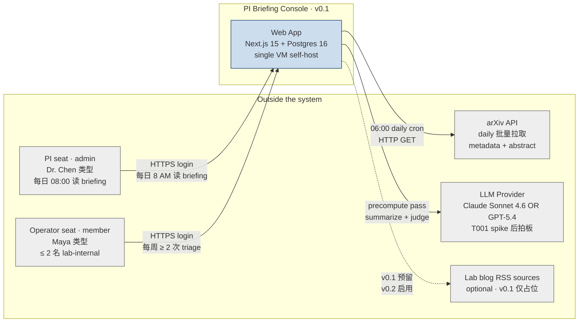
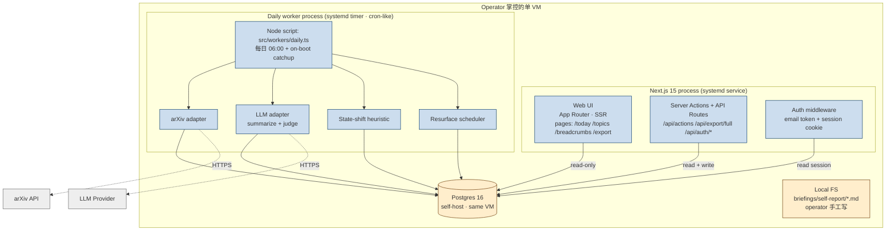
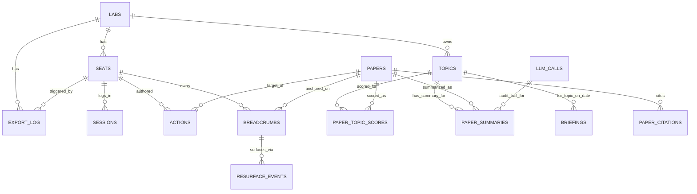

# Architecture · 001-pA · PI Briefing Console

**版本**: 0.3.1（R_final2 G6 sync · 2026-04-24 · ADR-6 Consequence 段同步 adapter-内写 llm_calls）
**创建**: 2026-04-23
**上次修订**: 2026-04-24（R_final2 G6 · ADR-6 consequence section rewrite · 见变更日志）
**依据**: `spec.md` v0.3.1 · `tech-stack.md` v0.1.1 · PRD v1.0

> 本文件给下游 builder 提供**最小可执行的工程蓝图**。原则：**boring over clever**。solo operator × 20h/周 × 5 周 的预算不允许任何"优雅但耗时"的折腾 —— 每一个技术决策都以"最少 ramp time + 最少 on-call"为第一目标。

---

## 1. 架构原则（不可妥协）

1. **Single process · Single VM · Single Postgres**：v0.1 不做多实例、不做微服务、不做容器编排。一个 VPS 跑 Next.js + 一个 cron 进程 + 一个 Postgres，足够 ≤ 15 用户。
2. **Precompute > 在线计算**：briefing / state-shift / resurface 全部在 06:00 daily worker 跑完，用户打开页面只 hit Postgres，不 hit LLM 也不 hit arXiv。
3. **LLM 行为 provider-agnostic**：`interface LLMProvider` 抽象所有 LLM 调用；T001 spike 后换 provider = 换一个文件，不 ripple 到业务层。
4. **数据主权 = operator 掌控**：所有业务数据进自持 Postgres；LLM provider 只看到短命的 API call（不开训练数据开关），不落在第三方。
5. **Cron 可容错**：任何一天的 06:00 worker 失败不能让 briefing 永久丢失；有 on-boot catchup 和 ≤ 24h 窗口重跑能力。

---

## 2. C4 Level 1 · System Context

**Actors**：
- **PI seat**（admin）：负责 topic 池 CRUD、每日 briefing 消费、breadcrumb resurface 回看、export 授权。
- **Operator seat**（member · ≤ 2 名 lab-internal）：负责替 lab 做 triage、4-action 标注、一句 "why I disagree" 轻量写入。
- **arXiv API**（外部）：唯一的 v0.1 数据源；通过公开 metadata API 每日批量拉取过去 24h 的 paper。v0.1 **不做** PDF 全文下载（OUT-6）。
- **LLM Provider**（外部 · 二选一，T001 spike 后定）：承担两件事 —— `summarize(abstract)` 与 `judge(papers, anchor)`；调用走统一 adapter，可随时切换。
- **Lab blog RSS**（v0.1 占位）：数据源 adapter 为未来扩展预留接口，但 v0.1 不接 RSS 源。

**外部接口清单**：

| 接口 | 协议 | 方向 | 鉴权 | v0.1 行为 |
|---|---|---|---|---|
| arXiv listing API | HTTP/1.1 · REST · public | outbound | 无 · User-Agent 自标识 | 每日 06:00 GET 过去 24h 的 arXiv cs/* 条目 + 按 topic keyword 过滤 |
| LLM Completion API | HTTPS · provider-specific | outbound | Bearer API key（env） | 预计算阶段逐篇调用；不传用户 PII；不开训练数据共享 |
| Web UI | HTTPS · HTML + Server Actions | inbound | httpOnly cookie + email token invite | 仅 lab seat 访问；所有 route 走 auth middleware |

---

## 3. C4 Level 2 · Container Diagram

**Container 职责分离**：

| Container | 进程 | 责任 | 不做 |
|---|---|---|---|
| **Web UI (Next.js)** | Node 22 LTS + Next 15 App Router | SSR briefing page、handle 4-action、admin CRUD topic、export | 从不直接调 LLM 或 arXiv（请求路径不允许外部调用） |
| **Daily worker** | 独立 Node 进程（systemd timer or cron） | 06:00 拉 arXiv → LLM pass → state-shift → 写 briefing → 触发 resurface | 不接收 HTTP 请求；失败写日志 + 下次 catchup |
| **Postgres 16** | 同 VM 本地 socket 连接 | 唯一 persistent store；schema 见 §5 | 不暴露公网；`pg_hba.conf` 限 localhost |
| **Local FS** | operator 手写 | 存 `briefings/self-report/YYYY-WW.md` + T001 spike 报告 | 不是数据库；export 不含 |

---

## 4. 关键设计决策（≤ 5 条 · 每条附 rationale）

### ADR-1 · **Cron / daily batch（而非 streaming / 在线计算）**
- **决策**：briefing + state-shift + LLM summary + resurface 调度全部跑在每日 06:00 的 daily worker 里，写入 Postgres；`/today` 页面 SSR 只 read Postgres。
- **Rationale**：PI 的使用场景是 **08:00 10 分钟 ritual**（PRD §Users），不需要任何 real-time。Precompute 让 /today p95 能拿到 < 1s（C11 成本 envelope 也要求批量才能压到 $50）。Streaming / 在线计算会把成本放大 10× 且无收益。
- **Tradeoff**：worker 失败 → 当天 briefing 缺失。缓解：on-boot catchup（worker 启动时检查 last_success < 24h，否则回补）+ systemd restart。

### ADR-2 · **Precomputed briefing（不在 request path 调 LLM）**
- **决策**：briefing 结果以 `briefings` 表形式存 Postgres；Web 请求 /today 绝不发起 LLM 调用。
- **Rationale**：守 p95 < 1s；守 C11 成本 envelope；守 O1 日活 ritual（页面必须秒开）。
- **Tradeoff**：无法"实时插入某篇论文"。但 v0.1 不需要这能力，OUT-6 已禁用 PDF 上传。

### ADR-3 · **Shared per-topic LLM judgments**（不做 per-seat judgment）
- **决策**：state-shift 判定和 summary 是 per-topic 生成一次，全 lab 共享；**4-action 和 breadcrumb 是 per-seat**（PI、operator 各自有各自的标注）。
- **Rationale**：
  1. 成本 × 一致性 —— 15 seat × 15 topic × 20 paper/day × 300 token = 3M token/month。per-seat 再 ×15 = 45M token = $150+/月，远超 C11 的 $50 envelope。
  2. Lab 内部的"state shift"本质是共享事实（某 topic 出 shift 不随读者视角变），共享合理。
  3. 4-action 是"我个人的 triage 决策"，必须 per-seat（O3、O4 的语义依赖此）。
- **Tradeoff**：lab 成员对 briefing 的"品味"无法分化。但 OUT-1 明确不做 hybrid taste agent，本来就没这需求。

### ADR-4 · **LLMProvider interface 抽象 · 绑定推迟到 spike 后**
- **决策**：在 `src/lib/llm/provider.ts` 定义 `interface LLMProvider { summarize(paper): Promise<string>; judgeRelation(papers, anchor): Promise<RelationLabel> }`，`ClaudeAdapter` 与 `GPTAdapter` 各自实现；业务层只依赖 interface。T001 spike 后 operator 选定 provider，env 里切换即可。
- **Rationale**：L4 intake Q2 明确推迟决策；设计 interface 避免 spike 结果出来后要重构业务代码。
- **Tradeoff**：两家 API 行为细节（retries / 流式 / token counting）有差异，adapter 内部要吃掉这些差异。预算 T007 共 1 天完成。

### ADR-5 · **Postgres 为唯一存储 · 无 Redis / ES / Vector DB**
- **决策**：topic / paper / action / breadcrumb / resurface / briefing / session 全部入 Postgres 16。无缓存层、无搜索引擎、无向量库。
- **Rationale**：
  1. ≤ 15 seat × 8–15 topic × 20 paper/day = ~300 行/天 insert，1 年也就 ~110k 行 paper。Postgres 随便跑。
  2. OUT-4（无 cross-paper 分析）→ 不需要 vector search。
  3. 少一个依赖少一个 oncall。C13（solo operator 可持续性）要求 ruthless 削服务数。
- **Tradeoff**：v0.2 若真要做 similarity search，得引入 pgvector（Postgres extension，不引入新服务）。本 v0.1 不装。

### ADR-6 · **`paper_summaries` 作为 derived-data 表，而非复用 `llm_calls` 审计表**（R1 adversarial fix · B1 · G6 amendment 2026-04-24）
- **决策**：LLM 产出的 summary 文本持久化在**独立** `paper_summaries` 表，per `(paper_id, topic_id, prompt_version)`；`llm_calls` 仅记录 `{tokens, cost, provider, latency_ms, paper_id}` 用于审计，不存 response body。
- **Rationale**：
  1. **语义分层**：`llm_calls` 是**审计表**（答"花了多少钱调了谁"），`paper_summaries` 是**derived-data**（答"这篇 paper 在这个 topic 下的 3 句解读是什么"）。两者维度完全不同，合表会让查询（尤其 /today loader）变复杂且低效。
  2. **Per-topic keying**：同一 paper 可被匹配进多个 topic（ADR-3 shared per-topic judgment），每个 topic 的 summary 语境不同；keying 到 `(paper, topic, prompt_version)` 支持 topic 级差异化且共享 LLM 调用成本。
  3. **Red line 2 机械兜底**：DB CHECK `summary_sentence_cap` 约束 `array_length(regexp_matches(summary_text, '[.!?。！？]', 'g'), 1) between 1 and 3`（G1 count-terminator 语义）；合入审计表会让 CHECK 对 judge 的 JSON response 误判。
  4. **Prompt reproducibility**：`prompt_version` 让 prompt 文案变动后同 (paper, topic) 能同时存 new/old 行（历史对比），审计表不需要这特征。
- **Consequence**（G6 权威 · R_final2 · 2026-04-24）：
  - **写入职责**：LLM adapter 内部调 `recordLLMCall({ purpose: 'summarize', ... })` 先写 `llm_calls` RETURNING id，并把 id 填入返回的 `SummaryRecord.llmCallId`（见 `reference/llm-adapter-skeleton.md §2/§3/§4/§7`）。T013 `persistSummary` **只写** `paper_summaries(paper_id, topic_id, summary_text, llm_call_id = record.llmCallId, model_name, prompt_version)`，消费 adapter 返回的 id 作为 FK —— **T013 不再写 `llm_calls`**，Adapter-内写是 G6 权威合同。
  - **Fallback 路径**：两家 provider 都 down 时 T013 走 `fallback-heuristic-v1` 写 `paper_summaries` 时 `llm_call_id = NULL`（schema F5 nullable）；此时没有 LLM 调用，也就没有 `llm_calls` 行可指。
  - **读路径**：T014/T015/T016 只 JOIN `paper_summaries`，不碰 `llm_calls`。
  - **Export（T023）**：`paper_summaries` 入包，`llm_calls` 排除（审计内部）。
- **Tradeoff**：2 张表比 1 张多一次 INSERT（LLM 调用本身有网络 latency · 内部 audit INSERT 无感）；schema 表数整体仍远低于任何"小 Postgres 项目"复杂度阈值。

### ADR-7 · **红线 2 "skip traceable" 三层机械兜底 · 非单层守护**（R1 adversarial fix · B2）
- **决策**：`action='skip'` 时 `why` 必填（btrim 后 ≥ 5 chars），通过 **DB CHECK + API validation + UI required** 三层同时保证：
  1. **DB Layer**：`actions.skip_requires_why` CHECK `action != 'skip' OR (why IS NOT NULL AND char_length(btrim(why)) >= 5)` —— 任何绕过 API 的直接 INSERT 都会被 reject
  2. **API Layer**：`src/lib/actions/recordAction.ts` 预校验返 400 `SKIP_WHY_REQUIRED` —— 前端 UI bypass 或手工 curl 都拦得住，且有明确 error code
  3. **UI Layer**：`src/components/skip-why-input.tsx` inline expand（不 modal）+ `Submit` 按钮 disabled until trim ≥ 5 —— 正常流用户不会遇到 400 / CHECK 拒绝
- **Rationale**：C6 / D16 是 PRD 红线硬约束（violate = block）；单层守护（比如只 UI required）会在：(a) 手工 API 客户端 (b) 未来重构时漏拦 (c) 前端组件库替换时把 disabled 态换掉 三种场景下默默失效。三层叠加的每一层都能独立 catch，成本只多 ~30 行代码 + 3 个 test case。
- **Consequence**：T003 承担 CHECK；T015 承担 API + UI；T016 承担 history page 可见性；4 个 verification hook 绑定到 spec §6。
- **Tradeoff**：三层之间可能有消息不一致（例如 API 的 error code 与 UI 的 disabled reason 文案）；mitigated by：API error 的 `code` 字段（`SKIP_WHY_REQUIRED`）与 UI placeholder 文案作为 single source-of-text 共同维护于 T015 出包。
- **选择不做的方案**：
  - "只用 CHECK，不要 API/UI" → 用户体验糟糕（表单提交后红屏），且错误 message 由 DB 暴露
  - "只用 API，不要 CHECK" → 未来任何直连 SQL 的脚本可以 bypass（v0.1 没有这种脚本，但 v0.2 `pnpm ops:bulk-skip` 之类命令就会漏）
  - "只用 UI，不要 API/DB" → 最弱；任何 curl / Postman / 开发 console 都绕得开

---

## 5. Data Model 草图

> 下方是**最小可跑**的表结构；具体字段类型、约束、index 在 T005（Drizzle migration）里定。命名用 snake_case。

### 5.1 表清单（v0.1 最小集 · R1 从 13 张升至 15 张（llm_calls 一直存在、此前漏计；R1 新增 paper_summaries + export_log 两张））

| 表 | 关键字段（非全量） | 备注 |
|---|---|---|
| `labs` | `id`, `name`, `created_at`, **`first_day_at timestamptz NOT NULL DEFAULT now()`**, **`allow_continue_until timestamptz NULL`** | v0.1 只存一条（单 lab 部署）；**R1 新增 `first_day_at`（T024 sentinel since_day 计算）+ `allow_continue_until`（operator 7 天签到窗口）** |
| `seats` | `id`, `lab_id`, `email`, `role ENUM('admin','member')`, `invited_at`, `last_login_at` | ≤ 15 行 |
| `sessions` | `id`, `seat_id`, `token_hash`, `issued_at`, `expires_at`, `login_date` | `login_date` 冗余列便于 O1/O3 查询 |
| `topics` | `id`, `lab_id`, `name`, `keyword_pool TEXT[]`, `arxiv_categories TEXT[]`, `seed_authors TEXT[]`, `created_at`, `updated_at`, `archived_at` | ≤ 15 活跃 topic |
| `papers` | `id`, `arxiv_id UNIQUE`, `title`, `abstract`, `authors TEXT[]`, `published_at`, `fetched_at` | 单篇论文的 metadata + abstract；无 PDF 内容 |
| `paper_citations` | `citing_paper_id`, `cited_arxiv_id` | reference list 抽取；从 arXiv API 取到多少存多少 |
| `paper_topic_scores` | `paper_id`, `topic_id`, `match_signal ENUM('keyword','category','seed_author')`, `created_at` | 一篇 paper 可入多个 topic |
| `actions` | `id`, `seat_id`, `paper_id`, `action ENUM('read_now','read_later','skip','breadcrumb')`, `why TEXT` (≤ 280; **nullable in general 但 CHECK `skip_requires_why` 强制 action='skip' 时 `char_length(btrim(why)) >= 5`**), `created_at` | 每次 4-action 一行；**R1 新增 CHECK 见 ADR-7** |
| `breadcrumbs` | `id`, `seat_id`, `paper_id`, `topic_id`, `created_at`, `dismissed_at` | `action = breadcrumb` 时**同步写入**此表，方便 resurface scheduler 扫 |
| `resurface_events` | `id`, `breadcrumb_id`, `trigger_type ENUM('6w','3mo','6mo','citation')`, `trigger_paper_id`（citation 时非空）, `context_text`, `surfaced_at`, `clicked_at`, `dismissed_at` | O2 直接由此表查 |
| `briefings` | `id`, `lab_id`, `topic_id`, `date`, `state_summary TEXT`, `trigger_paper_ids INT[]`, `anchor_paper_id`（state-shift 时非空）, `llm_provider`（审计追溯）, `token_cost_cents`, `created_at` | 一条记录 = 一 topic × 一日 · `state_summary` 仅 topic-level 判断句（per-paper summary 移至 `paper_summaries`） |
| `fetch_runs` | `id`, `started_at`, `finished_at`, `status ENUM('ok','failed','partial')`, `papers_fetched`, `error_text`, **`notes TEXT NULL`** | worker 审计；on-boot catchup 读 last `ok`；**R1 新增 `notes` 用于 worker 操作标注 + export 兼容** |
| `llm_calls` | `id`, `provider`, `kind ENUM('summarize','judge')`, `input_tokens`, `output_tokens`, `cost_cents`, `created_at`, `paper_id` | C11 成本监控 · alert 条件：月累计 > $40 时 worker 告警 · **仅审计，不存 response body**（ADR-6） |
| **`paper_summaries`** | `id`, `paper_id FK→papers`, `topic_id FK→topics`, `summary_text TEXT NOT NULL` (CHECK ≤ 3 句), `llm_call_id FK→llm_calls`, `model_name`, `prompt_version`, `created_at` · UNIQUE `(paper_id, topic_id, prompt_version)` | **R1 新增（B1）**：IN-7 summary 的权威落点；per-paper × per-topic × per-prompt_version；**derived-data 表**（非审计，与 `llm_calls` 分离，见 ADR-6） |
| **`export_log`** | `id`, `lab_id FK→labs`, `seat_id FK→seats`, `export_type`（v0.1 仅 `'full'`）, `row_counts_jsonb JSONB`, `byte_size INT`, `created_at` | **R1 新增（B3）**：SEC-1 export 审计稳定落点；每次 `/api/export/full` 成功写一行；`row_counts_jsonb` 记 9 张 export 表的行数 |

### 5.2 关键 index（Phase 0 必须建）

- `actions (seat_id, created_at)` — 用于 O3 / O4 查询
- `sessions (seat_id, login_date)` — 用于 O1 日活查询
- `resurface_events (breadcrumb_id, surfaced_at)` — 用于 timed scheduler 去重
- `paper_citations (cited_arxiv_id)` — citation-triggered resurface 的热路径
- `briefings (lab_id, topic_id, date UNIQUE)` — 去重 + /today 读
- **`paper_summaries (paper_id)`** — 用于 /today loader + /papers/:id/history（R1 新增）
- **`paper_summaries (topic_id)`** — 用于 briefing assemble 的 JOIN（R1 新增）
- **`export_log (lab_id, created_at)`** — operator 月度自审（compliance §7）+ SEC-1 监控（R1 新增）

### 5.3 数据保留策略 · v0.1

- **全部历史永久保留**，直到 operator 执行 `DELETE FROM <table> WHERE ...`。v0.1 不做自动清理（breadcrumb 需要 ≥ 6 个月回溯，OUT 的自动清理会破坏 O5）。
- Postgres 每日 `pg_dump` 到同 VM 外挂盘（worker 的 pre-fetch step）。
- `compliance.md` 详述数据主权与删除流程。

---

## 6. 关键 tradeoff（≤ 3 条 · 对应 ADR）

### T-1 · Cron/batch vs. 连续 streaming
- **v0.1 选 batch · 06:00 daily**：与 PI 的 8:00 ritual 节奏吻合；把所有 LLM cost 压到一次；worker 失败有 24h 重试窗口。
- **为什么不选 streaming**：streaming 要多跑一个 queue（BullMQ / Temporal），给 solo operator 多一个故障点，C13 明确禁止。
- **Upgrade path（如果 v1.0 需要近实时）**：保留 adapter 接口可随时切 streaming；不需要重构 core。

### T-2 · 在线 LLM 调用 vs. 预计算 briefing
- **v0.1 选预计算**：/today SSR 只 read Postgres，达到 p95 < 1s（见 SLA）且把成本降 10×。
- **为什么不选在线**：在线 LLM latency ~2–5s，会打断 08:00 ritual；成本 × 访问次数，C11 envelope 保不住。
- **Tradeoff**：操作员临时改 topic 后，briefing 不会立刻刷新，需等下一次 06:00 worker。v0.1 acceptable —— topic 维护是低频操作。

### T-3 · Per-seat LLM judgment vs. 共享 per-topic judgment
- **v0.1 选共享 per-topic**：state-shift 是 lab 级事实（§5 ADR-3），共享节省 10× cost 且更 consistent。
- **为什么不选 per-seat**：既超 C11 成本，又不对应任何 v0.1 需求（OUT-1 明确不做 per-seat taste agent）。
- **Tradeoff**：若 v0.2 启动 taste agent，需要引入 per-seat override layer（现有 schema 里 `actions.why` 已经是 seed）。

---

## 7. 安全边界

1. **无匿名读**：所有 route 走 auth middleware；未登录访问任何页面均 302 到 `/login`。
2. **Session**：JWT in `httpOnly; SameSite=Strict; Secure` cookie；30 天滑动过期；server-side session revocation（`sessions.revoked_at`）。
3. **Email token invite**：24h 有效 + 单次使用；token hash 入 Postgres，明文 token 仅出现在 operator 发给被邀者的邮件里。
4. **Admin-only action**：topic CRUD、JSON export 由 middleware 检查 `seats.role = 'admin'`；非 admin 写尝试 → 403 + log。
5. **Postgres 网络**：仅 localhost 连接；`pg_hba.conf` 强制 peer / SCRAM-SHA-256；Web app 与 worker 用**不同 Postgres 用户**（webapp_user 仅有必要表的 SELECT/INSERT/UPDATE；worker_user 具备 fetch + briefing 写权限）。
6. **LLM 调用**：API key 走 systemd `LoadCredential=` 注入，不落到环境变量或代码；**不传 seat email、不传 disagree 文本**到 LLM（只传 abstract + title）。
7. **JSON export**：admin-only；路径 `/api/export/full?fmt=json`；输出内容见 §8。**SEC-1 审计**：每次成功 export 写 `export_log` 一行（`lab_id, seat_id, export_type='full', row_counts_jsonb, byte_size, created_at`），operator 月度自审（compliance.md §7）。
8. **红线机械兜底**（Red line 2 · ADR-6 + ADR-7）：
   - **Summary ≤ 3 句**：LLM adapter 返回后 T013 `truncateTo3Sentences` 截断；之后入 `paper_summaries` 表还有 DB CHECK `summary_sentence_cap` 兜底（`regexp_split_to_array` 中英文标点）—— 两层保证 `llm_calls` 不存 response body，`paper_summaries` 行永远 ≤ 3 句
   - **Skip traceable**：三层机械兜底（DB CHECK + API validation + UI required）详见 **ADR-7**；任意单层失守仍被其他两层拦住

---

## 8. JSON Export 格式（满足 IN-6 + C8 · 满足 data portability condition）

**权威单一真源 = `reference/api-contracts.md §3.11 ExportEnvelope`**（G3 · 2026-04-24 R_final B3 fix · 2026-04-24 改为 camelCase + 12 顶层 key）。本段仅摘要合同要点，完整 shape 与 round-trip 策略以 api-contracts.md 为准。

### 顶层结构（12 resource collections · camelCase）
- `schemaVersion: '1.1'` · `exportedAt` (ISO)
- `lab: { id, name, firstDayAt, exportedAt, exportedBySeatId }`
- `seats[]` · `topics[]` · `papers[]` · `paperTopicScores[]` · `paperCitations[]`
- `paperSummaries[]` · `briefings[]` · `actions[]` · `breadcrumbs[]`
- `resurfaceEvents[]` · `fetchRuns[]`

### 刻意排除（3 张表 · 非 portable）
- `sessions`（runtime state 每次 login 重建 · 含 token_hash · 非可移植语义）
- `llmCalls`（成本/provider 审计 · 跨部署无意义 · 输出会泄模型元数据）
- `exportLog`（**本 endpoint 自身**的审计表 · 自引用不合理 · 但本 endpoint **同步写入**该表再返回 body）

### 字段命名
- **camelCase 一刀切**（与 Drizzle skeleton / TS 类型 / UI 层一致）· 旧 snake_case JSON 已废弃
- `schemaVersion`（不是 `schema_version`）· `firstDayAt`（不是 `first_day_at`）· `paperSummaries`（不是 `paper_summaries`）

### Round-trip 策略（F5 · 见 api-contracts.md §3.11 Import round-trip notes）
- `paperSummaries.llmCallId` FK 指向 `llmCalls`，但 envelope 不含 `llmCalls` · **v0.1 默认 option (a)**：import 时置 `llmCallId = null`（schema F5 已使该列 nullable + `on delete set null`）· option (b)（合成 stub rows）保留为 v0.2 升级路径

### schemaVersion 升级规则
- 1.0 → 1.1（完成 · +paperSummaries / +lab.firstDayAt / +11 新顶层 key · 前向兼容：旧 importer 忽略新 key）
- 1.1 → 1.2（预留 · 加 `exportLog` 或其他新 key · 仍前向兼容）
- 1.x → 2.0（breaking · v1.0 才可能 · 字段重命名 / 删除）

**Round-trip 要求**：T032 e2e 必须验证 export → 新部署 import 回去 → 页面展示的 action 历史 / breadcrumb 列表 / **paperSummaries** 与原部署一致（`llmCallId` 设 null · 其他字段逐字匹配）。

---

## 9. 部署拓扑（v0.1）

- **1 台 VPS**（建议 2 vCPU / 4 GB RAM / 40 GB SSD · ~$10–15/月，低于 C11 envelope 之外的 infra 预算）
- **systemd services**：
  - `pi-briefing-web.service` — Next.js production server · `pnpm start` · 端口 3000 · reverse proxy 由 Caddy/nginx 处理 TLS
  - `pi-briefing-worker.service` — 不常驻；由 `pi-briefing-worker.timer`（每日 06:00 + on-boot）触发
- **Reverse proxy**：Caddy（自动 Let's Encrypt）或 nginx + certbot；选 Caddy（config 更 boring）
- **Postgres 16**：apt 装，默认单实例，`pg_dump` 每日备份到 `/var/backups/pg/`
- **不用** Docker / Kubernetes / Vercel / Supabase：全在 VPS 上用系统包，最少抽象层（C13 solo operator 可持续性）

---

## 10. Non-architectural notes（留给下游 agent）

- **task-decomposer**：T001（spike）必须是 blocking 前置；其余 Phase 0 task 可以在 T001 跑的同时启动（脚手架、schema）但 Phase 1 在 T001 未签字前不得开始
- **parallel-builder file_domain 建议切法**：
  - `src/lib/llm/**` — LLM adapter（T007 一次性建，后续 T001 spike 决定的 provider 换 impl）
  - `src/lib/arxiv/**` — arXiv adapter
  - `src/db/**` — Drizzle schema + migrations
  - `src/app/(main)/**` — /today /topics /breadcrumbs pages
  - `src/app/api/**` — API routes
  - `src/workers/**` — daily worker
  - 以上 6 个 domain 基本不重叠，支持中等并行
- **adversarial reviewer（Codex）重点挑战区**：
  1. **ADR-3（shared per-topic judgment）** 是否会让 operator 的 disagree 文本沦为装饰（PRD O3/O4 是否仍可达成）
  2. **§4.1 heuristic 的 provisional 性**：T001 spike 失败（< 70%）时的 fallback 路径是否足够"诚实降级"而不是"偷偷降质"
  3. **cron worker 可观测性**：solo operator 周末出游 3 天时，worker 某天失败，operator 回来如何知道？（fetch_runs 表 + 邮件告警是否够？）

---

## 变更日志

| 日期 | 版本 | 变更 |
|---|---|---|
| 2026-04-23 | 0.1 | 初版 · C4 L1/L2 · 5 ADR · Data model · 部署拓扑 |
| 2026-04-23 | 0.2 | R1 fixes: +`paper_summaries`, +`export_log`, +skip CHECK, +ADR-6, +ADR-7; 表数 13 → 15（原叙述"12 → 14"为 R1 fix 漏计 `llm_calls`的 off-by-one；`llm_calls` 一直存在、R1 实际新增 2 张）；labs +2 列 (first_day_at / allow_continue_until)；fetch_runs +1 列 (notes)；JSON export schema_version 1.0 → 1.1；§7 安全边界更新 export_log 审计 + 三层红线兜底表述 |
| 2026-04-24 | 0.3 | R_final BLOCK fix（G3）· §8 JSON Export 格式段重写 · inline snake_case JSON 样例删除、改为引用 `reference/api-contracts.md §3.11` 作为权威单一真源 · 顶层 key 从 9 张扩到 12 张（补 paperTopicScores / paperCitations / fetchRuns + lab.exportedBySeatId）· 字段命名统一 camelCase（`schemaVersion` / `firstDayAt` / `paperSummaries`） |
| 2026-04-24 | 0.3.1 | **R_final2 G6 sync**：ADR-6 Consequence 段重写 · "T013 事务写双表：先 INSERT llm_calls，再 INSERT paper_summaries" → "**LLM adapter 内部调 `recordLLMCall()` 写 `llm_calls` RETURNING id**，T013 只写 `paper_summaries` 并消费 `SummaryRecord.llmCallId` 作为 FK"；同步 DB CHECK 表达式改 G1 count-terminator 语义（`regexp_matches` · 与 schema.sql v0.2.3 一致）；fallback 路径说明 `llm_call_id = NULL`。其他 ADR / §7 安全边界 / §8 export / §9 部署 未变。 |
