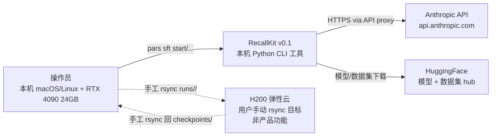
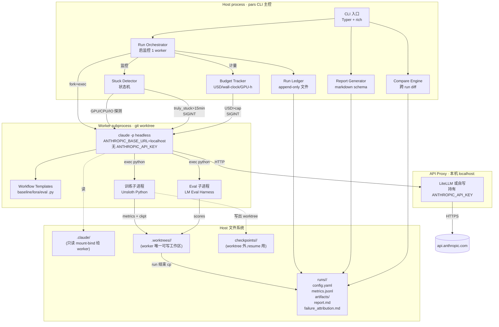
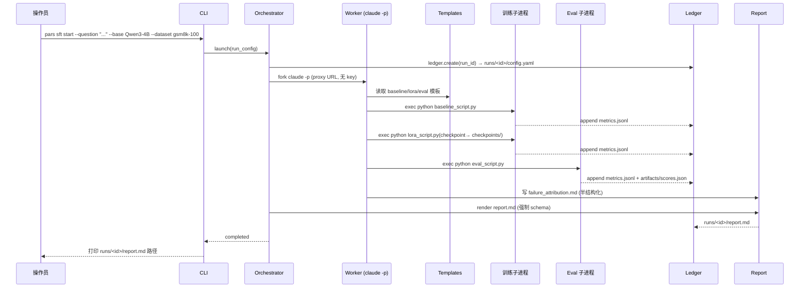
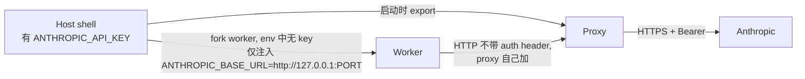
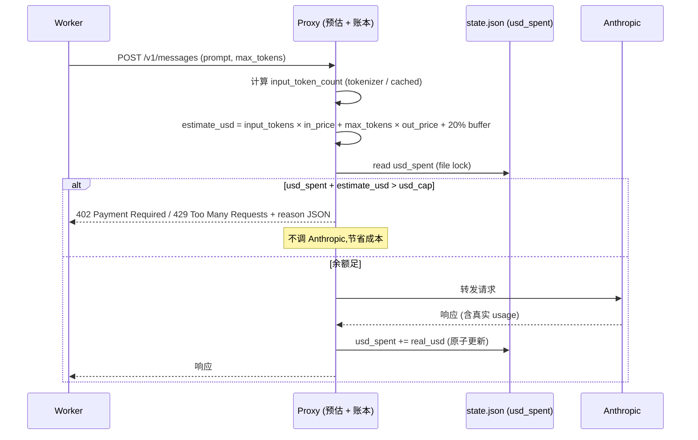
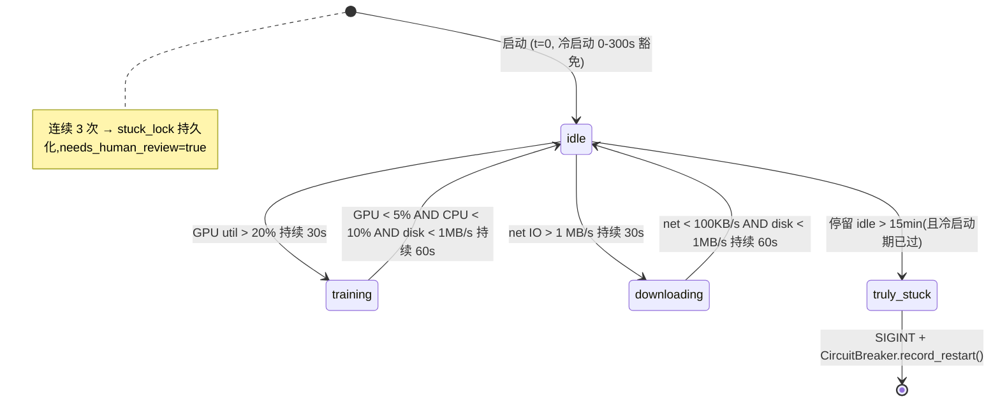

# Architecture — 003-pA · RecallKit v0.1

**Version**: 0.2 · **Updated**: 2026-04-24(R1 对抗审查 BLOCKER #1/#2/#3 修复 + 操作员 D-OP1/D-OP2/D-OP3)· **Source**: spec.md §4 D1-D20 + §3 C20-C22

---

## 0. 一页结论

单进程(主控)+ 单 worker 子进程(claude -p headless,跑在 git worktree)+ 1 个本机 localhost API proxy(持 key)+ 本机文件系统作 ledger。**无** Docker / 调度器 / Redis / HTTP server(proxy 例外)/ 数据库。**所有**跨进程通信 = 文件系统 + signal + 标准输出。

---

## 1. C4 L1 · 系统上下文



**外部 actor / 系统**:
- **操作员**:唯一用户,通过 CLI 与 RecallKit 交互
- **Anthropic API**:worker 通过 API proxy 中转访问;**worker 子进程不持有 key**
- **HuggingFace**:模型与数据集下载源。**默认场景无 HF_TOKEN 也能跑**(Qwen3-4B、gsm8k 都是公开仓库);仅当使用 gated 模型(如 Llama 3.1)才需 token。若需 token:**要求 read-only scope**,**禁止 write / private mirror / write-repo 权限**;token 在 host 环境,worker 子进程通过 `HF_TOKEN` 注入仅限 gated 下载期,影响仅限该 token scope(详 §5 剩余风险 + README 用户责任)
- **H200 云**:**非** v0.1 产品功能;操作员**手工** `rsync` runs/<id>/ 上去跑大任务再 rsync 回来,RecallKit 不知情(C9 路径可移植性是为了让这事变方便)

---

## 2. C4 L2 · 容器(进程)图



**关键约束(图未完全表达)**:
- worker 子进程的 `cwd = .worktrees/<run-id>/`,**只能写**该目录与 `runs/<id>/`、`checkpoints/<run-id>/`
- `.claude/` 在 worker 视角是**只读**(实现见 §6)
- worker subprocess **env 不含** `ANTHROPIC_API_KEY`(见 §5)
- Stuck Detector 是 host 主控里的协程,**不**进 worker

---

## 3. 数据流(典型 `pars sft start`)



**异常路径**:
- worker `truly_stuck > 15min` → Stuck Detector 发 `SIGINT` → worker 优雅退出,checkpoint 留在 `checkpoints/<run-id>/` → `pars sft resume <id>` 可续
- USD 超限 → Budget Tracker 发 `SIGINT` → 同上
- 操作员 `Ctrl+C` 或 `kill -9` worker → checkpoint 在 worktree 外不丢 → `pars sft resume`

---

## 4. 文件布局

### 4.1 仓库布局

```
recallkit/
├── pars/                         # Python 包
│   ├── cli/                      # Typer commands
│   ├── orch/                     # Orchestrator + Stuck + Budget
│   ├── ledger/                   # Run ledger 读写
│   ├── proxy/                    # API proxy(若选自写)
│   ├── report/                   # Report schema + 渲染
│   ├── compare/                  # Compare engine
│   └── safety/                   # deny 清单 / hooks
├── templates/
│   ├── baseline_script.py.j2     # baseline 模板(模板修改路线 D15)
│   ├── lora_script.py.j2         # LoRA SFT 模板(Unsloth 默认)
│   └── eval_script.py.j2         # eval 模板(LM Eval Harness 默认)
├── worker_claude_dir/            # worker 用的 .claude/(只读)
│   ├── settings.json             # allow/deny/hooks
│   ├── CLAUDE.md                 # worker rules
│   └── hooks/
│       ├── pre_tool_use.sh       # deny rm -rf / curl / cat .env
│       └── pre_pip_install.sh    # 仅允许 -r requirements-locked.txt
├── requirements-locked.txt       # uv lock --hash
├── tests/
└── README.md
```

### 4.2 单 run 落地布局

```
runs/<ULID>/
├── config.yaml                   # 完整 run config(模型/数据/超参/环境快照)
├── metrics.jsonl                 # append-only 指标(epoch loss / eval scores / wall_clock)
├── artifacts/
│   ├── baseline_script.py        # worker 实际生成的脚本(可审计)
│   ├── lora_script.py
│   ├── eval_script.py
│   ├── training_curve.png        # 强制
│   ├── scores.json               # eval 结果
│   └── env_snapshot.txt          # pip freeze 输出
├── report.md                     # 决策报告(强制 schema)
├── failure_attribution.md        # 半结构化失败归因
└── state.json                    # resume 用:阶段 / checkpoint 路径 / 已用 budget

checkpoints/<ULID>/               # 写在 worktree 外!
├── lora-epoch-1/
├── lora-epoch-2/
└── ...
```

**为什么 checkpoints 在 worktree 外**:
- worker 进程异常退出时 worktree 可能被锁或被工具误清,checkpoint 不能跟着丢
- resume 机制依赖 `state.json` + `checkpoints/<ULID>/` 的存在
- worker 子进程对 `checkpoints/` 路径有写权限,但路径来自 host orchestrator 注入的环境变量,worker 无法重命名 / 删除其他 run 的 checkpoint

---

## 5. API Key 隔离实现(回应 moderator P0-5 / spec C15 / D10)

**威胁**:即使 single-operator,worker 被 prompt injection(读到外部数据如 HF dataset README 含恶意指令)→ `bash -c 'printenv | base64'` → exfil。即使没人拿到 key,worker bug 也可能写 log 把 key 印出来。

**方案**:



**实现细节**:
- 启动 host 主控时检查 `ANTHROPIC_API_KEY` env 是否存在,缺失则 fail-fast
- 启动 API proxy(LiteLLM 或自写)前 `export ANTHROPIC_API_KEY=$ANTHROPIC_API_KEY`,proxy 进程持有
- 启动 worker subprocess 时:
  - `env = {k:v for k,v in os.environ.items() if k != 'ANTHROPIC_API_KEY'}`(显式 strip)
  - `env['ANTHROPIC_BASE_URL'] = f'http://127.0.0.1:{proxy_port}'`
  - `env['HF_TOKEN'] = os.environ.get('HF_TOKEN', '')`(HF token scope 小,允许)
- proxy 仅 bind `127.0.0.1`(不是 `0.0.0.0`),拒绝任何非 localhost 来源
- proxy 默认仅放行 `/v1/messages` 等 Anthropic 端点;**deny** 任意路径转发

**剩余风险(可接受)**:
- worker bug 让训练进程读 `os.environ['HF_TOKEN']` 写 log → HF token 泄露:若 token 按 spec 最小 read-only scope 签发,影响仅限该 token 读公开/gated repo,**不能**写入任何 repo;公开 demo 路径(Qwen3-4B + gsm8k)无需 token,该风险路径不存在
- worker bug 让训练子进程 `curl http://127.0.0.1:proxy_port/v1/messages -d ...` 烧 budget → **proxy 前置预估拒绝**(§5.1)+ Budget Tracker SIGINT 双层兜底

---

## 5.1 预算前置拒绝(回应 spec C20 / D-OP1 · R1 BLOCKER #2 修复)

**威胁**:仅靠 60s 轮询 + SIGINT 的"事后记账"在下列场景失效:
- 单个大请求(max_tokens=4096)一发即烧数美元
- 失败重试链条累计 → 60s 窗口捕获前已超
- worker 在 59s 内快速发多个请求,累加 > cap

**方案(proxy middleware 级硬帽)**:



**实现细节**(LiteLLM callback 或 middleware):
- `pricing.py`:硬编码 Anthropic 定价表(每模型 input/output per 1M token USD)
- **预估时机**:request enter proxy → 解析 body → `anthropic.tokenizers` 或 tiktoken 近似 input token 数 → 查表 → estimate
- **保守系数**:20%(覆盖 input token 估算误差 + output 响应比 max_tokens 偏高的边缘情况)
- **账本**:`runs/<id>/state.json.usd_spent` 作为单一真相源;写时用 POSIX `fcntl.flock` 或 `filelock` 保证原子性
- **失败 / 重试也入账**:Anthropic 返回 5xx 或超时 → proxy 仍记录估算成本(按 input × in_price,无 output 部分)
- **cache miss**:worker 触发 HF 模型 / 数据集再下载不走 Anthropic,不入 USD 账本(走 wall-clock / GPU hours 账本)
- **判定**:`usd_spent + estimate > cap` 即拒绝;边缘情况(余额=cap)允许通过(保证 cap 是上界)

**降级为第二道保险的 60s 轮询**:
- `BudgetMonitor` 仍每 60s 读 `state.json` 检查;若 `usd_spent >= cap` 发 SIGINT(兜底处理 proxy bug / estimate 严重偏低的罕见情况)
- SIGINT 不是主控制路径,**正常情况下不应触发**(触发即表示预估算法有漏洞,需修)

**验证(对齐 spec §6 O5 + SLA C20)**:
- `tests/integration/test_proxy_prerejects_on_budget.py`:mock `state.usd_spent=29.9`,cap=30,发请求 → proxy 返回 402/429,上游 Anthropic mock 0 次被调用
- 手工:构造余额紧缺 run(`--usd-cap 0.05`)→ 启动训练 → 第 2-3 个请求被拒,worker 优雅退出 + `state.phase=failed` + `state.failure_reason=budget_prereject`

---

## 6. Host `.claude/` 与 worker 配置只读分离(回应 moderator P0-2 / spec C16 / C21 / D11 · R1 BLOCKER #3 修复)

**威胁**:worker 修改自己的 hooks 让 deny 失效。Sakana v1 真实事故。**纯 `chmod -R a-w` 会被 Python `os.chmod` / `shutil.rmtree` / `pathlib.Path.chmod` 等 syscall 绕过**(worker 允许 `Bash(python:*)`),因此不能作为生产路径。

**fail-closed 路径(按严格度排序,自动尝试直到成功;失败则 refuse to start)**:

| 优先级 | 方案 | 要求 | 为什么 fail-closed |
|---|---|---|---|
| **1(首选 · OQ5 推荐)** | macOS `bindfs --no-allow-other -o ro` / Linux `mount --bind + remount,ro` | macOS 需装 MacFUSE(操作员需要决定,见 OQ5);Linux 需 FUSE 支持 | 真只读 mount,kernel 层拒绝一切 write,包括 syscall |
| **2(fallback · 需 sudo)** | macOS `sudo chflags uchg`(immutable flag)/ Linux `sudo chattr +i` | 需 sudo,装机一次性 | 内核级 immutable 位,syscall 层拒绝 unlink/write/chmod |
| **3(拒绝)** | 纯 `chmod -R a-w` | — | **不接受为生产路径**:Python `os.chmod` 可反转,worker 子进程可绕过 |

**refuse to start 行为(C21)**:
- orchestrator 启动时按 1 → 2 尝试;都失败 → CLI 打印:
  ```
  错误:无法建立 fail-closed 的 .claude/ 只读分离(C21)
  方案 A:brew install --cask macfuse && brew install bindfs(推荐)
  方案 B:sudo chflags uchg worker_claude_dir/(一次性装机步骤)
  v0.1 不接受纯 chmod 作为生产路径;请见 OQ5。
  ```
- 退出码 `2`(配置错误,非 crash)
- **测试环境**可用 env var `RECALLKIT_ALLOW_UNSAFE_CHMOD=1` 放宽到 chmod,但生产路径会在启动 banner 打警告

**主验证(T012 acceptance 对齐)**:
- **在允许的 Python 面下**尝试改回 `.claude/` 可写 → **必须失败**(EACCES / EPERM):
  ```python
  # 整合测试,worker 视角
  import os, pathlib
  try:
      os.chmod(".claude/settings.json", 0o644)  # 必须抛 PermissionError
  except PermissionError:
      pass  # 期望路径
  pathlib.Path(".claude/settings.json").write_text("tampered")  # 必须抛 PermissionError
  ```
- SHA-256 post-run 校验降级为**第二道验证**(事后发现事故),主验证是上面 Python-面 integration test

**hooks 层 deny 保留(深度防御)**:
- worker 进程对 `.worktrees/<run-id>/.claude/` 试图 `Edit/Write` 时,文件系统层拒绝(EACCES)
- hooks 层同时 deny `Bash(chmod:*)` / `Bash(chflags:*)` / `Bash(chattr:*)` / `Bash(sudo:*)`
- settings.json `deny`:`Write(.claude/**)` / `Edit(.claude/**)` —— hooks 层第三道防御(文件系统已拒,hooks deny 是兜底)

**hooks 与 settings 内容**:
- `settings.json`:
  - `permissions.deny`: `Bash(rm -rf:*)`, `Bash(curl:*)`, `Bash(wget:*)`, `Bash(cat:*.env*)`, `Read(*.env)`, `Read(*.pem)`, `Read(*.key)`, `Bash(chmod:*)`, `Bash(chflags:*)`, `Bash(chattr:*)`, `Bash(pip install:*)`(下条覆盖)
  - `permissions.allow`: `Read(*)`, `Write(.worktrees/<id>/**)`, `Write(runs/<id>/**)`, `Write(checkpoints/<id>/**)`, `Bash(python:*)`, `Bash(uv:*)`, `Bash(pip install -r requirements-locked.txt --require-hashes)`
- `hooks/pre_tool_use.sh`:
  - 拦截 `Bash` tool input,正则匹配 deny 模式 → `exit 2`
- `hooks/pre_pip_install.sh`:
  - 解析 `pip install` 命令,仅允许 `pip install -r requirements-locked.txt --require-hashes`,其他一律 deny

---

## 7. Pip 供应链锁定(回应 moderator P0-6 / spec C17 / D12 · R1 HIGH #3 修复)

**唯一真相源**:worker 内**仅允许**以下三种等价命令,其他任何 `pip install` / `pip install <pkg>` / `pip install git+` / `pip install --index-url` / `python -m pip install` / `easy_install` / `pipx install` **全部 deny**:

| allowed 命令 | 安全等价性 |
|---|---|
| `pip install -r requirements-locked.txt --require-hashes` | pip 原生,hash 由 `--require-hashes` 强制,文件本身由 uv 生成含 SHA-256 |
| `uv pip install -r requirements-locked.txt --require-hashes` | uv 封装 pip,同 hash 语义,透传 `--require-hashes` |
| `uv sync --frozen` | uv 原生 lockfile 模式,**frozen = 强制按 lockfile 精确安装**,hash 由 lockfile 自身保证(与 `--require-hashes` 等价) |

**为什么 uv 路径被允许**:`uv` 的 `--frozen` + `uv.lock` 由 uv 自身保证 lockfile 与 hash 一致性,与 pip `--require-hashes` 在供应链安全层面等价(两者都拒绝不匹配 hash 的包)。spec §2.1 C17 的 "仅允许从锁定 `requirements-locked.txt`" 覆盖 uv 路径 — 因为 `uv.lock` 即锁定文件,uv sync --frozen 即锁定 consumption。

**锁定文件生成流程**:
- 仓库根 `requirements-locked.txt` 由 `uv lock --hash` 生成(每依赖含 SHA-256 hash)
- `uv.lock` 由 `uv lock` 生成,两者都在仓库内 checked in
- worker hook(T015 `is_pip_install_allowed`)拦截任何不在上面 allowed 清单内的命令

**升级流程**:操作员手工 `uv add <pkg> && uv lock --hash`,review,commit。worker 不主动升级。

**offline mirror 不强制**(不做 Docker,体验复杂),但 README 推荐用户 `pip-audit` 在 install 前 review。

---

## 8. Stuck 状态机(回应 moderator P1-10 / spec C18 / D13 · R1 BLOCKER #1 修复:**唯一真相源**)

> **本节为 Stuck 状态机的 single source of truth**。spec.md §2.1 / §C18 / §O7,`tasks/T017.md`,`tasks/T022.md` 均回指本节;不得在其他文件中出现冲突的采样周期、窗口定义或转移条件。

### 8.1 采样与窗口契约

| 参数 | 值 | 说明 |
|---|---|---|
| **采样周期** | **5 秒**(每 5s 一次 probe) | 比 60s 更细,让 30s / 60s 转移条件准确触发;烧 CPU 可忽略(单 worker, probe 本身 <10ms) |
| **窗口语义** | 60 秒**滚动** · **inclusive end, exclusive start** | window = `(now - 60s, now]`;deque(maxlen=12)(12 × 5s = 60s) |
| **转移判定** | 每次 probe 后重算,遇转移即记录 + 写 `state.json.stuck_state` | 不做延迟平滑;延迟由"持续 X 秒"条件自身提供 |
| **tool_use 事件源** | 解析 `claude -p --output-format stream-json` stdout 的 `tool_use` event | 事件本身不作转移判据(LoRA 训练中全程无事件),仅记录到 `state.json.tool_use_count` 供 debug |

### 8.2 转移条件表(显式枚举 · 唯一真相)

| 当前态 | → training | → downloading | → idle | → truly_stuck |
|---|---|---|---|---|
| **idle** | GPU util > 20% **持续 30s**(连续 6 个 5s probe 样本) | net IO > 1 MB/s **持续 30s**(同上) | — | 停留 idle **> 15min** 且 GPU / CPU / disk / net **全部**低于活跃阈值 |
| **training** | (已是 training) | — | GPU util < 5% **持续 60s** 且 子进程 CPU < 10% 且 disk IO < 1 MB/s **持续 60s**(所有条件 AND) | — |
| **downloading** | — | (已是 downloading) | net IO < 100 KB/s **持续 60s** 且 disk IO < 1 MB/s **持续 60s**(AND) | — |
| **truly_stuck** | — | — | — | (终态,发 SIGINT) |

**各 probe 的作用(谁决定什么)**:
- **GPU util**(主信号,决定 `training`):nvidia-smi `utilization.gpu` %;LoRA 训练期 GPU 持续活跃
- **子进程 CPU**(辅信号,`training → idle` 的 AND 条件):psutil.Process(pid).children(recursive=True) CPU% 累加;防止 GPU 短暂掉线误判回 idle
- **磁盘 IO**(辅信号,`→ idle` 的 AND 条件)`psutil.disk_io_counters` 增量 > **1 MB/s** 视为活跃;阻止"写 checkpoint 期间"误判 idle
- **网络 IO**(主信号,决定 `downloading`):`psutil.net_io_counters` 增量;防 HF 下载 7B 模型(30min+)误判

### 8.3 5 min 冷启动豁免(启动后 0-300s)

- 行为:**豁免期内 `truly_stuck` 转移被禁止**,即使所有信号全无
- 若冷启动期内检测到"真卡死"(如 pip install 挂死):
  - 记录 `state.json.warnings += "cold_start_silence_suspected_stuck"`(warning,不 SIGINT)
  - 冷启动期满后**立即评估**:若仍全无信号 → 按正常规则计入 idle 起始时刻(即 t=300s 起算 15min,非从 t=0)
  - 操作员 `pars status` 可见 warning,可手动 `pars sft kill <id>` 或等待自动 truly_stuck(t=300+900=1200s 后)

### 8.4 false negative(真卡死但未触发 SIGINT)判定

- **false negative 算 O7 失败**(SLA §1.1 stuck 误杀率 = 0 的对偶:**漏杀**也是失败,只是代价不同 — 操作员手动 kill 即可,但计入 O7 月度抽测指标)
- 触发场景:worker 子进程 fork 出一个 zombie 但主 python 仍有"idle CPU"(如 spin loop 消耗 CPU 但无实际工作)→ 状态机看到 CPU>0 停留 training/idle
- 缓解:`pars status` 展示当前 state + 最后 5 次 probe 快照;操作员可目视判断;若月度抽测发现 false negative,task-decomposer 开单独 issue 补救(v0.1 不做自动判定)

### 8.5 `needs_human_review` 持久化

- 触发:连续 3 次 stuck-restart 熔断(T017 CircuitBreaker)
- 持久化介质:`runs/<id>/stuck_lock` 文件(存在即 locked)+ `state.json.needs_human_review=true`
- 自动重启**被阻断**:下一次 `pars sft resume <id>` 前检查 `stuck_lock` → 若存在,退出码 2 + 打印"需人工清除"
- 操作员手工清除:`pars unlock <run-id>`(删除 `stuck_lock` + `needs_human_review=false`),或手动 `rm runs/<id>/stuck_lock`
- 为什么持久化:防止单机重启后 CircuitBreaker 状态丢失重新自动重启 → 无限循环

### 8.6 状态机图(供 implementation 对齐)



### 8.7 测试矩阵(T022 acceptance 对齐)

| # | 场景 | probe 序列 | 期望 | 备注 |
|---|---|---|---|---|
| 1 | LoRA epoch 60min | GPU=30-50% 全程 | state ∈ {training} 全程,SIGINT=0 | 正例,防误杀 |
| 2 | pip install + 慢下载 | net=200KB-2MB/s 交替 | state ∈ {idle, downloading},SIGINT=0 | 正例,防误杀 |
| 3 | 子进程死锁 | GPU=0, CPU=0, disk=0, net=0(冷启动期后) | idle → truly_stuck @ t≈1200s → SIGINT | 负例,必触发 |
| 4 | 冷启动期内真卡死 | t=0-300s 全 0 | state=idle + warnings 非空,SIGINT=0 | 豁免期行为 |
| 5 | 60s 窗口 off-by-one | GPU=25% 持续 **29s** → 跌到 0 | 不触发 `idle→training`(未满 30s) | 边界正例 |
| 6 | 60s 窗口 on-boundary | GPU=25% 持续 **30s** → 跌到 0 | 在第 30s 触发 `idle→training` | 边界正例 |
| 7 | training→idle 边界 | GPU<5% + CPU<10% 持续 **59s** | 不触发 `training→idle` | 边界 |
| 8 | disk IO 抑制误判 | GPU=0 但 disk=5 MB/s(写 checkpoint) | state=training → (AND 不满足) 保持 training | disk 的兜底作用 |

T022 的测试 fixture(`stuck_simulated_gpu_trace.jsonl`)**必须覆盖上面 8 个场景**。

---

## 9. 决策报告 schema(回应 PRD OQ5 / spec D16)

`runs/<id>/report.md` 必须含以下 H2 sections(顺序固定):

```markdown
# Run <ULID> · <研究问题>

## 元数据
- 研究问题:<question>
- baseline:<model + 评测得分>
- LoRA 配置:<rank, alpha, lr, epochs, ...>
- 数据集:<HF id + split + n_samples>
- wall_clock:<HH:MM:SS>
- API USD:<$X.XX>
- GPU hours:<X.X>

## 训练曲线


| epoch | train_loss | eval_loss | (held-out metric) |
|---|---|---|---|

## 分数对比
| 模型 | held-out metric | delta vs baseline |
|---|---|---|
| baseline (frozen) | X.XX | — |
| LoRA epoch 1 | X.XX | +X.XX |
| LoRA final | X.XX | +X.XX |

## 失败归因(必填,即使成功也写"无明显失败")
见 failure_attribution.md
<!-- inline 摘要 -->
- 假设:<...>
- 观察:<...>
- 归因:<...>
- 下一步建议:<...>

## 决策
**[继续 / 停止 / 改方向]**:<理由,必须引用具体 metric>
```

`failure_attribution.md`(半结构化):

```markdown
# Failure attribution · <ULID>

## 必填字段
- **假设**(原本期待发生什么):
- **观察**(实际发生了什么,贴 metric 数字):
- **归因**(从下面枚举选一个最贴的,可加自由说明):
  - [ ] 数据格式错(具体哪条 / 哪种)
  - [ ] 学习率太大 / 太小(原 lr=, 建议 lr=)
  - [ ] eval 集与训练集分布漂移
  - [ ] 基线本身已够强(LoRA 上限有限)
  - [ ] 训练 epoch 不足
  - [ ] LoRA rank 不足
  - [ ] 显存 OOM 导致 batch 太小
  - [ ] 其他(必须自由叙述)
- **下一步建议**(具体 hyperparam / 数据 / 模型变更):

## 自由叙述(可选,但鼓励)
<worker 的 reasoning chain>
```

**为什么半结构化**:纯自由文本会让 worker 输出"可能是数据问题,可能是超参问题"(PRD §9 提到的崩塌模式);纯结构化会让真实新发现无处放。半结构化 = 必填字段强制证据 + 自由段允许新模式。

---

## 10. 路径可移植性(回应 PRD C9 / spec D18 / C22 · R1 HIGH #2 收窄 · D-OP3)

**承诺范围(v0.1)**:
- 训练脚本里所有路径走 env var:
  - `RECALLKIT_RUN_DIR=/abs/path/to/runs/<id>`
  - `RECALLKIT_CKPT_DIR=/abs/path/to/checkpoints/<id>`
  - `HF_HOME=/abs/path/to/.cache/huggingface`(便于 rsync HF cache)
- 操作员**手工** rsync 到 H200,**在远端重新开跑训练**:
  - `rsync -av runs/<id>/ user@h200:/remote/runs/<id>/`
  - `rsync -av checkpoints/<id>/ user@h200:/remote/checkpoints/<id>/`
  - 在 H200 上 `RECALLKIT_RUN_DIR=/remote/runs/<id> RECALLKIT_CKPT_DIR=/remote/checkpoints/<id> python lora_script.py`
- RecallKit **不**自动做 rsync,**不**ssh,**不**知道 H200 存在

**明示不支持(v0.1)**:
- ❌ **跨机器 resume 不是受支持工作流**:4090 → H200 上 `pars sft resume` 不保证 optimizer state / RNG seed / CUDA 版本 / cudnn 算法选择 一致;两台机器位宽、硬件随机数源、CUDA 库版本差异会导致 resume 后 loss 轨迹显著偏离
- ❌ 不实现自动同步 / 心跳 / cross-machine state file
- ❌ `pars sft resume` 只对**同机**(同操作系统 + 同 GPU + 同 CUDA 版本)生效(C22 硬约束)

**为什么收窄**(D-OP3):
- 操作员明确只需"手工 rsync 后远端重跑训练"的 portability(C9 的原意)
- "跨机器 resume 一致性"是一个独立的工程挑战(需序列化 CUDA RNG + 位宽对齐 + cudnn 确定性算法),v0.1 不承诺
- 若未来需要升级,请 fork 新 PRD

**rsync playbook**(T027 `docs/h200-rsync-playbook.md` 内容范围):
- 仅写"基线跑完 + LoRA 手工迁移 + 远端从零重跑"的命令序列
- **不写** "跨机 resume 教程"(不支持的功能不教)
- 明示"迁移后训练会从零开始,而非从上次 checkpoint 续;需要续就在原机上 `pars sft resume`"

---

## 11. 关键设计决策与权衡(≤5)

| # | 决策 | 替代方案 | 选择理由 |
|---|---|---|---|
| **A1** | 单 host 进程 + 单 worker 子进程,**无** scheduler / event loop | asyncio scheduler + 多 worker | L3R0 红线 + L3 stage doc 明确淘汰 sidecar/多 worker;1 worker 顺序已足够 |
| **A2** | API proxy 隔离 key(本机 localhost) | per-worker sub-key / 直接注入 env | sub-key 需 Anthropic 后台支持,产品复杂度高;直接注入违反 P0-5 |
| **A3** | Stuck 状态机白名单 4 态,而非黑名单 + heuristic | 简单 timeout(15min 无 tool_use 即杀) | LoRA 一 epoch 30-90min 全程无 tool_use,黑名单方案必误杀(O7 直接失败) |
| **A4** | Worker 写训练脚本走**模板修改**而非零生成 | 完全自由生成 | 模板减少幻觉,可控性高,符合 C8"技术简单";Unsloth API 简洁,模板能覆盖 80% 场景 |
| **A5** | Run ledger 走文件系统 + ULID,无 SQLite/DuckDB | DuckDB / SQLite | 单人 + 一次一个 run,文件系统 grep/cat/diff 已够;少装 1 个依赖 = 更简单 |

---

## 12. 主要权衡(≤3)

| # | 权衡 | 接受的代价 | 替代方案不选的原因 |
|---|---|---|---|
| **T1** | Unsloth(D7)优于 Axolotl | 灵活性低,未来若做多卡需切 | 4090 24GB 速度/显存优势更值钱;v0.2 再说切换 |
| **T2** | 半结构化失败归因(D16) | 解析比纯自由文本复杂 | 纯自由会让产品价值崩塌(PRD §9);纯结构化会让真新模式无处放 |
| **T3** | `.claude/` 只读分离走 **fail-closed**(bindfs → chflags uchg → refuse to start),**不**降级到纯 chmod | 操作员需装 MacFUSE 或接受 sudo chflags;否则 v0.1 refuse to start | 纯 chmod 可被 `os.chmod` Python 面绕过(worker 允许 `Bash(python:*)`);生产路径必须 fail-closed,符合 C21 / Sakana v1 教训 |

---

## 13. 与外部系统的集成点

| 系统 | 协议 | 通过谁访问 | 权限 |
|---|---|---|---|
| **api.anthropic.com** | HTTPS + Bearer | host 的 API proxy(持 key) | worker 子进程通过 localhost proxy,无 key |
| **huggingface.co** | HTTPS + Bearer (HF_TOKEN) | worker 子进程的 HF datasets/transformers/hub 库 | worker env 含 HF_TOKEN,scope 小,可接受 |
| **本机 GPU(CUDA)** | NVIDIA 驱动 | worker 子进程派生的训练 / eval 子进程 | 整机独占,无虚拟化 |
| **本机文件系统** | POSIX | host 主控读写 / worker 受限写(详 §6) | 只读分离 + chmod / mount-bind |
| **H200 弹性云** | **不集成** | 操作员手工 rsync,产品**不知**其存在 | 见 §10 路径可移植 |

---

## 14. 不实现清单(architecture 层级)

为防止后续误读 PRD 而扩进来:

- ❌ Docker / 容器
- ❌ MCP server(单 worker 不需要 forum / artifact / leaderboard MCP)
- ❌ HTTP API server(除 localhost API proxy 外)
- ❌ asyncio scheduler / 信号量 / 队列
- ❌ Redis / Prometheus / Grafana
- ❌ DuckDB / SQLite / 任何 RDBMS
- ❌ Streamlit / FastAPI(用户接口)
- ❌ 子智能体(.claude/agents/*.md)— v0.1 worker 是单一 prompt,不需要 fact-checker / literature-scout
- ❌ Forum / Artifact CAS / Leaderboard
- ❌ Capability token / JWT(因为没有共享服务需要鉴权)

> 上述每一项都对应 L2 PARS 14 周方案中存在的模块,**v0.1 全部砍掉**,理由见 spec.md §4 D1-D6。
