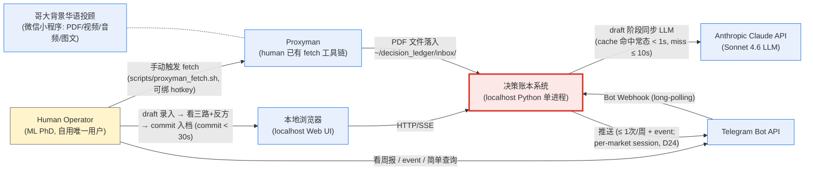
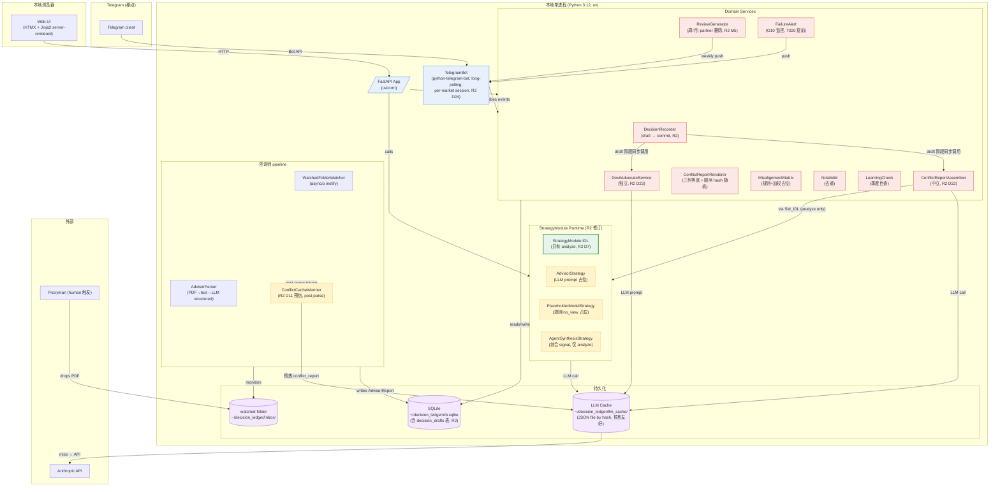
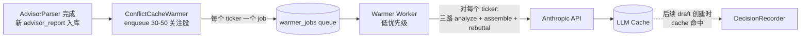
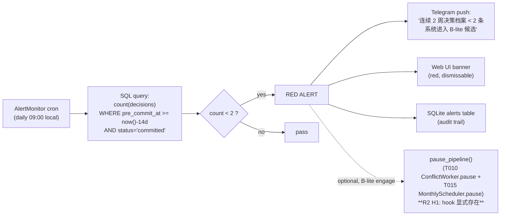

# Architecture — 004-pB · 决策账本

**Version**: 0.2
**Created**: 2026-04-25T15:05:00+08:00
**Updated**: 2026-04-25T19:30:00+08:00 (R2 surgical revision)
**Companion**: `spec.md` v0.2 · 6-element contract

> **架构枢纽**: `StrategyModule` IDL (analyze 单一职责) + `ConflictReportAssembler`
> 中立服务 + `DevilAdvocateService` 独立服务 + 决策档案 schema (含 draft/commit
> 双阶段) + 完全解耦模块拓扑。任何"为赶时间合并模块成长函数"的建议**违反 PRD R9**, spec 必拒。

---

## Revision History

| Version | Date | 修订摘要 |
|---------|------|---------|
| 0.1 | 2026-04-25T15:05 | 初稿 (C4 L1/L2 + IDL + 双阶段录入流 + tradeoff + 不变量) |
| 0.2 | 2026-04-25T19:30 | **R2 surgical revision** (Codex R1 BLOCK 修订): <br/>(1) §3.1 IDL 重写: StrategyModule 仅 `analyze()`, conflict_resolve / devil_advocate 拆出到独立服务 (B2/B3) <br/>(2) §3.3 录入流重写为 draft → preview → commit 三步 sequence diagram, draft 阶段同步 LLM (cache 命中常态 < 1s, miss ≤ 10s), commit 阶段无 LLM (B1) <br/>(3) §3.5 加 per-market session config (H4 D24) <br/>(4) §9 不变量 #1/#2/#6 修正 <br/>(5) §10 新增 Logs Schema section (M4) <br/>(6) §3.6 新增 cache 预热流程 (D11/D21) |

---

## 1. C4 L1 · System Context



### 系统边界 (确定不在系统内)
- **券商账户 / 真实交易 API**: 永远不接 (R1 红线)
- **市场数据源 (Yahoo / Bloomberg / TradingView)**: v0.1 不接, 价格快照由 human 录入或贴
- **多用户 / 云部署 / auth**: 永远不需 (D5)
- **音频 / 视频解析**: v0.2+ (PRD scope OUT)

### 外部依赖清单
- Anthropic API (单一 LLM 提供商, $500/年预算内)
- Telegram Bot (一次注册, 长连接 long-polling, 无 webhook 公网暴露)
- Proxyman (human 现有工具, 不是本系统组件)
- 文件系统 (watched folder + SQLite file)

---

## 2. C4 L2 · Container Diagram



### 容器责任表

| 容器 | 职责 | 进程 |
|------|------|------|
| FastAPI App | 路由 + Web UI 渲染 + Domain Service 编排 | 主进程 |
| TelegramBot | long-polling Bot, push notification, 简单查询; per-market session | 同主进程 (asyncio task) |
| WatchedFolderWatcher | 监听 inbox 新增 PDF, 触发 AdvisorParser | 同主进程 (asyncio task) |
| AdvisorParser | PDF → text → LLM 结构化 (`{方向, 标的, 置信度}`) | 同主进程 (异步任务队列) |
| **ConflictCacheWarmer** (R2) | parse 完成后, 对 30-50 关注股 enqueue conflict_report 预生成, 服务于 D21/D11 cache 命中目标 | 同主进程 (异步任务队列) |
| StrategyModule Runtime | 三个占位 Strategy + IDL 注入; **仅 analyze, R2 D7** | 同主进程 (异步) |
| **ConflictReportAssembler** (R2) | 中立聚合服务, 不是 lane; 接收 3 个 signals + env_snapshot, LLM 出 ConflictReport | 同主进程 |
| **DevilAdvocateService** (R2) | 独立反驳服务, 不是 lane; 接收 DecisionDraft + env_snapshot, LLM 出 Rebuttal ≤ 80 字 | 同主进程 |
| Domain Services | DecisionRecorder (draft→commit) / ConflictReportRenderer / Matrix / Review / Note / Learning / Alert | 同主进程 |
| SQLite | 唯一权威存储 (含 decision_drafts 表) | 文件 |
| LLM Cache | 按 `(advisor_week_id, ticker_set, prompt_hash)` 缓存, 命中跳过 API; 预热友好 | 文件 (JSON) |
| watched folder | inbox: human 把 Proxyman fetch 出的 PDF 拖进来 | 文件 |

### 单进程 = 简洁选择
v0.1 单用户 localhost, 不需要分布式。所有组件跑在 **一个 Python 进程**, FastAPI +
asyncio task group:
- 主 thread: HTTP 路由
- task 1: Telegram long-polling
- task 2: WatchedFolderWatcher
- task 3: ReviewGenerator cron (weekly + monthly)
- task 4: FailureAlert monitor (daily check, **R2 H1: T020 提前到 Phase 1 末段**)
- task 5: AdvisorParser worker (queue-driven)
- **task 6 (R2 新): ConflictCacheWarmer worker** — parse 后 enqueue 预生成 conflict_report, 服务 D21 cache 命中常态

---

## 3. 关键设计决策 (≤ 5)

### 3.1 IDL 边界与三服务拆分 (R2 修订, D7/D22/D23 → 解决 B2/B3)

**v0.1 之前 (v0.1)**: `StrategyModule` 三方法 (analyze / conflict_resolve / devil_advocate),
其中 `AgentSynthesisStrategy` 同时承担"参赛者 + 总结者"角色 → 击穿 R10 (默认优先级
经行为而非字段呈现) + IDL 自相矛盾 (analyze 签名不含 env_snapshot, 但描述综合).

**R2 修订**: 拆为三个独立服务边界:

```python
from typing import Protocol, runtime_checkable
from dataclasses import dataclass

@dataclass(frozen=True)
class StrategySignal:
    """单个 Strategy 实例对一笔潜在决策的判断。"""
    source_id: str  # "advisor" | "placeholder_model" | "agent_synthesis" | future custom
    ticker: str
    direction: str  # "long" | "short" | "neutral" | "wait" | "no_view"
    confidence: float  # 0.0 - 1.0; 0.0 表示没意见
    rationale_plain: str  # 白话解释 (R3 红线: 必须有, 不允许信号黑箱)
    inputs_used: dict  # {"advisor_week_id": ..., "price_at": ..., "model_version": ...}

@dataclass(frozen=True)
class ConflictReport:
    """三路 (或更多) signals 聚合后的冲突报告 — 由 ConflictReportAssembler 中立产出。
    无 priority / winner / recommended 字段 (R10 红线)。"""
    signals: list[StrategySignal]  # 至少 3 条 (advisor + placeholder + agent_synthesis), 即使有 confidence=0.0
    divergence_root_cause: str  # 白话根因; 若无分歧则为 "暂无分歧"
    has_divergence: bool
    rendered_order_seed: int  # hash(sources + day) % N, UI 据此随机化三列顺序

@dataclass(frozen=True)
class Rebuttal:
    """Devil's advocate 输出 — 由 DevilAdvocateService 独立产出。"""
    rebuttal_text: str  # 一句话粗糙反驳, ≤ 80 字
    invoked_at: str

@dataclass(frozen=True)
class DecisionDraft:
    """R2 新增: pre-commit 阶段的临时草稿。"""
    draft_id: str  # UUID
    ticker: str
    intended_action: str  # buy/sell/hold/wait, 可在 commit 时改
    draft_reason: str  # ≤ 80 字, 可在 commit 时改
    env_snapshot: "EnvSnapshot"
    created_at: str
    status: str  # 'draft' | 'committed' | 'abandoned'


# ───────────────── 服务 1: StrategyModule (R2 修订, 唯一职责 analyze) ─────────────────

@runtime_checkable
class StrategyModule(Protocol):
    """所有策略源实现此接口。
    单一职责: 输入 (advisor_report, portfolio, ticker, env_snapshot) → StrategySignal。
    不知道其他 lane 存在, 不读其他 lane 输出。"""
    source_id: str

    async def analyze(
        self,
        advisor_report: "AdvisorWeeklyReport",
        portfolio: "Portfolio",
        ticker: str,
        env_snapshot: "EnvSnapshot",   # R2 新加, 解决 B3 IDL 自相矛盾
    ) -> StrategySignal: ...


# ───────────────── 服务 2: ConflictReportAssembler (R2 新增, D22) ─────────────────

class ConflictReportAssembler:
    """中立聚合器, 不是任何 Strategy lane。
    输入: signals (三路 StrategySignal 平权列表)
    输出: ConflictReport (含分歧根因白话, 对称排版)
    Implementation: LLM prompt 严格 instruction
        "不要选 winner, 仅描述 X/Y/Z 三方观点和共同点 / 分歧点"
    不读任何 StrategyModule 内部状态。"""

    async def assemble(
        self,
        signals: list[StrategySignal],
        env_snapshot: "EnvSnapshot",
    ) -> ConflictReport: ...


# ───────────────── 服务 3: DevilAdvocateService (R2 新增, D23) ─────────────────

class DevilAdvocateService:
    """独立反驳服务, 不是 StrategyModule。
    输入: 一份 DecisionDraft + EnvSnapshot
    输出: Rebuttal (一句话, ≤ 80 字)
    Implementation: LLM prompt 反驳 intended_action,
        必含 "考虑反方" 语气, 不诱导高频 (R6)。"""

    async def generate(
        self,
        decision_draft: DecisionDraft,
        env_snapshot: "EnvSnapshot",
    ) -> Rebuttal: ...


# ───────────────── 扩展位 (v0.5+, D7) ─────────────────

class CustomStrategyModule(StrategyModule):
    """human 未来插入私有 ML 模型用。继承 IDL 接口 (analyze 单一方法), 实现细节由 human 自由。"""
    source_id = "custom_v1"  # human 自定义
    # ... model.predict() / model.train() / 自定义 features ...
```

**v0.1 三个 StrategyModule 占位实现 (R2 修订, 仅 analyze)**:

| 实例 | analyze 实现 | 备注 |
|------|-------------|------|
| `AdvisorStrategy` (source_id=`"advisor"`) | 取本周咨询师对该 ticker 的观点, LLM prompt 转 StrategySignal; 若无观点 confidence=0.0 | **不再承担 conflict_resolve / devil_advocate** |
| `PlaceholderModelStrategy` (source_id=`"placeholder_model"`) | Q6 默认: 永远 confidence=0.0 / direction="no_view" (最 conservative) | **不再承担 conflict_resolve / devil_advocate** |
| `AgentSynthesisStrategy` (source_id=`"agent_synthesis"`) | LLM 综合 (advisor_report + portfolio + env_snapshot) 出 signal; **R2 修订: 仅 analyze, 不再是 conflict 总结者** | 与其他两个 lane 平权; **不读** AdvisorStrategy / PlaceholderModelStrategy 输出 |

**关键解耦保证 (R2)**:
- 每个 StrategyModule 实例独立可替换 (依赖注入 via FastAPI Depends + registry)
- 一个实例的修改/删除不影响其他实例 (单元测试覆盖每个接口契约)
- 录制每条 signal 时记录 `source_id`, 永远可追溯
- **ConflictReportAssembler 是中立聚合, 不是 lane** (R10 红线工程化体现)
- **三列等宽 + 顺序按 `hash(source_id + day) % N` 随机化** — 避免固定位置 = 固定权重 (R10 心理层面 honor)
- **StrategyModule 单元测试不能 mock/import 其他 lane** (R9 解耦工程化体现)

### 3.2 决策档案 Schema (D8, R2 修订加 status / decision_drafts 表)

```python
from datetime import datetime
from enum import StrEnum
from uuid import UUID

class Action(StrEnum):
    BUY = "buy"
    SELL = "sell"
    HOLD = "hold"  # 已持有 → 继续持有
    WAIT = "wait"  # 未持有 → 等待入场, 或观望

class DecisionStatus(StrEnum):
    DRAFT = "draft"       # R2 新增
    COMMITTED = "committed"
    ABANDONED = "abandoned"  # R2 新增, 30 分钟未 commit GC

@dataclass(frozen=True)
class EnvSnapshot:
    """决策当时的不可变快照。"""
    price: float | None  # human 录入 / Proxyman 同步; v0.1 可空
    holdings_pct: float | None  # 该 ticker 占组合比例
    holdings_abs: float | None  # 绝对持仓金额
    advisor_week_id: str | None  # 关联到当周 AdvisorReport id
    snapshot_at: datetime

@dataclass
class PostMortem:
    """决策后 N 天回填; v0.1 可为空。"""
    executed_at: datetime | None
    result_pct_after_7d: float | None
    result_pct_after_30d: float | None
    retrospective_notes: str | None

@dataclass
class Decision:
    """决策档案 (单次档案条目)。"""
    trade_id: UUID
    ticker: str
    action: Action  # buy/sell/hold/wait
    reason: str  # ≤ 1 行 (UI 强制 ≤ 80 char)
    pre_commit_at: datetime
    env_snapshot: EnvSnapshot
    conflict_report_ref: UUID  # R2: 必填 (draft 阶段就生成完毕)
    devils_rebuttal_ref: UUID  # R2: 必填 (draft 阶段就生成完毕)
    post_mortem: PostMortem | None
    would_have_acted_without_agent: bool  # R2 修订: commit 阶段强制 yes/no (M1)
    status: DecisionStatus  # R2 新增
```

**SQLite 表 (DDL 摘要, R2 修订)**:

```sql
-- R2 修订: decisions 表加 status 字段
CREATE TABLE decisions (
    trade_id TEXT PRIMARY KEY,
    ticker TEXT NOT NULL,
    action TEXT NOT NULL CHECK (action IN ('buy','sell','hold','wait')),
    reason TEXT NOT NULL CHECK (length(reason) <= 80),
    pre_commit_at TEXT NOT NULL,
    env_snapshot_json TEXT NOT NULL,
    conflict_report_ref TEXT NOT NULL,                    -- R2: 必填, draft 阶段生成
    devils_rebuttal_ref TEXT NOT NULL,                    -- R2: 必填, draft 阶段生成
    post_mortem_json TEXT,
    would_have_acted_without_agent INTEGER NOT NULL CHECK (would_have_acted_without_agent IN (0,1)),  -- R2 M1: 强制 yes/no, 无默认
    status TEXT NOT NULL CHECK (status IN ('draft','committed','abandoned')) DEFAULT 'committed',     -- R2 新增
    created_at TEXT NOT NULL,
    updated_at TEXT NOT NULL,
    FOREIGN KEY (conflict_report_ref) REFERENCES conflict_reports(report_id),
    FOREIGN KEY (devils_rebuttal_ref) REFERENCES rebuttals(rebuttal_id)
);
CREATE INDEX idx_decisions_ticker_pre_commit ON decisions(ticker, pre_commit_at);
CREATE INDEX idx_decisions_action ON decisions(action);
CREATE INDEX idx_decisions_status ON decisions(status);

-- R2 新增: decision_drafts 表 (D13)
-- 注意: conflict_report_ref / devils_rebuttal_ref 在 INSERT 时可空 (status='draft' 中间态),
-- 但 UPDATE 完成后必填 (preview 返回前). pydantic 模型 + service 层校验 status=ready 时必填.
CREATE TABLE decision_drafts (
    draft_id TEXT PRIMARY KEY,
    ticker TEXT NOT NULL,
    intended_action TEXT NOT NULL CHECK (intended_action IN ('buy','sell','hold','wait')),
    draft_reason TEXT NOT NULL CHECK (length(draft_reason) <= 80),
    env_snapshot_json TEXT NOT NULL,
    conflict_report_ref TEXT,                             -- INSERT 时 NULL, asyncio.gather 完成后 UPDATE
    devils_rebuttal_ref TEXT,                             -- INSERT 时 NULL, asyncio.gather 完成后 UPDATE
    status TEXT NOT NULL CHECK (status IN ('draft','committed','abandoned')) DEFAULT 'draft',
    created_at TEXT NOT NULL,
    committed_at TEXT,                                    -- commit 时填
    abandoned_at TEXT,                                    -- 30min GC 或 human 弃用时填
    FOREIGN KEY (conflict_report_ref) REFERENCES conflict_reports(report_id),
    FOREIGN KEY (devils_rebuttal_ref) REFERENCES rebuttals(rebuttal_id)
);
CREATE INDEX idx_drafts_status_created ON decision_drafts(status, created_at);
-- GC 任务: status='draft' AND created_at < now()-30min → status='abandoned'
-- 服务层不变量: status='committed' 时 refs 必非空 (commit endpoint 校验)
```

### 3.3 录入双阶段流程: draft → preview → commit (R2 重写, B1 解决, D13/D19/D21)

**关键变化 (R2)**:
- **draft 阶段同步生成** ConflictReport + Rebuttal (cache 命中常态 < 1s, miss 上限 10s)
- **commit 阶段无 LLM 调用**, 仅 SQLite UPDATE status='committed', wall-clock < 1s
- C11 "< 30s" 度量改为 **commit 阶段 wall-clock** (从 preview 200 OK 起算)

```mermaid
sequenceDiagram
    autonumber
    participant H as Human
    participant W as Web UI (HTMX)
    participant API as FastAPI
    participant DR as DecisionRecorder
    participant SM as StrategyModule (3 lanes)
    participant CRA as ConflictReportAssembler
    participant DAS as DevilAdvocateService
    participant CACHE as LLM Cache
    participant DB as SQLite

    Note over H,W: 阶段 1 · 创建 draft (cache 命中常态 < 1s, miss ≤ 10s)
    H->>W: 打开 /decisions/new (默认填 ticker / intended_action / draft_reason)
    H->>W: Enter (创建 draft)
    W->>API: POST /decisions/draft {ticker, intended_action, draft_reason}
    API->>DR: create_draft(payload)
    DR->>DB: INSERT decision_drafts (status='draft', refs=NULL placeholder)
    par 同步并发: 三路 analyze + Rebuttal
        DR->>SM: 三 lane analyze() (advisor / placeholder / agent_synthesis)
        SM-->>CACHE: hash key 查 / miss → Anthropic
        CACHE-->>SM: signals (≤ 1s 命中, ≤ 10s miss)
        SM-->>DR: list[StrategySignal] (3 条)
        DR->>CRA: assemble(signals, env_snapshot)
        CRA-->>CACHE: hash key 查 / miss → Anthropic
        CACHE-->>CRA: ConflictReport
        CRA-->>DR: ConflictReport
    and 并行 Rebuttal
        DR->>DAS: generate(draft, env_snapshot)
        DAS-->>CACHE: hash key 查 / miss → Anthropic
        CACHE-->>DAS: Rebuttal
        DAS-->>DR: Rebuttal
    end
    DR->>DB: UPDATE decision_drafts SET conflict_report_ref=..., devils_rebuttal_ref=...
    DR-->>API: draft_id + ConflictReport + Rebuttal
    API-->>W: 302 → /decisions/draft/{draft_id}/preview
    Note over H,W: 阶段 2 · preview (human 看到三列等宽 + 反方一句话; 顺序 hash 随机化)
    W->>API: GET /decisions/draft/{draft_id}/preview
    API-->>W: 200 OK, 渲染三列 + 反方
    Note over H,W: ⏱️ C11 30s 计时起点 = preview 200 OK 这一刻
    H->>W: 看完三路冲突 + 反方; 可改 final action; 写 final reason ≤ 80 char;<br/>**强制 yes/no would_have_acted_without_agent** (M1)<br/>键盘 1=buy / 2=sell / 3=hold / 4=wait; Enter
    W->>API: POST /decisions/{draft_id}/commit {final_action, final_reason, would_have_acted_without_agent}
    API->>DR: commit_draft(draft_id, payload)
    DR->>DB: BEGIN<br/>INSERT decisions (status='committed', refs=draft.refs)<br/>UPDATE decision_drafts SET status='committed', committed_at=now()<br/>COMMIT
    Note over DR: 阶段 2 wall-clock < 1s (无 LLM 调用)
    DR-->>API: trade_id
    API-->>W: 302 → /decisions/{trade_id} (success)
    Note over H,W: ⏱️ C11 30s 计时终点 = commit 200 OK<br/>commit 阶段 wall-clock < 30s (常态 < 5s)
```

**UX 细节 (R2 修订)**:
- `/decisions/new` 第一屏只有 3 个字段 (ticker / intended_action / draft_reason); 默认填好
- ticker 字段: HTMX autocomplete 关注股 30-50 (本地内存)
- intended_action 字段: 4 个 radio button, 数字键 1/2/3/4 切换 (label 注明)
- draft_reason: textarea, 字数限制 80, 显示倒数
- submit (创建 draft): Enter 即触发
- **draft 阶段 spinner**: cache 命中 < 1s 几乎不见 spinner; cache miss 时 spinner 5-10s, 显示 "正在生成三路冲突报告 (cache miss, 首次 ticker / 旧 advisor_week)" — 让 human 知情
- preview 页: 三列等宽 (CSS grid 1fr 1fr 1fr); 顺序按 `hash(source_id + day) % 6` 排列; **不留"总结位"** (即不固定 advisor 第 1 / agent_synthesis 第 3); 一句反方在三列下方
- commit 页字段:
  - final_action (默认 = intended_action, human 可改, 数字键 1-4)
  - final_reason (默认 = draft_reason, human 可改)
  - **would_have_acted_without_agent: yes/no radio (强制选, 无默认; M1 修订)** — UI 在 yes/no 都没选时禁用 commit 按钮
- commit submit: Enter (commit 阶段无 LLM, wall-clock < 1s)
- env_snapshot: draft 创建时**就**取 SQLite 中最近一条 holdings_snapshot + 最近一条 advisor_week_id; price 字段可空 (post-mortem 回填)
- **GC**: 后台 task 5 分钟检查一次, status='draft' AND created_at < now()-30min → status='abandoned'
- 验证测试: `tests/e2e/test_decision_input_timing.py` Playwright 模拟键盘输入, 测 **commit 阶段 wall-clock** 从 preview 200 OK 到 commit 200 OK < 30s

### 3.4 咨询师 pipeline (D9, R2 RESOLVED)

**v0.1 路径** = 半自动 watched folder, R2 锁死 (Q5 RESOLVED):

```mermaid
flowchart LR
    H[Human] -->|微信小程序看到周报| H
    H -->|手动触发<br/>scripts/proxyman_fetch.sh<br/>可绑 Alfred/Raycast hotkey| Proxyman
    Proxyman -->|抓取 PDF| Inbox[~/decision_ledger/inbox/]
    Inbox -->|inotify event| Watcher[WatchedFolderWatcher]
    Watcher -->|enqueue parse_job| Q[Async Queue]
    Q -->|read PDF| Parser[AdvisorParser]
    Parser -->|pdfplumber → text| LLM[Claude API + cache]
    LLM -->|structured JSON| Parser
    Parser -->|UPSERT| DB[(advisor_reports)]
    Parser -->|enqueue 30-50 关注股<br/>conflict_report 预热<br/>R2 D11/D21| Warmer[ConflictCacheWarmer]
    Warmer -->|预生成 conflict_report| CACHE[(LLM Cache)]
    DB -->|notify weekly review| REV[ReviewGenerator]

    %% R2 新增: backup paste UI
    H -.->|fallback: Web UI<br/>"贴 PDF" 按钮| WebPaste[Web /advisor/paste]
    WebPaste --> Inbox
```

**为什么选半自动而非"human 粘贴"作为主路径**:
- human 已有 Proxyman 工作流 (PRD §11 freeform), 复用低成本
- 比纯粘贴稳定 (PDF 文件保留, 不丢格式)
- 比全自动 (v0.2+) 风险低 (微信小程序 auth/session 无需破解)
- 接口层 `WatchedFolderWatcher` 可平移到 v0.2+ 自动抓取 (替换源即可)

**R2 backup**: Web UI `/advisor/paste` 按钮提供"贴 PDF / 文本"作为 fallback (不是主路径), 实现成本低 (≤ 1h), 任何路径失败时 human 仍能 ingest 内容.

**failure mode**:
- inbox 长期空 → ReviewGenerator 用上一期 AdvisorReport, 在周报里显式标 "本周咨询师内容尚未导入"
- PDF 解析失败 → 入 `parse_failures` 表, Web UI 显示错误供 human 重试或手动结构化

### 3.5 Telegram vs Web UI 分工 (D15) + Per-market session (R2 D24, H4 解决)

| 任务 | Telegram | Web UI | 备注 |
|------|---------|--------|------|
| 决策录入 (draft + commit) | ❌ | ✅ 主场 | commit < 30s UX 只在 Web 实现 |
| 三路冲突报告 (详细) | 叙事版 (短) | 三列等宽 + 顺序随机 (详) | Web 是主场 |
| 错位矩阵 | ❌ | ✅ | HTML table |
| 周报推送 | ✅ 主动 push | ✅ 同 view 镜像 | Telegram 主动 |
| 月度 review | ❌ | ✅ | 静态报告 |
| 学习检查 | ❌ | ✅ | 季度自查表 |
| 笔记 wiki | ❌ | ✅ | 全文搜索 |
| 简单只读查询 ("TSM 本周咨询师怎么看") | ✅ | ✅ | 双通道 |
| event 通知 | ✅ 主动 push | ✅ banner | 节制 + per-market session |
| 失败告警 (O10) | ✅ 主动 push | ✅ banner | 双通道 |
| 配置 / setup | ❌ | ✅ | localhost 一次性 |

**Telegram 通知节制实现** (R4) + **Per-market session config (R2 D24, H4 解决)**:
- 周报 cron: 周日 21:00 (本地时区, R2 改 `Asia/Taipei` + tzlocal fallback, M3) 单次发送
- event push: 仅在 ticker ∈ holdings 且 event_type ∈ {earnings, fomc} 触发, 且**仅按 ticker.market 决定的 session 时间内**:
  - **US** (NYSE/NASDAQ): 09:30-16:00 ET
  - **HK** (HKEX): 09:30-16:00 HKT
  - **CN** (SSE/SZSE): 09:30-15:00 CST
  - 默认 'US' 若 ticker.market 未填
- 全局 rate limiter: 7 天滚动窗口内最多 (1 周报 + 5 event)
- 单元测试 `test_telegram_cadence.py` 验证 (O8) + `test_per_market_session.py` (R2 D24)

### 3.6 LLM Cache 预热流程 (R2 新增, D11/D21 配套)

为让 D21 "draft 阶段同步 LLM cache 命中常态 < 1s" 实现:



**预热触发**: 每次 AdvisorParser 完成后 (D9 流程末尾), 自动 enqueue 当前 30-50 关注股 × (3 lanes analyze + 1 assemble + 1 rebuttal) ≈ 150-250 LLM call.

**预热成本估算**: 约 1-2 小时跑完 (Sonnet 平均 5-8s/call, asyncio 并发 5), $0.5-1/期 LLM 成本. 周一次, 月成本 $2-4, 在预算内.

**降级**: 若 cache 预热失败或 human 中途加新 ticker, draft 创建时 cache miss → spinner 5-10s, UI 告知 (D21 接受).

---

## 4. 主要 tradeoff 考虑 (≤ 3)

### Tradeoff 1: 单进程 asyncio vs 进程拆分 (worker queue)
**选**: 单进程 (FastAPI + asyncio task group)
**vs**: Celery / RQ + Redis

**为什么单进程**:
- 单用户 localhost, 不需要 horizontal scale
- 减少运维 (无 Redis, 无 worker 监控)
- C13 "≤ 3h/周维护" 友好
- LLM 调用是异步 await, 不阻塞 I/O loop

**代价**:
- LLM 长任务卡 event loop 时, Web UI 响应可能延迟。**缓解**: LLM 调用全部 `asyncio.to_thread()` 隔离
- 没有任务持久化 (重启丢未完成 job)。**缓解**: SQLite `pending_jobs` 表 + 启动时恢复
- **R2 新增风险**: draft 阶段同步 LLM 调用 (D19/D21) 可能因 cache miss 阻塞 UI worker; 缓解 = cache 预热 (3.6) + miss 上限 10s + spinner 告知

**重审时机**: 若 LLM 调用 > 5s/次频繁出现 (cache miss 率 > 10%), 或 human 意外引入多用户场景 (违反 D5)

### Tradeoff 2: SQLite vs DuckDB vs JSON file (D10)
**选**: SQLite
(原文未变, 略)

**SQLite 选择细节**:
- 启用 WAL mode (`PRAGMA journal_mode=WAL;`) 解决多 task 并发 (HTTP read + worker write)
- 启用 `foreign_keys=ON`
- 单文件 `~/decision_ledger/db.sqlite`, 备份 = 复制文件
- migration 工具 = `alembic` (生产级, 防止 schema drift)

### Tradeoff 3: LLM 调用策略 — Anthropic API vs 本地模型 (D11, R2 强化预热)
**选**: Anthropic Claude API (Sonnet 4.6) + 本地 file cache + **R2: cache 预热**

**vs 本地 LLM (Ollama / llama.cpp)**:
- 本地需 ≥ 64GB RAM 才跑得动有用模型, human 设备未必满足
- 本地模型质量差距明显 (尤其中文金融解析), C7 "研究 rigor 优先" 不允许妥协
- 维护负担: 模型更新 / 量化 / GPU driver → 违反 C13 (≤ 3h/周)

**vs OpenAI / Gemini**:
- Anthropic Sonnet 在中文长文档解析 + structured output benchmark 优势 (经验), 适合 PDF 中文
- 单一供应商减少 SDK / API 形态杂项

**预算控制 (R2 修订, 加预热成本)**:
- 缓存键 = `sha256(advisor_week_id + ticker + prompt_template_version)` → 命中率高 (周报每周一次, ticker 30-50 重复查)
- 估算 (R2 修订, 含预热): 每次 conflict_resolve + rebuttal 约 5k input + 1k output tokens, 单次 ~$0.030; 8 周 × 15 commit + 8 期 advisor_report × 30-50 ticker 预热 = (120 + ~300) calls × $0.030 = $13; 全年 $50-80, 远 < $500/年 budget
- 监控: SQLite 表 `llm_usage` 记录每次 token 数 + cost, Web UI 设置页显示当月累积; **额外 latency p95 监控** (R2 Q11)

---

## 5. 失败告警监控 (O10) 设计

(R2 修订: T020 提前到 Phase 1 末段; pause_pipeline hook 显式)



**B-lite 触发后的人工决策点 (R2 修订, M2 解决)**:
- v0.1 **不实现 UI toggle** (B-lite engage 自动开关)
- 但 `pause_pipeline()` / `resume_pipeline()` / `is_paused()` hook 在 T010 (ConflictWorker) 和 T015 (MonthlyScheduler) outputs **显式存在**, T020 提前到 Phase 1 末段时这些 hook 就已可用
- T022 在 Phase 3 仅加 runbook + meta_decisions UI (一键 toggle), 不再"假设接口存在"
- decision 本身记录到 `meta_decisions` 表 (元决策档案), 14 天 cooling-off

**测试** (verify O10):
```python
# tests/integration/test_failure_alert.py
def test_alert_fires_when_2_weeks_below_2():
    # 注入 14 天内只有 1 条 committed decision
    # 触发 AlertMonitor.run()
    # 断言 telegram_mock.push 被调用
    # 断言 alerts 表新增一行

# R2 新增: tests/unit/test_pause_pipeline_hook.py
def test_conflict_worker_pause_resume():
    # T010 ConflictWorker 暴露 pause() / resume() / is_paused()
    # 断言 hook 存在并可调用 (即使 v0.1 UI 不暴露 toggle)
```

---

## 6. 集成点清单 (外部 system)

| 系统 | 协议 | 责任 | 故障处理 |
|------|------|------|---------|
| Anthropic API | HTTPS POST `/v1/messages` | LLM 调用 | retry with exponential backoff (3 次), fallback 写入 `parse_failures`; **R2: draft 阶段超时 10s 后 spinner 升级文案 "稍候, 首次 fetch 较慢"** |
| Telegram Bot API | HTTPS long-polling | push + receive; **per-market session enforcement (D24)** | retry 5min; 失败累计 > 3 次 触发 Web UI 错误 banner |
| Proxyman | 文件系统 (PDF drop) | 半自动 fetch (D9 RESOLVED) | watched folder 5min idle 不触发任何处理 |
| 本地浏览器 | HTTP + SSE | UI | localhost only |

---

## 7. 安全与隐私 (与 risks.md 对照)

- **localhost only** (D5): FastAPI bind `127.0.0.1`, 不接 `0.0.0.0`, 防止 LAN 暴露
- **API key 存储**: `.env` 文件 (gitignored), 启动时 fail-fast 检查
- **咨询师 PDF / 解析结果**: 仅本地, 不 export, 不 commit (gitignore inbox + db + cache)
- **不接 webhook 公网**: Telegram 用 long-polling, 不开 ngrok

详见 `risks.md` SEC-1 / SEC-2 / SEC-3。

---

## 8. 部署与启动 (单用户 localhost)

**首次安装**:
```bash
git clone <repo>
cd decision_ledger
uv sync                              # 安装依赖
cp .env.example .env                 # 填入 ANTHROPIC_API_KEY + TELEGRAM_BOT_TOKEN
mkdir -p ~/decision_ledger/{inbox,llm_cache}
uv run alembic upgrade head          # 创建 SQLite schema (含 decision_drafts 表 R2)
uv run python -m decision_ledger.main  # 启动 FastAPI + Telegram bot + watcher
```

**日常**:
```bash
./scripts/start.sh
# 浏览器打开 http://localhost:8000
# Telegram 已注册 bot, 直接私信
```

**备份** (D5 简化运维):
```bash
cp ~/decision_ledger/db.sqlite ~/decision_ledger/backups/db.$(date +%Y%m%d).sqlite
```

---

## 9. 关键不变量 (Invariants, 实现/review 都要守) — R2 修订

1. **commit 阶段无 LLM 调用** (违反 → C11 commit < 30s 必死). **R2 修订**: 原"录入路径无 LLM"改为"commit 路径无 LLM, draft 路径 LLM 调用 ≤ 10s 上限 + 缓存预热保证常态命中". draft 路径**允许同步 LLM** (服务于 pre-commit framing).
2. **ConflictReport.signals 始终包含 ≥ 3 个 signal** (即使有 confidence=0.0); **R2**: 由 ConflictReportAssembler (中立服务, D22) 强制, 不是由任一 lane; 违反 → R10 红线
3. **Decision.action enum 永远包含 hold + wait** (UI/schema/review 三处都不能去掉); 违反 → R11 红线
4. **每条 StrategySignal 都有 rationale_plain 非空**; 违反 → R3 红线
5. **Telegram push 7 天滚动窗口 ≤ 1 + event_count_in_window**, **per-market session window enforcement** (R2 D24); 违反 → R4 红线
6. **StrategyModule + ConflictReportAssembler + DevilAdvocateService 都不读其他 lane / service 内部状态**, 仅通过 IDL / 输入参数协作 (R2 修订, B2 解决); 违反 → R9 解耦红线
7. **localhost binding 永远是 127.0.0.1**; 违反 → 安全
8. **任何 LLM call 都通过 LLMClient 封装层** (统一 retry / cache / cost log)
9. **R2 新增**: ConflictReport 永远无 `priority` / `winner` / `recommended` 字段; UI 三列**等宽** + 顺序按 `hash(source_id + day) % N` 随机化, 不留"总结位". 违反 → R10 红线
10. **R2 新增**: `would_have_acted_without_agent` 在 commit 阶段强制 yes/no (M1), 无默认; 违反 → O3 度量失真
11. **R2 新增**: `pause_pipeline()` / `resume_pipeline()` / `is_paused()` hook 在 T010 (ConflictWorker) + T015 (MonthlyScheduler) outputs 显式存在, 即使 v0.1 UI 不暴露 toggle (H1 解决)
12. **R2 新增**: decision_drafts 30 分钟未 commit 自动 GC (status='draft' AND created_at < now()-30min → status='abandoned'), 防止堆积

---

## 10. Logs Schema (R2 新增, M4 解决)

为防止日志格式漂移, 列出 v0.1 三个 jsonl 日志文件的 schema 与 owner:

### `release_log.jsonl` (Owner: T009 timing test + T019 grade_learning)

```jsonc
// T009 (manual_press_test): commit 阶段 wall-clock 验证
{
  "type": "press_test",
  "ts": "2026-04-25T19:00:00+08:00",
  "git_sha": "abc1234",
  "commits": [12.3, 8.7, 14.1, 9.2, 11.5],   // 单位秒, 5 次 commit 阶段 wall-clock
  "draft_latencies": [0.8, 1.2, 0.5, 7.3, 0.9], // 单位秒, draft 阶段 LLM 等待 (D21 监控)
  "pass": true,
  "owner": "T009"
}
// T019 (grade_learning): 季度评分
{
  "type": "learning_grade",
  "ts": "2026-04-25T19:00:00+08:00",
  "quarter_id": "2026-Q1",
  "score": 8,                                // 0-10
  "concepts_n": 7,
  "pass": true,                              // score >= 7
  "owner": "T019"
}
```

### `alerts_log.jsonl` (Owner: T020 failure_alert)

```jsonc
{
  "type": "failure_alert",
  "ts": "2026-04-25T09:00:00+08:00",
  "trigger": "low_decision_2w",              // O10 触发条件
  "decision_count_14d": 1,
  "telegram_pushed": true,
  "banner_shown": true,
  "alert_id": "uuid-...",
  "owner": "T020"
}
```

### `llm_usage.jsonl` (Owner: T005 LLMClient)

```jsonc
{
  "type": "llm_call",
  "ts": "2026-04-25T19:00:00+08:00",
  "service": "ConflictReportAssembler",      // or "AdvisorStrategy.analyze" / "DevilAdvocateService" / ...
  "prompt_template_version": "conflict_v1",
  "cache_hit": false,                        // R2 D11/D21 监控
  "input_tokens": 5400,
  "output_tokens": 1200,
  "cost_usd": 0.0312,
  "latency_ms": 8200,                         // R2 Q11 监控
  "owner": "T005"
}
```

**约束**:
- 任何新 task 不得擅自加日志类型, 必须先在本 section 注册 schema + owner
- 三个 jsonl 路径默认 `~/decision_ledger/logs/{release,alerts,llm_usage}.jsonl`
- 每个文件按 monthly rotate (`{prefix}.YYYY-MM.jsonl`)
- 单测覆盖每个 owner 写入符合 schema (jsonschema validate)

---

## 11. 不在本架构内的工程决定 (留给 task-decomposer 或后续)

- 具体 task DAG (T001 / T002 / ... 由 task-decomposer)
- HTMX 模板细节 (Jinja2 template structure)
- Telegram bot 命令 schema (`/weekly`, `/ticker TSM`)
- alembic 迁移文件具体内容 (除 R2 已锁定的 decision_drafts 表)
- 每个 LLM prompt 模板的逐字内容 (留给 implementation, 但 prompt 版本号必须记录)
