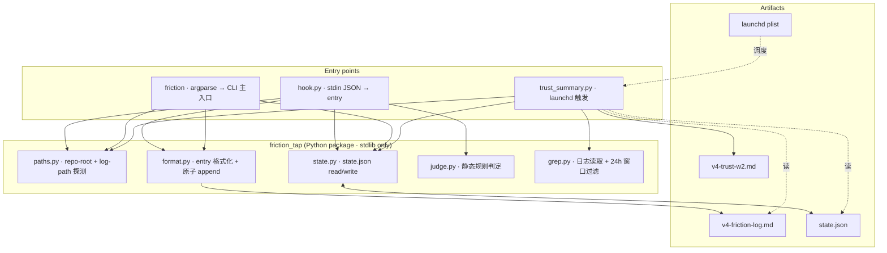

# Architecture — 007a-pA

**Version**: 0.3
**Created**: 2026-05-08T13:30:00Z
**Revised**: 2026-05-08T14:30:00Z(R2 review propagation fix — §5.1 移除 stale Read whitelist + 加 review_mode hook gate + 显式空 stdin pre-read · H-R2-1/H-R2-3/B-R2-3 / §5.2 加 D16 边界 examples · medium / §5.4 加 review_mode field + set_review_mode helper · B-R2-3 / **R3/R4 narrow drift fix** — §5.4 加 review_mode_set_at 时间戳 field · H-R3-2 / §5.5 trust_summary 模板加 `## Hook Operational Status` 段 + stuck-true WARNING · H-R3-2 / §5.5 加 `--on` 完整恢复语义注释 · H-R3-1)
**Source spec**: spec.md v0.3
**Tier**: 1(权威合同 — 任何修改需同步 spec.md)

## 1. System context(C4 L1)

```mermaid
flowchart LR
  Op[Operator · Yashu Liu]
  CC[Claude Code · session]
  FS[(macOS filesystem)]
  LD[launchd · macOS user agent]

  subgraph FT["friction-tap (this system)"]
    Hook[hook.py · PostToolUseFailure handler]
    CLI[friction · CLI · Python single-file]
    Trust[trust_summary.py · day-14 report]
  end

  CC -- "JSON payload via stdin (PostToolUseFailure fires)" --> Hook
  Op -- "friction \"<msg>\" / friction --off / friction --on / friction --threshold" --> CLI
  LD -- "scheduled fire on day 14 of dogfood window" --> Trust

  Hook -- "append entry (atomic)" --> FS
  CLI -- "append entry / read+write state.json" --> FS
  Trust -- "grep / aggregate / render markdown" --> FS

  FS -- "friction-log.md (operator opens manually)" --> Op
  FS -- "trust-w2.md (operator opens manually)" --> Op

  classDef external fill:#eef,stroke:#557
  class Op,CC,LD external
  classDef boundary stroke-dasharray: 5 5
  class FS boundary
```

**外部 actor**:
- **Operator(Yashu)** — 单一用户,跑 IDS V4 dogfood;通过 CLI 控制 + 直接编辑 markdown 完成 adjudication;day 14 看 trust 报告 + 答 self-interview
- **Claude Code session** — `PostToolUseFailure` hook fire 源,通过 stdin 给 hook.py 发 JSON
- **launchd** — macOS native scheduler,作为 day-14 trigger 触发 trust_summary.py(D9)

**外部存储**(macOS filesystem · 无远程依赖):
- `<repo-root>/docs/dogfood/v4-friction-log.md` — 主日志(D4 hardcoded)
- `<repo-root>/docs/dogfood/v4-trust-w2.md` — day-14 trust 报告(O3 / O6 载体)
- `~/.config/friction-tap/state.json` — 唯一 config(D12)
- `~/Library/LaunchAgents/dev.idsmaintainer.friction-tap.trust-w2.plist` — launchd 注册文件(D9)

无外部网络调用 — 所有数据停留在 operator 本机。Privacy promise 由 hardcoded path + offline-only 双重保证(C5 RL-3 / C10)。

## 2. Container view(C4 L2)



**3 个执行入口 + 5 个 helper module + 4 个 artifact**。Helper module 都是 stdlib only(无第三方包);3 个入口共享 helper 但完全独立 — 任一入口 fail 不影响其他。

## 3. Key design decisions(≤5,带 rationale)

### ADR-1 · Static rule judge(D3)
**Decision**: friction signal 判定用静态规则(白名单 tool + 黑名单 keyword/state),非 LLM-judge。
**Rationale**:
1. PRD C1 时间预算紧(**12–23h** · PRD v1.1 sign-off 2026-05-08;R2 B-R2-1 fix:本行从原 10-20h 旧 C1 数值修订),LLM-judge 工程隐藏成本高(API key + retry + cost monitoring + offline fallback)
2. L2 §6 验证显示静态规则可覆盖 80% 真实 friction signal;LLM 是 disputed 率优化,不是 substrate
3. 与 C11 precision > recall 对齐 — 静态规则的 false-positive 边界清晰可调,LLM 边界含糊
**Tradeoff accepted**: recall 损失部分(some friction with success exit-code 漏 — eg semantic 错误);通过 D5 markdown tag + `friction <msg>` CLI 兜底

### ADR-2 · Hardcoded log path as privacy commitment(D4)
**Decision**: log 路径硬编码 = `<repo-root>/docs/dogfood/v4-friction-log.md`;不可配。
**Rationale**:
1. C10 privacy 是 visible commitment 不是隐藏假设 — 路径可见 = 承诺可见
2. 可配路径会引入 default-shared 风险(operator 误配置到 git tracked 公共目录)
3. 跨仓 ship(C8 ADP)留 v0.2 — 那时配路径加 `--scope=ids|adp` flag 即可,设计余地保留
**Tradeoff accepted**: cwd 不在 repo → fail loud(D6);非 git 仓库的场景被拒绝(operator 必须显式 `-f` 指定)

### ADR-3 · Markdown tag adjudication(D5)
**Decision**: operator 通过在 entry 行下方追加单行 markdown tag 完成 adjudication;无 state machine,无 entry id。
**Rationale**:
1. PRD UX 原则 simplicity > cleverness — 记事本就能编辑,grep -c 能统计
2. State machine 工程量 ~+3-4h 但不增 trust 价值(operator 已说够)
3. operator 对自己写的 markdown 文件 100% 控制权(C5 RL-1 不接全知监控的工具)
**Tradeoff accepted**: tag 与 entry 的"绑定"靠物理位置(下一行),不靠 id;若 operator 调整 entry 顺序需手工搬 tag(罕见)

### ADR-4 · Atomic append via tempfile-rename pattern(技术决策)
**Decision**: hook + CLI 在 append entry 时用 "open with O_APPEND" + 单次 write 以保证原子性;trust_summary.py 渲染 trust-w2.md 用 tempfile + os.replace。
**Rationale**:
1. hook fire 与 CLI 调用在快速 dogfood 场景可能并发(operator 正调试 + agent 触发同一文件)— POSIX `O_APPEND` 单 write 在本地 regular file 上是原子(macOS APFS / Linux ext4 实测;**非 PIPE_BUF 语义** — PIPE_BUF 仅 pipe/FIFO 适用,§5.3 已详 — R1 medium fix retained)
2. trust-w2.md 渲染若中途崩溃不能留半文件(operator day-14 信任此文)
3. stdlib 自带,无需第三方 file lock
**Tradeoff accepted**: 单行 entry 必须 ≤ ~4 KiB(典型 200–500 字节,**4 KiB 是 conservative engineering bound 而非 PIPE_BUF cap** — §5.3 措辞修订 R1 medium · 见原子性精确说明段);超长 stderr 已由 `[stderr-200chars]` 截断保证

### ADR-5 · Default off / opt-in by `friction --on`(D15 / C13)
**Decision**: state.json 初始 `enabled: false`;hook 在 `enabled=false` 时直接 noop;operator 必须显式 `friction --on` 才进 dogfood mode。
**Rationale**:
1. L2 §5 末段警告 — 非 dogfood 模式自动 emit 会造日志膨胀,operator 失去 trust
2. 首装 vs dogfood "起点"是同一动作 — `friction --on` 同时是仪式与 enable
3. 与 fast off-switch UX 原则对称 — `friction --off` 一行止血,`--on` 一行起步
**Tradeoff accepted**: operator 忘记 `--on` → 整 dogfood 周期无 entry — 由 README 安装说明 + day-3 mid-pilot review 兜底(详见 risks.md TECH-3)

## 4. Major tradeoffs considered(≤3)

### Tradeoff-A · Hook 注册:`~/.claude/hooks/`(global)vs project-local `.claude/hooks/`
- **Choice**: project-local `.claude/hooks/post_tool_use_failure.sh` → 调 `python -m friction_tap.hook`(可执行入口在仓内 `tools/friction_tap/`)
- **Why**: 与 D4 hardcoded log path 对称 — hook 只在该仓 dogfood 期间 fire;不污染其他 Claude Code session
- **Rejected**: global hook 会让所有仓的 tool 失败都 emit,违反 C2 single-operator dogfood scope

### Tradeoff-B · launchd vs cron 作 day-14 trigger(D9 决议结果)
- **Choice**: launchd
- **Why**: macOS native(C4);新 macOS cron 需 Full Disk Access 妥协;launchd plist 更可控(失败有 unified log 痕迹)
- **Rejected**: cron — 配置脆弱;day-14 trigger 一次性,操作 plist 比改 crontab 更可调试
- **Note**: `tools/install_launchd.sh` 在安装时算出 day-14 ISO 时间(install 时刻 + 14 天),写入 plist `StartCalendarInterval`;确保 day-14 那天 09:00 一次触发

### Tradeoff-C · Python single-file CLI vs proper package
- **Choice**: 介于两者之间 — `tools/friction_tap/` 是 proper package,但每个文件 ≤ 100 行;`friction` 命令是 thin wrapper script(`#!/usr/bin/env python3` + `python -m friction_tap.cli`)
- **Why**: PRD §"Scope IN" 写 single-file CLI,但实际 hook + CLI + trust 三入口共享 helper,纯 single-file 会导致代码重复;package 形态可保 stdlib only + 模块化
- **Rejected**: 严格 single-file — 代码重复 + 难测试

## 5. Component contracts(关键模块的输入/输出契约)

### 5.1 `hook.py` 入口契约(R2 H-R2-1 / B-R2-3 修订)
- **输入**:stdin 一段 JSON(由 Claude Code 注入),含字段:
  - `tool_name: str`(**D8 修订白名单 = `{Bash, Edit, Write}`** — R1 H4:Read 移出 v0.1;**与 §5.2 / T010 / T030 / spec §2 / non-goals 完全一致**;R2 H-R2-1 fix:本段先前 stale 列了 Read,已修正)
  - `exit_code: int`
  - `stderr: str`(任意长度,由 hook 截断到 200 + D19 redact)
  - `task_description: str`(可空;含字符串 `[debugging-friction-detection]` → 黑名单)
  - `block: bool`(可选 — Claude Code lifecycle hook block 信号 — D8)
- **行为**:
  1. **空 stdin pre-read 检查(R2 H-R2-3 fix)**:`raw = sys.stdin.read()`;若 `not raw.strip()` → exit 0(legal noop,**不增 schema_error_count**)
  2. `payload = json.loads(raw)` — 失败抛 `JSONDecodeError` → bump_schema_error_count(reason="json_decode_error") + log + exit 0(real schema drift,与空 stdin 显式区分;R2 H-R2-3 fix)
  3. 读 state.json;**若 `enabled == false` OR `review_mode == true` → exit 0(noop)** — D17 / D20:hook gate = `enabled AND NOT review_mode`,review 期间静默暂停但 `state.enabled` 仍 true 不受 O3 影响
  4. 过 judge.py 静态规则;若 disposition=skip → exit 0
  5. 过 format.py 渲染 entry;append 到 friction-log
  6. exit 0(任何异常都 silently swallow → 不可让 hook 失败影响 Claude Code session)
- **输出**:friction-log.md 末尾多一行;无 stdout/stderr

### 5.2 `judge.py` 规则与 confidence 决定(R1 B1 重写 — 解耦 classification 与 filtering)

> **R1 B1 fix · 关键设计变更**:原决策表把 threshold 与 confidence 耦合(同一批 whitelisted failure 在 `--threshold high` 下仍 emit,只是 relabel),导致 TECH-2 主 mitigation 失效。新设计**两阶段**:
>
> 1. **Classification(独立于 threshold)**:基于 event features(tool kind + Claude Code block flag + stderr 强信号 pattern)把候选事件分类为 H/M/L 一个 confidence,**或** skip(白名单外 / 黑名单 / 禁用)
> 2. **Filtering(threshold gate)**:`--threshold X` 作为 minimum-confidence filter — 仅 emit confidence ≥ X 的 event;低于 → skip

- **输入**:hook payload 解析后的 dict + `state.State`(`enabled` / `threshold`)
- **顺序敏感的决策流程**:

#### Stage A · Skip checks(短路;返回前不进 classification)

| # | 条件 | disposition | confidence | 说明 |
|---|---|---|---|---|
| A1 | `state.enabled == false` | skip | — | D15 / ADR-5 默认 off |
| A1b | `state.review_mode == true`(R2 B-R2-3 / D17 / D20) | skip | — | review session 期间 hook 静默暂停;state.enabled 仍 true → O3 不受影响 |
| A2 | `task_description` 含 `[debugging-friction-detection]` | skip | — | D8 黑名单(operator 自定 escape hatch) |
| A3 | `tool_name not in {Bash, Edit, Write}` AND `block != true` | skip | — | D8 修订(R1 H4:Read 移出 v0.1 白名单) |

#### Stage B · Confidence classification(基于 event features,独立于 threshold)

> **核心原则**:H 是 strong signal(明确高可信),M 是 typical signal,L 是 weak/noisy signal。事先决定 confidence,**再**让 threshold 决定是否 emit。

| # | 条件(顺序敏感,优先 match) | confidence |
|---|---|---|
| B1 | `block == true`(Claude Code lifecycle hook block 信号 — 比 generic exit code 强) | **H** |
| B2 | `tool_name == "Bash"` AND `exit_code != 0` AND stderr 含强信号 pattern(`hook block` / `spec_validator` / `failed:` / `Error:` / `Traceback`)(R1 B1 fix:H boundary 不再 generic) | **H** |
| B3 | `tool_name in {Edit, Write}` AND `exit_code != 0`(写操作失败通常伴随明确 path / collision 错误,H boundary) | **H** |
| B4 | `tool_name == "Bash"` AND `exit_code != 0` AND stderr 长度 ≥ 50 chars(中等长度 stderr 表 tool 主动报错,M typical) | **M** |
| B5 | `tool_name == "Bash"` AND `exit_code != 0` AND stderr 长度 < 50 chars(可能是 `set -e` 中静默退出,L weak/noisy) | **L** |
| B6 | 其他白名单 tool 失败但不 match 上面任一 → fallback | **L** |

> **B1 重要变更**:**generic "Bash exit_code != 0" 不再自动 H** — 现在需要 stderr 含强信号 pattern 才 H,否则 M 起步;长度极短的 stderr 视为 noisy → L。这把"误报洪水"风险更精确分到 L bucket,让 `--threshold high` 的 mitigation 真正过滤掉它们。

> **D16 边界 examples(R2 medium fix · operator-readable)**:
>
> | event | 决策 | 说明 |
> |---|---|---|
> | Bash · stderr length 49 · 无强信号 pattern | **L** confidence | 短 stderr 视为 noisy/weak;`set -e` 静默退出常见落点 |
> | Bash · stderr length 50 · 无强信号 pattern | **M** confidence | 边界(boundary cliff;v0.1 接受截断式阈值) |
> | Bash · stderr length 51 · 无强信号 pattern | **M** confidence | 中等 stderr,typical signal |
> | Bash · stderr 任意长度 · 含 `spec_validator failed:` | **H** confidence | 强信号 pattern 覆盖长度 — strong-signal 优先于长度 |
> | Bash · stderr 长度 5 · 含 `Error:` | **H** confidence | 同上 — pattern match 优先 |
>
> **rationale**:v0.1 用截断式 50-char threshold 作为简单边界;边界 cliff 可被强信号 pattern 覆盖;v0.2 可换更精细的 length-bin(R2 medium follow-up)。50-char 不是科学最优,是"精度可调 + operator 可懂"的工程平衡。

#### Stage C · Threshold filter(R1 B1 fix · 真过滤)

| state.threshold | 行为 |
|---|---|
| `low`(默认值改为 `medium` — 见下注) | emit if confidence in {H, M, L} — 全 capture |
| `medium`(默认) | emit if confidence in {H, M};confidence == L → **skip(filter out)** |
| `high` | emit if confidence == H;confidence in {M, L} → **skip(filter out)** |

> **defaults 注**:`state.json` 初始 `threshold: "medium"`(原 spec 已锁,此处不改),平衡 capture 与 noise。operator 真要更精确 → `--threshold high`;真要全 capture → `--threshold low`。

- **输出**:`("emit" | "skip", confidence_letter | None)`
- **关键测试断言**(spec §6 + T030 / T010 必有):同一 fixture event 集合(含 H/M/L 各 ≥ 1 条),`threshold=high` 时 M/L 必 skip;`threshold=medium` 时 L 必 skip;`threshold=low` 时全 emit。**这是 TECH-2 mitigation 的物理证明**。

### 5.3 `format.py` 原子 append 契约
- **输入**:`(kind: "agent-emit"|"operator-cli", confidence, tool, exit_code, stderr, task_desc, free_text)`(operator-cli 时 tool/exit/stderr 留空,free_text 必填)
- **行为**:
  1. ISO-8601 UTC `Z` 时间戳
  2. `stderr[:200]` 截断 + **secret-pattern redact**(D19:regex 匹配 `(sk|pk|ghp|github_pat|aws|AKIA)_[A-Za-z0-9]{16,}` / `Bearer [A-Za-z0-9_-]{20,}` 等 → 替换 `[redacted]`)+ 转义换行(替换 `\n` / `\r` 为 `↵`)
  3. 渲染单行字符串(IN-4 格式)
  4. 用 `O_APPEND` 模式打开 friction-log,单次 `os.write()` 写完(原子保证 — 见下原子性说明)
- **原子性精确说明(R1 medium fix · 移除 PIPE_BUF 误用)**:
  > 之前文字引用 PIPE_BUF 是错的 — PIPE_BUF 仅适用于 pipe 与 FIFO,不适用于 regular file。对**本地 APFS / ext4 / btrfs 等 POSIX regular file**,实际原子保证来自:
  > 1. `O_APPEND` 标志确保 write offset 在写入前由 kernel 原子地求 file end,与 write 操作合并(POSIX `pwrite` semantics)
  > 2. 单次 `write(2)` system call 在 regular file 上对**单一进程内单次调用**是 atomic — 即多线程/多进程并发 `O_APPEND + write` 不会交错(macOS APFS 与 Linux ext4 实测都满足此保证)
  > 3. NFS / iCloud Drive / SMB **不**保证此原子性(TECH-5)— 这是 v0.1 仅支持本地 APFS 的根因
  >
  > 我们仍保留 `len(line) < 4096` 的安全边界(原 PIPE_BUF 数值)作为 conservative cap,因为:(a)单 entry 工程上不应超 4 KiB(stderr 已截断 200 chars + 业务字段 ~300 chars 远低于);(b)在不严谨理解的边界 case 上,4 KiB 是各 POSIX 实现都安全的尺寸。**4 KiB cap 不是 PIPE_BUF 语义 — 是 conservative engineering bound**。
- **输出**:None;失败抛 `FormatError`(由 hook silently swallow / CLI fail-loud)

### 5.4 `state.py` config 契约(R1 H3 + R2 B-R2-3 + R3/R4 H-R3-2 fix:加 schema_error_count + review_mode + review_mode_set_at)
- **schema**(`~/.config/friction-tap/state.json`):
  ```json
  {
    "enabled": false,
    "review_mode": false,
    "review_mode_set_at": null,
    "threshold": "medium",
    "installed_at": "2026-05-08T14:00:00Z",
    "version": "0.1",
    "schema_error_count": 0
  }
  ```
- **`review_mode` 字段(D17 修订 / D20 · R2 B-R2-3)**:bool,默认 false。**与 `enabled` 正交** — operator 进 review session 时 `friction --review-mode` / `--review-mode-on` 设 true(不动 enabled);`--review-mode-off` 退出。**hook gate** = `state.enabled AND NOT state.review_mode`。**O3 verification 仅看 `enabled`,不看 review_mode**(D20)— review session 期间 O3 仍 PASS
- **`review_mode_set_at` 字段(R3/R4 H-R3-2 / D17)**:nullable ISO-8601 UTC 时间戳;**仅在 `set_review_mode(True)` 时由 helper 自动写入当前时间**;`set_review_mode(False)` 时清回 None。**用途**:trust_summary 渲染 `## Hook Operational Status` 段时,若 review_mode=true AND now - set_at > 24h → 显示 stuck-true WARNING(防 day-14 review 看到 O3 PASS 但 review_mode 长期 stuck true 致 hook 静默暂停的 false adoption signal)。**Backward-compat**:缺失 / null → trust_summary 跳过 24h 计算,只显示 `state.review_mode = true|false` 不带 WARNING
- **`schema_error_count` 字段(D18)**:hook 内部任何 payload schema drift / parse 异常 / `judge.JudgeError` 都让该字段累加 +1;主流程仍 silently exit 0(TECH-4 不可破)。trust-summary 输出 `## Schema health` 段时显示该计数,operator 在 day-14 review 能见到 hidden capture failure
- **首次读不存在** → 写入默认值并返回(默认 `enabled=false / review_mode=false / review_mode_set_at=null / threshold=medium / schema_error_count=0`)
- **写入** → tempfile + os.replace(原子)
- **`schema_error_count` 累加路径独立于 `update()`** — hook 调专门 `state.bump_schema_error_count()` 函数,内部 read-modify-write 用 `O_APPEND`-equivalent atomic 避免与 CLI `update()` 竞争(实现细节:T002 加该 helper)
- **Backward-compat(R2 B-R2-3 + R3/R4 H-R3-2 fix)**:旧 state.json 缺 `review_mode` / `review_mode_set_at` / `schema_error_count` 字段时 → from_dict 视为 `false` / `None` / `0`(向后兼容);
- **helper `set_review_mode(value: bool)`(R2 B-R2-3 + R3/R4 H-R3-2 修订)**:value=True 时 `update(review_mode=True, review_mode_set_at=<now ISO UTC>)`;value=False 时 `update(review_mode=False, review_mode_set_at=None)`(清时间戳)。**invariant 仍是不动 `state.enabled`** — set_review_mode 只动 review_mode 与 review_mode_set_at 两字段
- **CLI `--on` 完整恢复语义(R3/R4 H-R3-1 / D21)**:`friction --on` 由 cli.py 实装为 `update(enabled=True)` + 若 prev review_mode=True 则 `set_review_mode(False)`;否则不调 set_review_mode(避免无谓 IO)— 终态 invariant 是 `enabled=true AND review_mode=false`

### 5.5 `trust_summary.py` 模板与 OQ-C 实现(R1 B2 / B3 / H1 / H3 修订)

- **launchd 触发**:install_at + 14 天那天 09:00:00 当地时间(单次 `StartCalendarInterval` + `RunAtLoad: false`)
- **新增 CLI flags(R1 B2 fix · 替代不存在的 health_check 模块)**:
  - `python -m friction_tap.trust_summary`(无 flag) → 渲染完整 trust-w2.md
  - `python -m friction_tap.trust_summary --check-enabled` → **仅** stdout 打印 `enabled: <true|false>` + exit 0/1;O3 verification 用此 flag(R1 B2)
  - `python -m friction_tap.trust_summary --check-self-interview` → **仅**校验已存在的 trust-w2.md 中 self-interview 段是否含结构化答案(label + reason 长度) → exit 0/1;O6 verification 用此 flag(R1 H1)
- **行为**:
  1. grep `[agent-emit]` 总数 / 各 tag 比例(`[acked]` / `[disputed]` / `[needs-context]`)
  2. **O3 计算(R1 B3 修订 · 严格 binary)**:仅 `state.json.enabled` → O3 pass/fail
  3. **Activity freshness(informational)**:最近 24h 是否有 `[agent-emit]` entry — 单列 `## Activity health` 段,**不进 O3**
  4. **Schema health(R1 H3)**:读 `state.json.schema_error_count`,显示该值;> 0 → 警告 operator hook 内部有 schema drift
  5. **Hook Operational Status(R3/R4 H-R3-2 / D17 / D20 / D21)**:读 `state.json.review_mode` 与 `review_mode_set_at`;新段显示 `state.review_mode = <true|false>`;若 review_mode=true AND review_mode_set_at not None AND `now - set_at > 24h` → 加 WARNING 文案。**O3 verdict 段独立** — review_mode=true 仍可 O3 PASS(D20)
  6. 渲染 markdown(模板见下),包含**结构化** self-interview prompt(D14 + R1 H1)
  7. atomic write to `docs/dogfood/v4-trust-w2.md`(若已存在 → 后缀 -2 / -3 防覆盖)
- **trust-w2.md 新模板**:
  ```markdown
  # Trust mini-summary · day 14 · <ISO date>

  ## Metrics
  - Total agent-emit entries: <N>
  - acked: <X> (<X/N pct>)
  - disputed: <Y> (<Y/N pct>)
  - needs-context: <Z>
  - Operator CLI entries: <M>

  ## Hook adoption(O3 — 严格 binary,R1 B3)
  - state.json `enabled`: <true|false>
  - O3 verdict: <pass|fail>(仅 enabled flag 决定,不依赖 activity)

  ## Activity health(informational · 不进 O3 verdict)
  - 最近 24h 有 agent-emit entry: <yes|no>
  - 14 天总 entry 数: <N>
  - **解读**:operator 暂离 / 周末 / 假期等场景下"近 24h 无 entry" 仍可能 hook 健康。仅作为 dogfood activity 信号,不影响 adoption verdict

  ## Schema health(R1 H3 · D18)
  - `state.json.schema_error_count`: <K>
  - **解读**:K > 0 → hook 内部有 K 次 payload schema drift;若 K 显著 → Claude Code 升级可能改了 hook payload schema,需 operator 看 `~/.config/friction-tap/last_run.log` traceback 确认

  ## Hook Operational Status(R3/R4 H-R3-2 · D17 / D20 / D21)
  - `state.review_mode = <true|false>`(R4-cleanup H-R4-1:用等号空格形式与 spec §6 verification + T031 assert 对齐 contract)
  - **解读**:review_mode=true 时 hook 在 review session 期间静默暂停(§5.1 Stage A1b);O3 verdict 与 review_mode 正交(D20),review_mode=true 不破 O3
  - **若 review_mode_set_at 存在 AND now - set_at > 24h**:加一行 `WARNING: review_mode has been on for >24h (Xh); hook is paused. Run \`friction --review-mode-off\` if review session is over.`(防 stuck-true)

  ## Outcome check
  - O1 ≥ 8: <pass|fail>(本次 N=<N>)
  - O2 acked ≥ 50%: <pass|fail>(本次 acked=<X pct>)
  - O2 disputed ≤ 20%: <pass|fail>(本次 disputed=<Y pct>)
  - O3 hook still enabled: <pass|fail>(严格 binary)

  ## Self-interview(R1 H1 结构化)

  **After 2 weeks, do you feel relieved / watched / both? (≥ 20 CJK chars OR ≥ 8 English words)**

  Please fill BOTH lines below before this report is considered complete:

  [label: <relieved|watched|both>]

  Reason: <自由文本,≥ 20 CJK 字符 OR ≥ 8 English words 一句话说为什么>

  ## Notes
  (附:operator 可在此追加 ≥ 3 条 named entry 的引用 — O5)
  ```
- **`--check-self-interview` 实现**:
  1. 读 `docs/dogfood/v4-trust-w2.md`
  2. 找 `[label: ` 行;断言 label ∈ `{relieved, watched, both}`(三选一)
  3. 找 `Reason:` 行;计 CJK 字符(`一-鿿`)与 English words(空格分词);任一 ≥ 阈值 → pass
  4. 任一 fail → exit 1 + stderr 写明 fail 原因(operator 能看见怎么补)

## 6. Integration points with external systems

| External | Protocol | Direction | Failure mode |
|---|---|---|---|
| Claude Code `PostToolUseFailure` hook | stdin JSON one-shot | Claude Code → friction-tap | hook.py 内部任何异常 silently swallow,不影响 Claude Code session(关键 — `set -e` 不传播) |
| macOS launchd | plist `StartCalendarInterval` 单次触发 | launchd → friction-tap | launchd 失败有系统 unified log;trust_summary.py 自身 fail 写日志到 `~/.config/friction-tap/last_run.log` |
| macOS filesystem | POSIX read/write/atomic-rename | bidirectional | `O_APPEND` 单 write 原子;state.json 用 tempfile-rename;若磁盘满 → fail loud,不破坏 friction-log |
| Git | 仅在 `paths.py` 中调 `git rev-parse --show-toplevel` 探测 repo-root;**不写 git** | friction-tap → git(read only) | `git` 命令失败(cwd 不在仓内)→ exit 非零 → hook 与 CLI 路径分别处理(hook silently swallow;CLI 显式报错 D6) |

无 HTTP / 无 socket / 无外部 API。

## 7. Operational notes(for SLA + ops)

- **Hook fire latency**:hook.py 总 wall time 应 ≤ 200ms p95(stdin parse + judge + redact + append);超过即视为退化 — Claude Code 用户感知阻塞
- **Day-14 trigger 准确度**:launchd 误差 ≤ ±5 min(macOS 文档 not realtime,但对 day-14 单次足够)
- **Storage growth**:典型 dogfood 14 天 = 8–30 entry × 200–500 字节 ≈ < 20 KiB;无需 rotation
- **Operational entry-volume math(R1 medium fix)**:14 天 × 5 hr/day × 2 hook fire/hr ≈ **140 entry max**;每条 entry ~500 字节 = ~70 KiB total;**grep-friendly threshold ≈ 10000 lines = 70 day overflow margin**;v0.1 不需 rotation
- **Backup**:friction-log 在 git repo 内 → operator 决定是否 .gitignore(privacy promise 一致 → 详见 README + risks.md SEC-1)
- **Hook fail mode(R1 H3 fix)**:
  1. **payload schema drift / parse error**:hook 内部 try/except 捕获 → `state.bump_schema_error_count()` → silently exit 0(TECH-4 / D18)
  2. **install.sh 执行 post-install smoke test**(T033 实装):用 fixture JSON pipe 给 hook,断言 friction-log 末尾多一行 + state.json `schema_error_count == 0`;失败 → install.sh stderr 警告,但 install 仍继续(operator 可手动调试)
  3. **trust-summary `## Schema health` 段**:operator day-14 review 时可见 schema drift 累计次数(D18)
  4. **last_run.log traceback**:每次异常都写 traceback(architecture §6 已存在),operator 排错入口
  5. **关键不变量**:hook 主流程**永远** silently exit 0,不污染 Claude Code session(TECH-4 H/H risk 保持 mitigated)

## 8. Out of architecture scope(由 spec OUT 推导)

- 多 hook 注册(C7 仅 `PostToolUseFailure`)
- 跨仓 aggregator(C8;v0.2 加 `--scope` flag 即可)
- HTTP server / dashboard(C5 RL-4)
- LLM-judge backbone(D3 / 留 v0.2)
- entry id state machine(D5)
